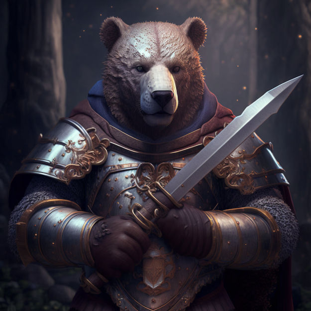

  
  

    
hecku

    

      

        <a class="px-1 hover:text-primary-700 dark:hover:text-primary-400" href="https://twitter.com/th3_5had0w_w" target="_blank"
          aria-label="{{ $name | title }}" rel="me noopener noreferrer"></a>
        <a class="px-1 hover:text-primary-700 dark:hover:text-primary-400" href="https://github.com/th3-5had0w" target="_blank"
          aria-label="{{ $name | title }}" rel="me noopener noreferrer"></a>
        <a class="px-1 hover:text-primary-700 dark:hover:text-primary-400" href="https://t.me/th3_5had0w" target="_blank"
          aria-label="{{ $name | title }}" rel="me noopener noreferrer"></a>                
      

    

  

