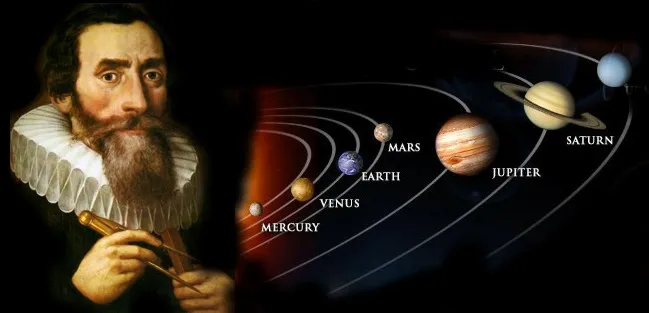
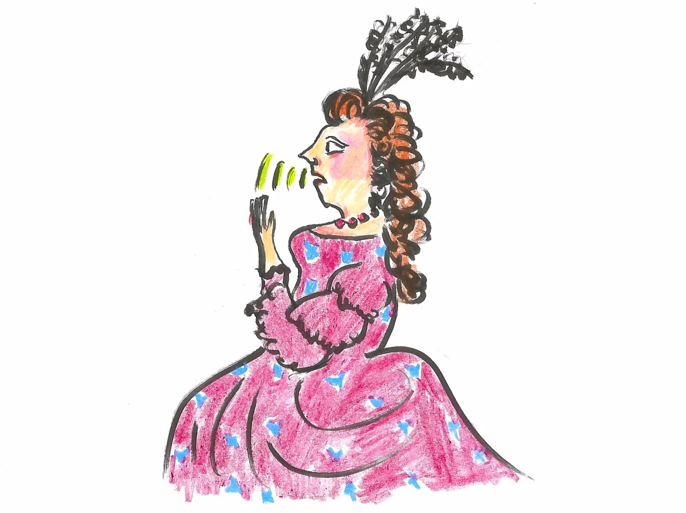

## Từ Hành Trình Tìm Kiếm Nửa Kia Đến Quy Tắc 37% Của Cuộc Đời

**"Trong tình yêu, sự nghiệp, và cuộc sống, đâu là lúc ta nên ngừng tìm kiếm và bắt đầu lựa chọn?"**

### PHẦN I: CÁNH ĐỒNG HOA VÀ CÁI GIÁ CỦA SỰ DO DỰ

*--Trích đoạn một câu chuyện nhân văn--*Nguồn câu chuyện chàng trai trẻ và nhà hiền triết: [bài đăng gốc trên Facebook](https://www.facebook.com/photo.php?fbid=4482965695138764&id=1417920664976631&set=a.1419627544805943).

Một hôm, có chàng trai trẻ đến thăm nhà hiền triết và thỉnh hỏi ngài rằng: 

-"Vì sao người ta không thể lấy được người mình yêu?". 

Câu trả lời của ông đã khiến cậu nhận ra nhiều chân lý. Nghe câu hỏi của chàng thanh niên, nhà hiền triết mỉm cười, nhìn cậu và đáp: "Để có được câu trả lời, con hãy đi đến cánh đồng và chọn bông hoa mà con tin là đẹp nhất rồi mang về đây. Nhưng hãy nhớ rằng con chỉ được phép tiến lên phía trước mà không được quay đầu nhìn lại để nhìn xem nên ngắt bông nào".

Chàng trai đi đến cánh đồng. Khi đi qua hàng cây đầu tiên, cậu nhìn thấy một bông hoa rất đẹp và muốn hái ngay mang về. Nhưng cậu lại băn khoăn tự hỏi, liệu còn bông nào đẹp hơn nữa không? Sau đó, quả thật cậu đã tìm được một bông hoa tuyệt đẹp. Nhưng cũng như lần trước, cậu lại nghĩ rằng có lẽ những bông hoa khác đẹp hơn vẫn đang chờ ở phía trước.

Thế rồi khi đã đi qua nửa cánh đồng, cậu bắt đầu nhận ra rằng các bông hoa giờ đã không đẹp bằng bông mà cậu đã bỏ qua. Cậu đã bỏ lỡ những bông đẹp nhất trong khi cứ mải mê tìm kiếm, kén cá chọn canh.

Vì vậy, cậu buồn bã trở về gặp lại nhà hiền triết mà không mang theo bất kỳ bông hoa nào trong tay. Bởi cậu không thể tha thứ cho bản thân vì đã bỏ lỡ không hái bông đẹp nhất. Cậu kể lại toàn bộ sự việc xảy ra.

Nhà hiền triết ôn tồn giảng: 

"Con đã cố công tìm kiếm bông đẹp hơn trong khi đã bỏ qua những bông đẹp nhất. Khi nhận ra rằng mình đã bỏ lỡ cơ hội, con lại không thể quay đầu trở lại một lần nữa. Đây chính là sai lầm phổ biến nhất của con người khi họ yêu ai đó và đánh mất người tốt nhất trong cuộc đời mình".

### PHẦN II: CÂU CHUYỆN CHỌN VỢ CỦA NHÀ THIÊN VĂN HỌC KEPLER

**Johannes Kepler** (1571-1630) là một nhà toán học và thiên văn học nổi tiếng người Đức. Ông đã đóng góp cho nhân loại nhiều nghiên cứu khoa học quý giá, trong đó nổi tiếng nhất là những định luật chuyển động của các thiên thể. 

Sau cái chết của người vợ đầu vào năm 1611, nhà thiên văn học Johannes Kepler khi ấy đã hơn 40 tuổi bắt đầu hành trình tìm kiếm một người vợ mới.Chuyện chọn vợ của Kepler kể theo [bài viết trên tamlyhoctoipham](https://tamlyhoctoipham.com/khi-ong-kepler-chon-vo) và video [Astronomer Johannes Kepler Solved Life's Hardest Problem: Marriage](https://www.youtube.com/watch?v=u5Q4N2dkMiU). Là một người sống trong thế giới của các con số, của quỹ đạo và quy luật vận động của hành tinh, Kepler không đơn thuần chọn vợ bằng cảm tính. Ông suy nghĩ, phân tích, cân nhắc và thậm chí... viết ra danh sách những người phụ nữ tiềm năng để cân nhắc kỹ lưỡng, như thể đang giải một bài toán lớn trong đời.

Là một người cẩn trọng, Kepler không dễ dấn thân vào chuyện lấy vợ lần hai như người ta chọn theo cảm xúc. Ông bắt đầu quá trình tìm hiểu, mà thực chất là phỏng vấn từng người một cách kỹ càng như đang tuyển trợ lý cho một công trình khoa học. Tổng cộng có 11 người phụ nữ, và ông ghi chép lại từng ứng viên chi tiết trên một cuốn sổ.

Sau khi tìm hiểu người đầu tiên, ông phán ngay: "Hôi miệng cực kỳ". Người thứ hai thì xuất thân giàu có, sống vượt quá vị thế thật sự của mình, trong khi tính cách lại chẳng đem đến hy vọng nào về sự hòa hợp lâu dài. Người thứ ba thì rắc rối vì đã đính hôn, mà trớ trêu thay, người đàn ông kia còn có con riêng với người khác, đủ khiến Kepler thở dài: "Quá phức tạp".

Người thứ tư, theo ông mô tả, có vẻ ngoài cao lớn, khoẻ khoắn, thể thao. Nhưng rồi lại xuất hiện người thứ năm, một người phụ nữ mà theo người ta đồn là khiêm tốn, tiết kiệm, cần cù và giàu tình cảm. Cô còn yêu thương cả con riêng nếu lấy chồng, điều mà Kepler đặc biệt quan tâm. Thế nhưng ông lại do dự quá lâu. Cả người thứ tư lẫn thứ năm vì mất kiên nhẫn mà rời bỏ ông.

Rồi đến người thứ sáu, một phụ nữ đứng tuổi khiến ông lo rằng mình sẽ phải tổ chức một lễ cưới rườm rà và tốn kém. Người thứ bảy thì quyến rũ khiến ông rung động thực sự, nhưng vì còn lưỡng lự chưa hoàn tất danh sách, ông trì hoãn, và cô ấy cũng chẳng phải người biết chờ. Vậy là lại mất một người nữa.

Người thứ tám thì ông không hứng thú, dù mẹ ông lại thích. Người thứ chín thì hay đau yếu, còn người thứ mười thì không cân đối vóc dáng, dù gương mặt dễ chịu. Người cuối cùng, người thứ mười một, lại quá trẻ.

Đến lúc đó, Kepler bắt đầu băn khoăn: phải chăng mình đã sai? Ông đặt bút viết một dòng đầy day dứt: "Liệu đây là ý Chúa, hay là vì lương tâm nhiều tội lỗi của tôi, mà suốt hai năm qua tôi cứ xoay vòng, đắm chìm trong những kịch bản riêng lẻ của đời người?"

Có lẽ điều mà Kepler thiếu không phải là tình cảm, mà là một chiến lược rõ ràng, một cách để đưa ra quyết định mà không bị mắc kẹt trong những vòng lặp của lưỡng lự và tiếc nuối. Một chiến lược không đảm bảo sẽ dẫn tới người hoàn hảo nhất, nhưng ít nhất là giúp ông đưa ra lựa chọn trong thời điểm hợp lý nhất.

Hàng trăm năm sau, các nhà toán học lại cho rằng bài toán của Kepler có thể giải bằng một công thức rất cụ thể, thứ mà ngày nay ta gọi là Bài toán thư ký hay quy tắc 37%.

### PHẦN III: Quy tắc 37%

#### Khi toán học dạy ta biết dừng lại trước khi quá muộn

Có một bài học kỳ lạ mà toán học từng dạy tôi. Đó không phải là công thức tính diện tích hay giải tích tổ hợp gì cao siêu, mà là:

**"Không phải chọn cái tốt nhất, mà là chọn đúng lúc để dừng lại."**

Nếu bạn từng yêu mà không dám ngỏ lời, hoặc từng đi qua quá nhiều lựa chọn rồi tiếc nuối người đầu tiên thì bạn đang sống trong phiên bản đời thực của một bài toán cổ điển: The Secretary Problem bài toán thư ký, hay còn gọi là Bài toán dừng tối ưu (Optimal Stopping Problem).

#### Một câu chuyện đời thường

Hãy tưởng tượng bạn là một CEO đang tuyển thư ký riêng và bạn thật sự muốn chọn người xuất sắc nhất. Có 100 ứng viên nộp đơn. Bạn phỏng vấn họ lần lượt, và mỗi người bạn chỉ được quyết định ngay sau buổi phỏng vấn: **chọn** hoặc **bỏ**.

Một khi từ chối, bạn không thể quay lại.

Nghe quen không? Đó chính là cách cuộc đời vận hành.

Bạn gặp một người tuyệt vời, nhưng nghĩ: "Mình còn trẻ, phía trước còn nhiều người hơn".

Rồi bạn gặp thêm vài người nữa, rồi vài người nữa… cho đến khi nhận ra: "Người tuyệt nhất, mình đã bỏ qua mất rồi."

#### Bài toán phía sau

Bài toán này được gọi trong giới học thuật là "The Secretary Problem" Bài toán thư ký. Nó xuất hiện từ những năm 1950, 1960, trong các nghiên cứu xác suất học của các nhà toán học như Martin Gardner, Thomas Ferguson, và Chow-Robbins.Tham khảo: [Secretary problem trên Wikipedia](https://en.wikipedia.org/wiki/Secretary_problem) và [bài giới thiệu bằng tiếng Việt trên MathVn](https://www.mathvn.com/2018/06/quy-tac-37-va-thoi-iem-ua-ra-nhung.html).

Ban đầu, nó là một trò đố vui trí tuệ. Nhưng rồi người ta phát hiện: nó chính là hình mẫu của rất nhiều quyết định trong cuộc sống từ tình yêu, công việc, tài chính, cho đến việc… chọn chỗ ngồi trong quán cà phê.

Giả sử có n người cần phỏng vấn, theo thứ tự ngẫu nhiên. Sau mỗi lượt phỏng vấn, bạn biết thứ hạng tương đối (ai tốt hơn ai) nhưng không biết tổng thể.Đây là giả thiết quan trọng nhất của bài toán. Bạn chỉ so sánh được người này với người kia, không có điểm số tuyệt đối. Nếu chấm điểm được từng người thì bài toán đã khác hẳn và lời giải cũng khác.

Chiến lược tối ưu nhất là:

**Bỏ qua r người đầu tiên chỉ để quan sát, không chọn. Sau đó, từ người thứ r+1 trở đi, chọn người đầu tiên tốt hơn tất cả những người trước đó.**

Câu hỏi là: nên bỏ qua bao nhiêu người bao nhiêu là vừa?

Theo lời giải chi tiết, gọi: 
- \(n\) là tổng số ứng viên,
- \(r\) là số người bạn bỏ qua ban đầu để quan sát (không chọn),
- \(P(r)\) là xác suất bạn chọn đúng người tốt nhất khi dùng chiến lược này.

Theo đó, ta có công thức xác suất:

$$
\begin{aligned}
P(r) = \frac{r}{n} \sum_{k=r+1}^{n} \frac{1}{k-1}
\end{aligned}
$$

Bạn muốn tìm \(r\) sao cho \(P(r)\) là lớn nhất.Tổng các phân số 1/(k-1) chính là chuỗi điều hoà, và chuỗi này xấp xỉ ln(n/r) khi n đủ lớn. Lấy đạo hàm của (r/n) nhân ln(n/r) rồi cho bằng 0 sẽ ra r/n = 1/e. Số e xuất hiện ở đây là vì logarit, không phải trùng hợp.

Khi \(n \to \infty\) người ta chứng minh rằng:

$$
\frac{r}{n} \to \frac{1}{e} \approx 0.368
$$

Tức là: \(r = n/e \approx 37\%\)

Và xác suất tối đa bạn có thể chọn đúng người giỏi nhất cũng sẽ là:

$$
P_{\text{max}} = \frac{1}{e} \approx 36.8\%
$$

Đồng nghĩa với việc:

- Nếu bạn có 100 ứng viên → bỏ qua khoảng 36–37 người đầu.
- Nếu bạn có 30 người → bỏ qua 11 người.
- Nếu bạn có 10 người → khoảng 3–4 người.

#### Vì sao phải bỏ qua 37% đầu?

Bạn cần có một mẫu quan sát đủ lớn để ước lượng tiêu chuẩn xem thế nào là "tốt". Nếu bạn chọn ngay từ đầu, bạn chưa có tiêu chuẩn. Nếu bạn đợi đến cuối, bạn sẽ bỏ qua mất người tốt nhất.

37% đầu tiên giống như "cánh đồng quan sát". Nó là cái giá của sự học hỏi. Và chỉ khi quan sát đủ, bạn mới có thể ra quyết định đủ tốt.

Dựa trên lý thuyết toán học của bài toán thư ký, nếu **Kepler** có tổng cộng 11 ứng viên (như ông kể), thì chiến lược tối ưu là:

**Bỏ qua khoảng khoảng 4 ứng viên đầu tiên chỉ để quan sát, không chọn.Điều thú vị là ngoài đời Kepler cũng dừng ở người thứ năm: ông quay lại và cưới Susanna Reuttinger năm 1613, và theo ông kể thì đó là một cuộc hôn nhân hạnh phúc. Sau đó, từ người thứ 5 trở đi, chọn người đầu tiên tốt hơn tất cả những người trước đó. Nếu Kepler đã làm đúng theo chiến lược này, thì người phụ nữ thứ 5 mà ông thấy tốt hơn bốn người trước chính là lựa chọn lý tưởng về mặt xác suất.**

**Bạn có thể hỏi:**

**“Nếu xác suất tối ưu chỉ là 36.8%, vậy chẳng lẽ ta thất bại 63% còn lại sao?”**

Câu trả lời là: đúng, nhưng đó vẫn là cơ hội cao nhất bạn có thể đạt được nếu bạn không biết gì về tương lai.Cần phân biệt: 36.8% là xác suất chọn trúng đúng người tốt nhất trong toàn bộ danh sách. Xác suất chọn được một người thuộc nhóm rất tốt thì cao hơn nhiều, nên con số này bi quan hơn thực tế đời sống.

**Đây là bài toán lý tưởng hóa:** người ta không biết trước ai sẽ đến sau, không biết bạn có thể gặp bao nhiêu người “vừa đủ tốt”. Nó giả định thế giới vận hành theo một quy luật ngẫu nhiên, công bằng. Và trong thế giới đó, không có chiến lược nào tốt hơn 37%.

Thế nên, bạn không thể đạt xác suất 90% hay 100% trừ khi bạn du hành thời gian. Nhưng bạn có thể tăng khả năng chọn đúng nhất trong một thế giới bất định và đó là cái đẹp nhất của toán học: **cho bạn sự tự tin khi bước đi, dù đường còn mờ mịt.**

### PHẦN IV: ỨNG DỤNG THỰC TẾ

Khi còn nhỏ, người ta dạy tôi rằng: "Yêu ai thì cứ yêu, duyên đến thì đến." Nhưng khi lớn lên, tôi phát hiện ra: nếu duyên cứ đến bất kỳ lúc nào, vậy tại sao người ta lại ly hôn nhiều đến thế? Nếu chọn đại, sao có người lại chọn trúng hạnh phúc mà người khác thì không?

Hóa ra, chuyện tình cảm tưởng như bất định và cảm tính cũng có thể tuân theo một nguyên lý xác suất toán học. Và một trong những câu hỏi được nghiên cứu nghiêm túc là: **Tuổi nào là hợp lý nhất để kết hôn?**

#### Câu trả lời theo toán học

Giả sử bạn cho rằng khoảng tuổi thích hợp để kết hôn là từ 18 đến 40 tuổi. Đây là khoảng thời gian mà hầu hết mọi người đều “có thể” kết hôn đủ trưởng thành, nhưng chưa quá muộn để ổn định cuộc sống gia đình.

Tổng chiều dài quãng thời gian này là 22 năm.

Áp dụng quy tắc dừng tối ưu với tỷ lệ \(1/e \approx 37\%\), ta có:

$$
22 \times 0.37 \approx 8.14
$$

**Kết luận: "26 là độ tuổi hoàn hảo để ra quyết định cưới vợ"**Tham khảo: [bài trên khoahoc.tv](https://khoahoc.tv/cac-nha-toan-hoc-khang-dinh-26-la-do-tuoi-hoan-hao-de-ra-quyet-dinh-cuoi-vo-93088), cùng hai bài tiếng Anh về quy tắc 37% trên [Big Think](https://bigthink.com/neuropsych/the-37-percent-rule/) và [IFLScience](https://www.iflscience.com/math-says-you-should-use-the-37-percent-rule-for-big-life-decisions-78618).

Tuy nhiên, Nhà xã hội học Nicholas H. Wolfinger từ Đại học Utah lại phát hiện rằng độ tuổi kết hôn lý tưởng để giảm nguy cơ ly hôn là từ 28 đến 32 tuổi.

#### Vì sao lại là 28–32?

Nghe qua thì tưởng như không ăn khớp với quy tắc 37% vốn gợi ý tuổi chọn bạn đời rơi vào khoảng 26–27, nhưng thực ra lại rất hợp lý. Bởi lẽ, người ta thường ra quyết định yêu và gắn bó trước đó 1–2 năm, rồi mới cưới sau.

Vậy nên nếu bạn gặp đúng người ở tuổi 26, rồi kết hôn ở tuổi 28, thì bạn đã chọn đúng lúc không chỉ theo cảm xúc, mà cả theo xác suất.

Vậy, bạn nên dành khoảng 8 năm đầu tiên (từ 18 đến khoảng 26 tuổi) để “tìm hiểu, quan sát và học hỏi” không nên kết hôn vội. Đây là giai đoạn bạn đang xác lập tiêu chuẩn của chính mình: bạn cần trải nghiệm, biết mình muốn gì, không muốn gì, hiểu rõ bản thân và kiểu người phù hợp với mình.

Sau tuổi 26, bắt đầu từ năm thứ 9 trở đi (khoảng 27–28 tuổi), nếu bạn gặp một người phù hợp hơn tất cả những gì bạn từng biết, thì nên sẵn sàng gắn bó. Và nếu không có lựa chọn tốt hơn, bạn vẫn còn thời gian đến năm 40 để quyết định.

Một số nghiên cứu và thống kê khác cũng đã thực hiện các nghiên cứu thực nghiệm, và họ phát hiện ra rằng:

- Cũng theo Nghiên cứu từ Nicholas H. Wolfinger chỉ ra rằng những người cưới trước 25 tuổi có tỷ lệ ly hôn cao hơn rõ rệt. Ví dụ: những người lấy nhau tuổi 20–24 có khoảng 27% ly hôn trong vòng 5 năm sau cưới, so với nhóm tuổi lớn hơn.
- Theo các phân tích từ Institute for Family Studies, hôn nhân sau tuổi đầu 30 không tiếp tục giảm nguy cơ ly hôn như kỳ vọng, mà thậm chí tăng lên khoảng 5% mỗi năm cưới sau tuổi 32. Việc trì hoãn quá lâu có thể dẫn đến khó hòa hợp vì quá nhiều thói quen cá nhân đã hình thành

#### Câu chuyện phía sau con số

Người ta thường nghĩ hạnh phúc là duyên số. Nhưng càng lớn, tôi càng tin rằng: duyên có đến mấy cũng cần đúng thời điểm. Bạn không thể chọn được người hoàn hảo, nhưng bạn có thể chọn đúng lúc để tin tưởng. Và nếu bạn dành đủ thời gian để hiểu đời, hiểu mình, thì đến một lúc nào đó, bạn sẽ biết rằng: "Tôi đã đi đủ xa, và đây là người khiến tôi muốn dừng lại."

**Nói đi cũng phải nói lại rằng, tuy quy tắc 37% và bài toán thư ký nghe có vẻ logic, chính xác và đầy tính toán, nhưng chúng ta cần hiểu rõ:**

**Đây chỉ là một mô hình toán học lý tưởng không phải kim chỉ nam tuyệt đối cho mọi lựa chọn trong đời.**

Đừng vì những con số mà bạn từ bỏ một người mình đang yêu thương chỉ vì “chưa đủ 37%”, hay cố chờ đợi một điều gì đó “tốt hơn” chỉ vì lý thuyết bảo vậy. Bởi đời thực không giống phòng thí nghiệm. Con người không phải các biến số, và tình cảm không phải thứ có thể đưa vào công thức.

Bài toán này nên được xem như một cách nhìn thú vị từ toán học về sự do dự, kỳ vọng và tiếc nuối của con người, chứ không phải là lời khuyên ràng buộc. Nếu bạn đã gặp được một người khiến mình cảm thấy bình yên, hiểu mình, và sẵn sàng cùng nhau đi qua những năm tháng phía trước thì bạn không cần đợi đến 37% thanh xuân để quyết định.

**Toán học có thể giúp ta hiểu logic của thế giới, nhưng chỉ trái tim mới giúp ta đưa ra quyết định đúng cho chính mình.**
<!-- TODO:

- chuyện chàng trai trẻ và nhà hiền triết: https://www.facebook.com/photo.php?fbid=4482965695138764&id=1417920664976631&set=a.1419627544805943
- chuyện ông kepler: https://tamlyhoctoipham.com/khi-ong-kepler-chon-vo
- tuoi 26 la tuoi tot nhat de lay vo: https://khoahoc.tv/cac-nha-toan-hoc-khang-dinh-26-la-do-tuoi-hoan-hao-de-ra-quyet-dinh-cuoi-vo-93088
- Bai toan thu ki: https://www.mathvn.com/2018/06/quy-tac-37-va-thoi-iem-ua-ra-nhung.html
 -->