Welcome back! corCTF 2022 mình làm được bốn bài reverse, ở đây mình xếp theo thứ tự từ nhiều solve tới ít solve: Microsoft ❤️ Linux, turbocrab, msfrob và hackermans dungeon. Bài đầu tiên là bài mình nhớ lâu nhất, không phải vì khó mà vì nó dạy mình một chuyện: những gì IDA hiện ra chưa chắc đã là toàn bộ chương trình.

## Microsoft ❤️ Linux - 127 solves/122 points

> **Description:**
Microsoft's latest addition to the world of Open Source: a flag checker...
**Attachment file:**
[m<3l.exe](https://static.cor.team/uploads/646804dc1464496e49422efa4ca83cf62f82f080e3d62a40f2188c97740d042d/m%3C3l.exe)

Thử check file với DiE:

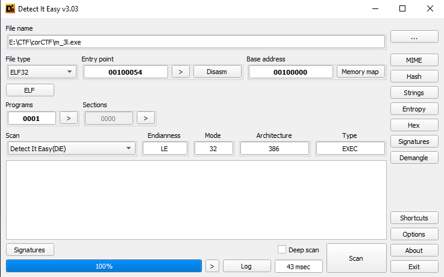

Thì mình phát hiện nó là file elf nhưng mà đuôi nó là exe:)))Phần mở rộng của file trên Linux không quyết định gì cả. Loader chỉ đọc 4 byte magic đầu tiên, `ELF`, nên đặt tên gì cũng không đổi được bản chất file.

Thử setup và chạy trên linux:

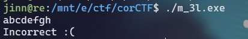

Và tất nhiên là nó không chạy trên windows như thường được, thử dùng IDA để load file:

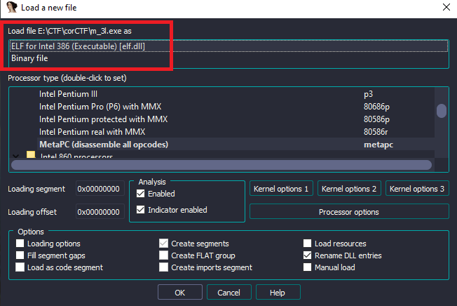

Nó dùng thư viện `elf.dll`, cái này mình cũng mới nghe và cũng không có nhiều kiến thức về nó lắm, mình cũng không thấy nhiều tài liệu về cái này và hiện tại chưa cần tới nên tạm thời bỏ qua.

Đoạn code ban đầu khá là ngắn:

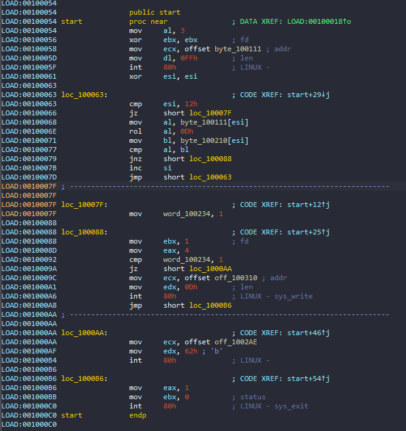

Cơ bản thì đoạn này nó sẽ lấy input của mình lưu vào `byte_100111` sau đó có 1 vòng lặp 18 lần dùng để lấy từng kí tự input của mình, sau đó rol 0xd bits và compare với byte có sẵn `byte_100210``rol` là xoay bit, khác với `shl` là dịch bit. Bit bị đẩy ra khỏi một đầu sẽ quay lại đầu kia nên không mất thông tin, và phép ngược lại đơn giản là `ror` cùng số bit.. Flow khá ngắn gọn và dễ hiểu.

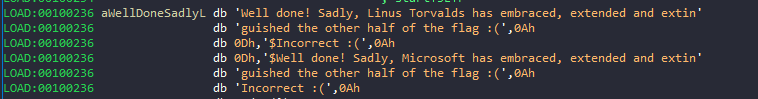

Sau khi kiểm tra thì nó có thể in ra `Incorect :(` hoặc là `$Well done! Sadly, Microsoft has embraced, extended and extinguished the other half of the flag :(`...

Về phần data có sẵn `(flag_encrypted)` thì nó sẽ trông như thế này:

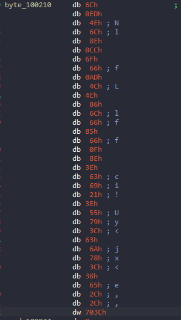

Tuy nhiên theo mình thấy thì nó là 36 byte chứ không phải là 18 bytes, tạm thời cứ lấy luôn.

Dùng `get_bytes(0x100210,36)` để lấy 36 bytes từ IDA:

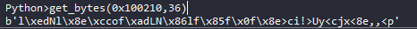

Với 18 bytes đầu thì có thể dễ dàng viết script để rev lại:

```python
from pwn import ror
data = b'l\xedNl\x8e\xccof\xadLN\x86lf\x85f\x0f\x8e>ci!>Uy<cjx<8e,,<p'

flag = ""
for i in data:
    flag+=chr(ror(i,13,8))
print(flag)
```

Và đây là kết quả:

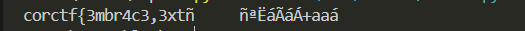

Có vẻ như khúc sau không đúng cho lắm, thử nhập chạy file và nhập 18 kí tự đầu flag:

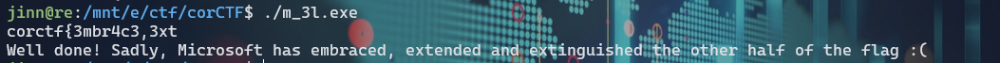

Yes, nó đúng rồi, nhưng phải có đoạn check kiểm tra khúc sau chứ?

Thử tìm lại trong IDA thì mình phát hiện đoạn này khá đáng nghi:

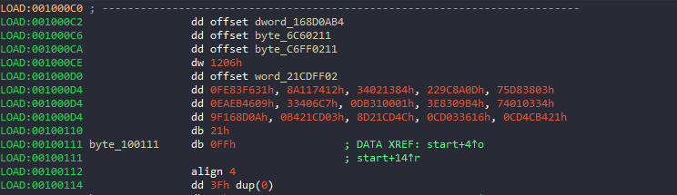

Bấm 'c' để chuyển data về code thì thu được đoạn code khá tương tự với đoạn trên:IDA chỉ disassemble những vùng mà nó lần được tới qua luồng thực thi. Byte nào không có ai nhảy tới thì nó để nguyên dạng data, dù đó vẫn là code chạy được. Gặp một vùng data lớn nằm giữa hàm thì nên thử bấm `c` trước khi kết luận.

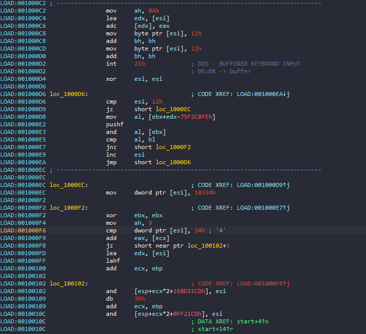

Flow của đoạn này cũng tương tự như đoạn trên tuy nhiên thay vì `rol` thì nó lại dùng `pushf` và and,.. Nhưng chung quy thì nó cũng chỉ là một toán tử nào đó, vì một lí do nào đó thì IDA không nhận diện được opcode nên nó đã không hiển thị đầy đủ.

Mình tới đây mình đã thử đoán xem cái này nó đã làm gì với 18 bytes cuối `>ci!>Uy<cjx<8e,,<p`.Và bởi vì nó là bài rev khá đơn giản nên không cần bruteforce gì cả, mình thấy nó cũng khá dễ đọc nên có thể là `+`,`-` hoặc `xor` thôi, còn về toán hạng thì mình vẫn sử dụng số cũ là `0xd`.

Vậy nên là lúc dùng phép xor với 0xd thì mình đã tìm được nữa flag cuối:

```python
last = b'>ci!>Uy<cjx<8e,,<p'
print(xor(last,0xd)) #3nd,3Xt1ngu15h!!1}
```
Kết hợp 2 phần lại ta được flag:

Flag: ```corctf{3mbr4c3,3xt3nd,3Xt1ngu15h!!1}```

## turbocrab - 57 solves/154 points

> **Description:**
🚀🚀 blazinglyer faster 🚀🚀
SHA256 hash of the flag: `dc136f8bf4ba6cc1b3d2f35708a0b2b55cb32c2deb03bdab1e45fcd1102ae00a`
**Attachment file:**
[turbocrab](https://static.cor.team/uploads/c151963ea732b096d482896731662b367e7c50b12fc1427d0461319d01bd9a04/turbocrab)

Về cơ bản thì nó chỉ là 1 file ELF bình thường, không packed và check flag:


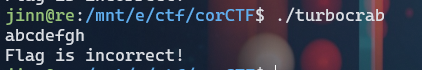

Load bằng IDA và static analysis thử:

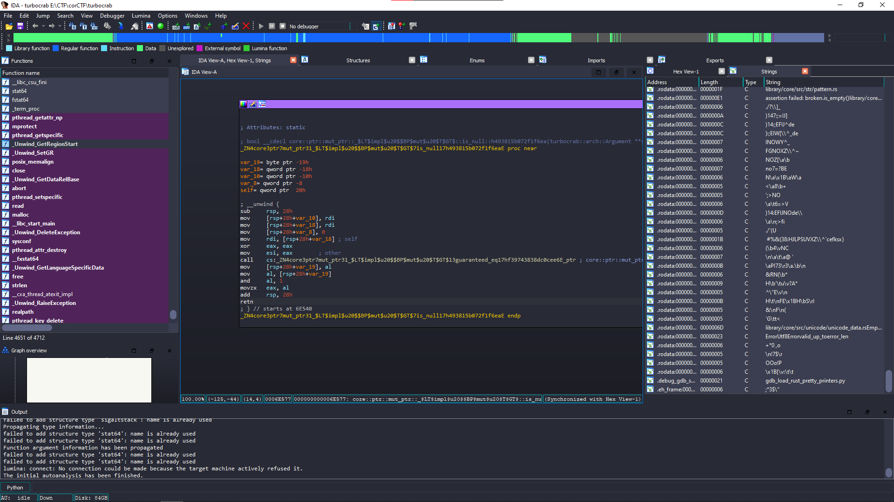

Vì là viết bằng `rust` nên là khá loằng ngoằngBinary Rust thường rất nhiều hàm vì generic được sinh riêng cho từng kiểu, cộng thêm bộ máy panic và format đi kèm. Hàm `main` thật hay nằm sâu sau vài lớp runtime, nên đi từ string ngược lên là nhanh nhất., vậy nên cách nhanh nhất là kiểm tra trong tab `string`(tìm đoạn text "Flag is incorrect!") để reference tới chổ gọi nó:

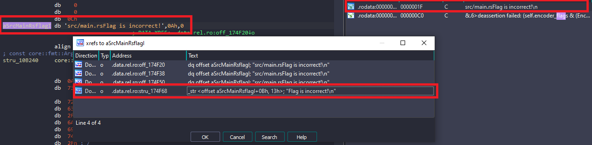

```rust
void __cdecl turbocrab::execute_shellcode::h6984ce5848b31780(__u8_ shellcode)
{
  __u8_ v1; // rdi
  __int64 v2; // r15
  __int64 v3; // rdx
  usize v4; // [rsp+8h] [rbp-190h]
  u8 *v5; // [rsp+10h] [rbp-188h]
  usize len; // [rsp+20h] [rbp-178h]
  __int64 count; // [rsp+28h] [rbp-170h]
  core::ffi::c_void *src; // [rsp+30h] [rbp-168h]
  core::ffi::c_void *dst; // [rsp+48h] [rbp-150h]
  _BYTE v10[29]; // [rsp+63h] [rbp-135h] BYREF
  alloc::vec::Vec<u8,alloc::alloc::Global> self; // [rsp+80h] [rbp-118h] BYREF
  u8 *v12; // [rsp+98h] [rbp-100h]
  __int64 v13; // [rsp+A0h] [rbp-F8h] BYREF
  core::fmt::Arguments v14; // [rsp+A8h] [rbp-F0h] BYREF
  core::fmt::Arguments v15; // [rsp+D8h] [rbp-C0h] BYREF
  __u8_ v16; // [rsp+108h] [rbp-90h]
  core::ffi::c_void *v17; // [rsp+118h] [rbp-80h]
  __int64 *v18; // [rsp+130h] [rbp-68h]
  __int64 v19; // [rsp+138h] [rbp-60h]
  __int64 v20; // [rsp+140h] [rbp-58h]
  __int64 v21; // [rsp+148h] [rbp-50h]
  core::ffi::c_void *v22; // [rsp+150h] [rbp-48h]
  core::ffi::c_void *v23; // [rsp+158h] [rbp-40h]
  __int64 v24; // [rsp+160h] [rbp-38h]
  __int64 v25; // [rsp+168h] [rbp-30h]
  u8 *v26; // [rsp+170h] [rbp-28h]
  __int64 v27; // [rsp+178h] [rbp-20h]
  u8 *v28; // [rsp+180h] [rbp-18h]

  v16 = shellcode;
  v25 = 0LL;
  dst = (core::ffi::c_void *)mmap(0LL, shellcode.length, 3, 33, -1, 0LL);
  v17 = dst;
  qmemcpy(v10, "R^CRIWJM<6.[5I.G`.C3G3CB5_V?P", sizeof(v10));
  alloc::vec::from_elem::hba0d51ad3cb1207d(&self, 0, 0x4000uLL);
  v26 = alloc::vec::Vec$LT$T$C$A$GT$::as_ptr::h0252951c7d91d004(&self);
  v27 = 49602LL;
  v28 = v26 + 49602;
  v12 = v26 + 49602;
  src = (core::ffi::c_void *)core::slice::_$LT$impl$u20$$u5b$T$u5d$$GT$::as_ptr::h869fdf96852d8c48(shellcode);
  count = core::slice::_$LT$impl$u20$$u5b$T$u5d$$GT$::len::h00af0a2d7a9c0658(shellcode);
  v22 = dst;
  v23 = src;
  v24 = count;
  core::intrinsics::copy::h46e3e522e297e890(src, dst, count);
  len = core::slice::_$LT$impl$u20$$u5b$T$u5d$$GT$::len::h00af0a2d7a9c0658(shellcode);
  mprotect(dst, len, 5);
  v13 = v20;
  v18 = &v13;
  v1.data_ptr = v10;
  v1.length = 29LL;
  v5 = core::slice::_$LT$impl$u20$$u5b$T$u5d$$GT$::as_ptr::h869fdf96852d8c48(v1);
  v1.data_ptr = v10;
  v1.length = 29LL;
  v4 = core::slice::_$LT$impl$u20$$u5b$T$u5d$$GT$::len::h00af0a2d7a9c0658(v1);
  v2 = (__int64)v12;
  v13 = ((__int64 (__fastcall *)(_BYTE *, __int64, __int64, core::ffi::c_void *, u8 *, usize))dst)(
          v10,
          29LL,
          v3,
          dst,
          v5,
          v4);
  v12 = (u8 *)v2;
  v19 = v13;
  v21 = v13;
  if ( v13 == 1 )
    core::fmt::Arguments::new_v1::h610d7aa66ccb1a0c(
      &v14,
      (___str_)__PAIR128__(1LL, &stru_174F78),
      (__core::fmt::ArgumentV1_)(unsigned __int64)&stru_10B240);
  else
    core::fmt::Arguments::new_v1::h610d7aa66ccb1a0c(
      &v15,
      (___str_)__PAIR128__(1LL, &stru_174F68),
      (__core::fmt::ArgumentV1_)(unsigned __int64)&stru_10B240);
  std::io::stdio::_print::hccc6c4adfff98fee();
  core::ptr::drop_in_place$LT$alloc..vec..Vec$LT$u8$GT$$GT$::h34608ea8b4b90afb(&self);
}
```

Tới đây có 1 điểm đáng chú ý là 

```qmemcpy(v10, "R^CRIWJM<6.[5I.G`.C3G3CB5_V?P", sizeof(v10));``` 

nhìn khá giống với đoạn flag encrypted vậy.

Tiếp theo là shellcode được sử dụng khá nhiều

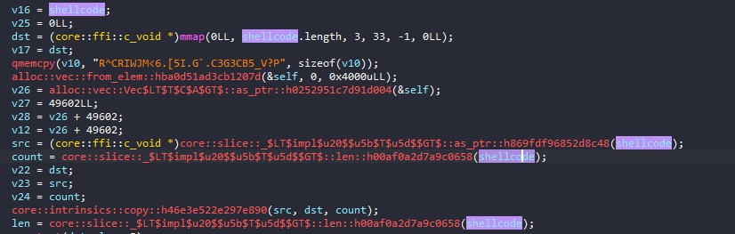

Và ngoài ra còn biến `v13` dùng để rẽ nhánh chương trình Xuất ra Correct! hay Incorrect!:

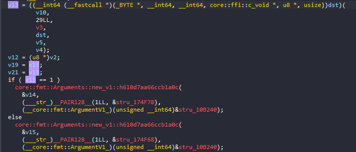

Và nó được trả về sau khi gọi "dst".

Tới đây rất có thể dst này sẽ chứa shellcode là là luồn thực thi chính của chương trình, setup ngay máy ảo, đặt breakpoint và debug file thôi!..

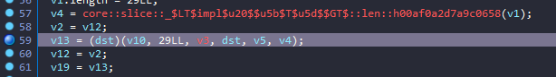

Sau khi tới breakpoint, nhấn `f7` để step into
 xem bên trong "dst" cũng như là shellcode có gì:
 
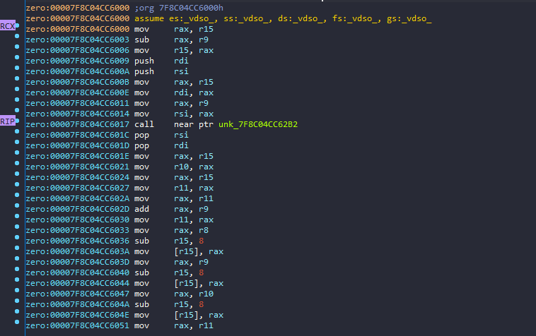

Sau khi chạy tới `call    near ptr unk_7F8C04CC62B2`, nó bắt mình nhập input, thử nhập "abcdefgh" cho dễ quan sát

Tới đây có thể thấy được đoạn flag encrypted cũng được load vào, và cả input của mình nữa:

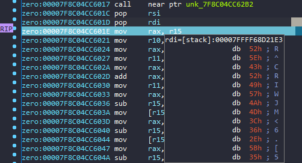

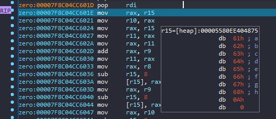

Tiếp tục trace và debug, mình biết được flow như sau: Nó lấy từng kí tự của input mình `c`, sau đó:
`c^0x13 - 0x1e` và compare với lại từng kí tự của flag encrypted.

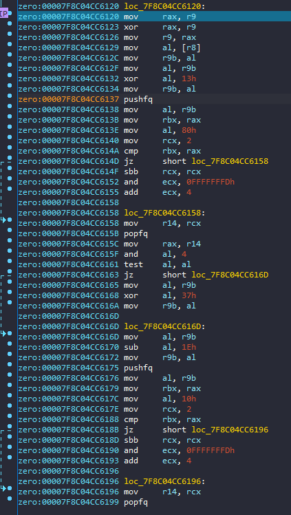

Tới đây thì mình mừng thầm, chỉ cần viết scipt rev lại là ra. Sau đó mình đã dùng python và code thử:

```python
fl = b"R^CRIWJM<6.[5I.G`.C3G3CB5_V?P"
s = ""
j = 0
for i in fl:
    s+=chr((i+0x1E)^0x13)
print(s) #corctf{xIG_j@t_vm_rBvBrs@ngN}
```

Có lẽ đã gần đúng nhưng nhìn không giống flag cho lắm. Tới đây mình đã thử submit và tất nhiên nó sai.

Sau đó mình đã thử rev kĩ lạ chương trình thì thấy một vài chi tiết bị thiếu nhưng khi thử nhập flag vào chương trình thì nó vẫn đúng => nó không dùng tới những khúc đó, phần rev file coi như xong.

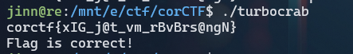

Tuy nhiên vẫn còn 1 thiếu sót là đề cho chúng ta sha256 flag, vậy là có thứ để kiểm chứng, còn về flag thì có thể dễ dàng nhìn thấy một số kí tự nhìn khá là lạ, một số còn lại hầu như chắc chắn đúng:

```corctf{xIG_j@t_vm_rBvBrs@ngN}```

Dựa theo flag của bài trước thì có hướng suy nghĩ là có thể những kí tự uppercase và symbol coi như sai, còn từ cuối trong flag có thể dễ đoán là reversing

=> B là chữ i, hoặc cũng có thể là số 1, hoặc là I, thôi cứ đưa vào cho chắc ăn, tương tự với @.

Còn I,G,N tạm thời chưa biết nên là cứ bruteforce, mình đã viết thử script để brute:

```python
from pwn import *
fl = b"R^CRIWJM<6.[5I.G`.C3G3CB5_V?P"
s = ""
j = 0
for i in fl:
    s+=chr((i+0x1E)^0x13)
print(s)
hashflag = "dc136f8bf4ba6cc1b3d2f35708a0b2b55cb32c2deb03bdab1e45fcd1102ae00a"

xflag = "corctf{xIG_j@t_vm_rBvBrs@ngN}"
for I in range(0xf7):
    for G in range(0xf7):
        for a in ['1','i','I']:
            for B in ['3','e','E',]:
                for N in range(0xf7):
                    temp = xflag.replace('I',chr(I)).replace('G',chr(G)).replace('@',a).replace('B',B).replace('N',chr(N))
                    hashed_string = hashlib.sha256(temp.encode('utf-8')).hexdigest()
                    if hashed_string==hashflag:
                        print(temp)
                        exit(0)
            #corctf{x86_j1t_vm_r3v3rs1ng?}
```

Flag: ```corctf{x86_j1t_vm_r3v3rs1ng?}```

## msfrob - 44 solves/170 points

> **Description:**
6b0a444558474b460a5a58454d584b470a5f5943444d0a444558474b460a4d464348490a4c5f44495e4345445904
**Attachment file:**
[msfrob](https://static.cor.team/uploads/48fcb317ca7280353ab06e4867f510740046ad9e65eaa9a3fc5e97095fbbf9d7/msfrob)

Thử kiểm tra bằng DiE:

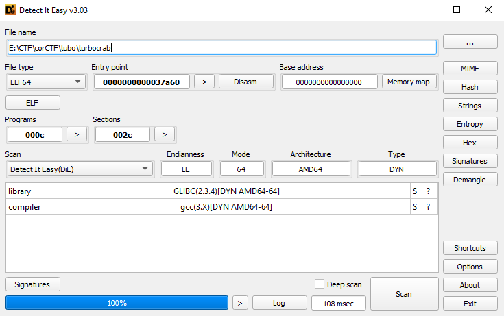

Vì ban đầu chạy không được nên load bằng IDA để phân tích thử:

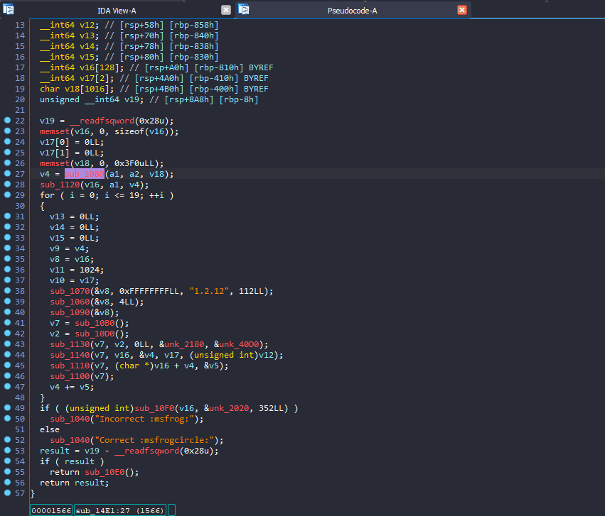

Thì ban đầu flow khá dễ hiểu nó sẽ nhận input thông qua agrv và xử lí qua vòng lặp 20 lần, tuy nhiên, các hàm ở vòng lặp này không có tên và cũng không có code, nên mình đoán nó là lấy từ thư viện ra mình. Vậy là trước khi chạy thì mình không biết gì về nó

Đối với mình thì bài này là bài khiến mình mất thời gian nhất =))) Không phải vì bài khó mà là fix cái ubuntu của mình vì khi chạy file nó sẽ như thế này:

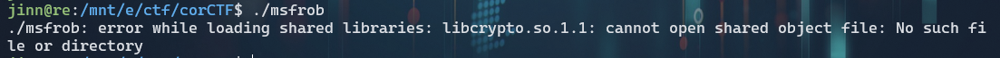

Hoặc là như thế này:

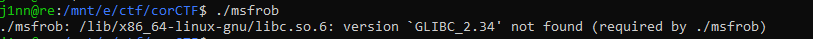

Thì 2 hình ảnh là 2 phiên bản hệ điều hành khác nhau (`22.04` và `18.04`, mình cũng đã thử với `20.04`nhưng cũng tương tự), mình xài WSL nên cũng hay có lỗi vặt. Mình đã thử tìm cách fix trên mạng rất nhiều nhưng nó rất nhức đầu và làm theo cũng không fix được.

Tới đây còn cách duy nhất là mình cài lại 1 ubuntu hoàn toàn mới, rồi từ đó biết mình thiếu cái gì thì cài cái đó.

Cụ thể thì sau khi cài [Ubuntu](https://ubuntu.com/download/desktop), và nó báo mình thiếu thư viện `libcrypto.so.1.1`, qua 1 thời gian dài tìm hiểu thì mình tìm được cách fix là cài lại toàn bộ openssl theo phiên bản 1.1 như [link này](https://fedingo.com/how-to-install-openssl-in-ubuntu/).

Sau khi fix xong, chạy fix thì nó sẽ trông như thế này:

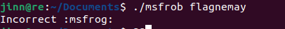

Nice, giờ thì setup debug để xem nó làm gì thôi.

Trước khi vào vòng lặp thì nó đi qua 2 hàm, nhưng có vẻ 2 hàm này không quan trọng lắm.

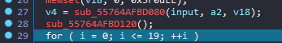

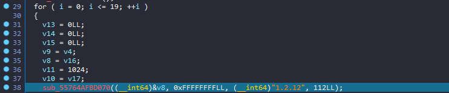

Tới hàm đầu tiên, mình thử click đúp và trace xem nó là gì thì được kết quả như này:

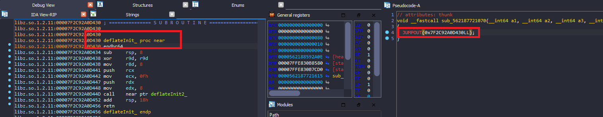

Thì nó là deflate init, search thử `deflate` trên mạng thì mình biết được nó là compress nhưng thay vì trên file (zip,tar) thì là trên data (compress data).

Tiếp tục làm tương tự với các hàm còn lại, mình đã rename lại gần như toàn bộ và được đoạn code như sau:

```c
__int64 __fastcall sub_55A613A3B4E1(__int64 input, __int64 a2)
{
  __int64 aes; // rax
  __int64 result; // rax
  int len_out; // [rsp+1Ch] [rbp-894h] BYREF
  int blocksize; // [rsp+20h] [rbp-890h] BYREF
  int i; // [rsp+24h] [rbp-88Ch]
  __int64 CipherCTX; // [rsp+28h] [rbp-888h]
  __int64 *v8; // [rsp+30h] [rbp-880h] BYREF
  int v9; // [rsp+38h] [rbp-878h]
  __int64 *v10; // [rsp+48h] [rbp-868h]
  int v11; // [rsp+50h] [rbp-860h]
  __int64 len_in; // [rsp+58h] [rbp-858h]
  __int64 v13; // [rsp+70h] [rbp-840h]
  __int64 v14; // [rsp+78h] [rbp-838h]
  __int64 v15; // [rsp+80h] [rbp-830h]
  __int64 buf_out[128]; // [rsp+A0h] [rbp-810h] BYREF
  __int64 buf_in[2]; // [rsp+4A0h] [rbp-410h] BYREF
  char v18[1016]; // [rsp+4B0h] [rbp-400h] BYREF
  unsigned __int64 v19; // [rsp+8A8h] [rbp-8h]

  v19 = __readfsqword(0x28u);
  memset(buf_out, 0, sizeof(buf_out));
  buf_in[0] = 0LL;
  buf_in[1] = 0LL;
  memset(v18, 0, 0x3F0uLL);
  len_out = sub_55A613A3B080(input, a2, v18);
  sub_55A613A3B120();
  for ( i = 0; i <= 19; ++i )
  {
    v13 = 0LL;
    v14 = 0LL;
    v15 = 0LL;
    v9 = len_out;
    v8 = buf_out;
    v11 = 1024;
    v10 = buf_in;
    Deflate_init((__int64)&v8, 0xFFFFFFFFLL, (__int64)"1.2.12", 112LL);
    Deflate(&v8, 4LL);
    Deflate_end(&v8);
    CipherCTX = CIPHER_CTX_new();
    aes = Aes_256_cbc();
    Encrypt_init(CipherCTX, aes, 0LL, (__int64)&key, (__int64)&iv);

    EncryptUpdate(CipherCTX, buf_out, &len_out, buf_in, (unsigned int)len_in);
    EncryptFinal_ex(CipherCTX, (char *)buf_out + len_out, &blocksize);
    CIPHER_CTX_free(CipherCTX);
    len_out += blocksize;
  }
  if ( (unsigned int)sub_55A613A3B0F0(buf_out, &byte, 352LL) )
    sub_55A613A3B040("Incorrect :msfrog:");
  else
    sub_55A613A3B040("Correct :msfrogcircle:");
  result = v19 - __readfsqword(0x28u);
  if ( result )
    return sub_55A613A3B0E0();
  return result;
}
```

Giải thích: Sau nhiều lần debug thì mình biết được `input` của mình sẽ được deflate (compress) và 16bytes đầu của đoạn compressed_data sẽ được encrypt bằng AES_CBC (với key,iv biết trước, `EncryptUpdate()`) và hàm `Encrypt_final_ex()` sẽ encrypt đoạn còn lại của compressed_data và lưu vào ngay sau đoạn đầu tiên.

Như vậy với compressed_data có `16 < lenght < 32` thì out put được ghi trên buf_out sẽ có lenght bằng 32, ở vòng lặp tiếp theo, nó sẽ lấy 32 byte này compress và lặp lại các bước trong vòng lặp, buf_out lần này sẽ có length là 48... cho tới khi length = 352 (lặp đủ 20 lần) và thoát khỏi vòng lặp, như vậy nó sẽ được mô phỏng như sau:

```python

from Crypto.Cipher import AES
from Crypto.Util.Padding import pad, unpad
import zlib

byte = b'L\xef4\xfa\xd1%EK\xe7\xad\x99\xc4\xb1\xd7\xf6,[\xf3\x13\xbf\xcc\x03\x1d\x16\x81\xdbP8\xa8\xb6\xdd \x90*n\xa2\xef\xfek\x8f\xdb\x80opt\xeb}6\xe4\xdc\x87\xf3 \xeb\xe5\x0f>(5X\xad\x07\xd2=\xd8]A5^OA\x9b\x91\x85\xe1\\\x18\xb8\xf6Z\xdf\x0851\x04\xd2\xe0Dd\xfc\x06\xc6\xd6[\x98 O\x1c\x1e\xb8 \xd5\x9e\xda\x81\xd66[U`\xa8,\xf2\xdaW\x92\xc9\xe0\x14\xf0CK.\x11\xd3pg\xa8U\x08}\xc7vOw\xe8\xbe\xf3\x19\x04\x84\xb2\xa0 \xdcL\xd2\xc8\x94\x17\x9buOx55\xe6bt-\x0c\xa84\xf1\x90\xa9\xfdY\xd4\xf8$\xb9;\x94\xbdy\xc7x\xb9V\xc1\xe3\xb6.\x17:2\xf9NG\xf9\t\xc4\xe8\xfaISj\x0b\xb96\x0b+\\\xc9\xf39c\xb3\xd1\xacpl\xf1FB\xbc\x0b\x91:d\x95w\xec$\x01d\xd2\x98\xe1\xbf8\x17\xd4\xd09\x16\x13\x1d4\xa4\x1a\xfa3_\x88!\xd5\\N\xbf3\x9d\xe1*\xccG\x15\x03\x9d\xa6\x856-m1\x01=\x95\x08\xdcr\xd3\xf6\xf7e\xb7\xc0\x95]\xf4\xc9\xa7\xfa\xdc\xefQ6\xc1\x1d\xe6\x08\xeb\x8a\xec]\xc9Z=\xd3\x9a\xa6\xad(\x99$\x88\x92@-\xab\x12Y\xf8\x84G\xb2\xb9H\xf7\x8f\x1e2d\xba$\xd2=\xf3\xc4\x84\xbd\xd2\xe1\x01\x07\xa1v\x18E\x1eT\x91\x93\x11nAT~@\xe7\x02'
key = b'\xd4\xf5\xd9g\x15/w\x7fl|Fs\xf6\xf0\x92\xf0wP;0\x0c\x87\x8a\r\x9c\x1dr\xa2eF\xc8\xdc'

# cipher explain
inp = b'corctf{abcdefgh}'
buf_out = inp
for i in range(20):
    text = zlib.compress(buf_out)
    cipher = AES.new(key, AES.MODE_CBC,iv= (b'\x00'*16))
    first = cipher.encrypt(text[:16])
    final = cipher.encrypt(pad(text[16:],16))
    buf_out = first + final 
print(buf_out)

```

Như vậy, có thể dễ dàng rev algo này lại như sau và lấy flag:

```python
from Crypto.Cipher import AES
from Crypto.Util.Padding import pad, unpad
import zlib

byte = b'L\xef4\xfa\xd1%EK\xe7\xad\x99\xc4\xb1\xd7\xf6,[\xf3\x13\xbf\xcc\x03\x1d\x16\x81\xdbP8\xa8\xb6\xdd \x90*n\xa2\xef\xfek\x8f\xdb\x80opt\xeb}6\xe4\xdc\x87\xf3 \xeb\xe5\x0f>(5X\xad\x07\xd2=\xd8]A5^OA\x9b\x91\x85\xe1\\\x18\xb8\xf6Z\xdf\x0851\x04\xd2\xe0Dd\xfc\x06\xc6\xd6[\x98 O\x1c\x1e\xb8 \xd5\x9e\xda\x81\xd66[U`\xa8,\xf2\xdaW\x92\xc9\xe0\x14\xf0CK.\x11\xd3pg\xa8U\x08}\xc7vOw\xe8\xbe\xf3\x19\x04\x84\xb2\xa0 \xdcL\xd2\xc8\x94\x17\x9buOx55\xe6bt-\x0c\xa84\xf1\x90\xa9\xfdY\xd4\xf8$\xb9;\x94\xbdy\xc7x\xb9V\xc1\xe3\xb6.\x17:2\xf9NG\xf9\t\xc4\xe8\xfaISj\x0b\xb96\x0b+\\\xc9\xf39c\xb3\xd1\xacpl\xf1FB\xbc\x0b\x91:d\x95w\xec$\x01d\xd2\x98\xe1\xbf8\x17\xd4\xd09\x16\x13\x1d4\xa4\x1a\xfa3_\x88!\xd5\\N\xbf3\x9d\xe1*\xccG\x15\x03\x9d\xa6\x856-m1\x01=\x95\x08\xdcr\xd3\xf6\xf7e\xb7\xc0\x95]\xf4\xc9\xa7\xfa\xdc\xefQ6\xc1\x1d\xe6\x08\xeb\x8a\xec]\xc9Z=\xd3\x9a\xa6\xad(\x99$\x88\x92@-\xab\x12Y\xf8\x84G\xb2\xb9H\xf7\x8f\x1e2d\xba$\xd2=\xf3\xc4\x84\xbd\xd2\xe1\x01\x07\xa1v\x18E\x1eT\x91\x93\x11nAT~@\xe7\x02'
key = b'\xd4\xf5\xd9g\x15/w\x7fl|Fs\xf6\xf0\x92\xf0wP;0\x0c\x87\x8a\r\x9c\x1dr\xa2eF\xc8\xdc'

# cipher explain
inp = b'corctf{abcdefgh}'
buf_out = inp
for i in range(20):
    text = zlib.compress(buf_out)
    cipher = AES.new(key, AES.MODE_CBC,iv= (b'\x00'*16))
    first = cipher.encrypt(text[:16])
    final = cipher.encrypt(pad(text[16:],16))
    buf_out = first + final 
print(buf_out)
#rev
p1 = byte[:16]
p2 = byte[16:]
# first = p1
# final = p2
for i in range(20):
    cipher = AES.new(key, AES.MODE_CBC,iv= (b'\x00'*16))
    first = cipher.decrypt(p1)
    final = cipher.decrypt(p2)
    comp_text = first+final
    
    decomp_text = zlib.decompress(comp_text)
    p1 = decomp_text[:16]
    p2 = decomp_text[16:]
    print(decomp_text)
```
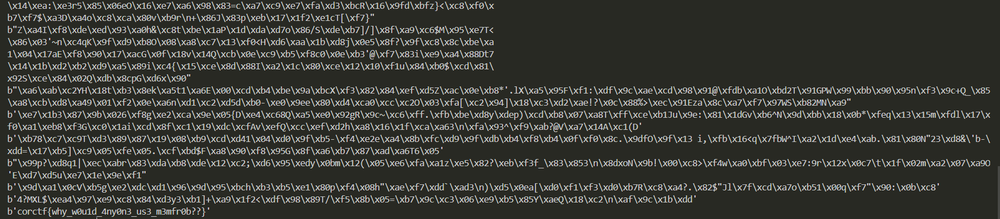

Flag: ```corctf{why_w0u1d_4ny0n3_us3_m3mfr0b??}```


## hackermans dungeon - 8 solves / 362 points

> **Description:**
Hackerman told us he cannot be hacked. Can you hack hackerman?
**Attachment file:**
[hackermans_dungeon.exe](https://static.cor.team/uploads/42df4d989f27b7bfbd1c66dcc329644bca70a48c717fdb6e65b3ca53c228fd4f/hackermans_dungeon.exe)

Riêng bài này thì mình làm ra sau khi giải vừa kết thúc vì mình biết mình bị bjp ạ=)) nên là sẵn viết luôn để đây cho mọi người có nhu cầu tham khảo ạ.

Mở bằng IDA để phân tích thì có 1 điều là nó không hiện các tên hàm và không biết nó làm gì, tuy nhiên mình có sử dụng plug-in `findcrypt` và debug nhiều lần thì đây là thứ mà mình có được:

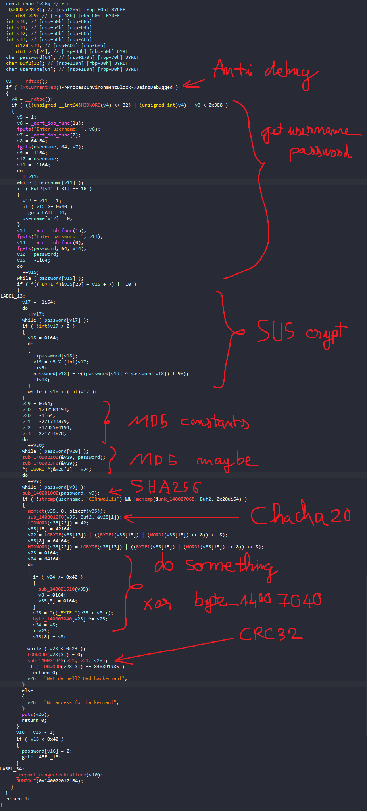

Và thêm 1 vài điều là mình biết trước SHA256 lúc mà nó compare với Buf2. Còn username thì không làm gì nhiều

Ban đầu với flow này, mình đã thử 1 cách đó là tại lúc compare sha256 với buf2, mình đã patch buf2 = sha256 đề cho và pass qua được đoạn check đó, tuy nhiên, debug một hồi mình vẫn không thấy flag đâu.

Thử lại nhiều lần và tìm hiểu kĩ các thuật toán trên thì mình biết được nó dùng các encryption như trên nhưng cũng không giúp ít gì nhiều, mình chỉ biết được là, sau khi làm gì đó với password thì nó dùng đoạn đó để xor với `byte_1400740`(length  = 35) va rất có thể đây chính là flag. Nhưng tại sau vẫn không đúng nhỉ?

Sau giải thì mình có thử tham khảo mấy anh thì cách duy nhất là crack cái sha256 đó=))) mà ban đầu minh quên mất một điều là, đó chỉ là password chứ không phải flag, còn passwordlist thì trên mạng đầy =)) sax

Thôi thì ngậm ngùi viết script crack pass thôi:

[rockyou.txt](https://github.com/brannondorsey/naive-hashcat/releases/download/data/rockyou.txt)

```python

from hashlib import sha256
from itertools import count
from pwn import *
from Crypto.Cipher import Salsa20,ChaCha20

from pwn import *
pwhash = b"\x9c\x00\xf1\xaccb\x16\xe24/d\xae;\x82\xe3\xc0'I\xa6\x9c5\xdf\x8c\x03UMU\xc1\x01\x86\x9dG"
# username = b'CORnwallis'
#[patch_byte(0x0B010D3F7F0+i,d) for i,d in zip(range(35),b"\x9c\x00\xf1\xaccb\x16\xe24/d\xae;\x82\xe3\xc0'I\xa6\x9c5\xdf\x8c\x03UMU\xc1\x01\x86\x9dG")]
# byte = b':\xab5\x81\xd5_V\xb0\xce\xe5\xf5\x16M\xb3\x8d-x#\xd0\x1c\x00\xc1\xec\x07\x19\x022\x91J\xb4c\xcc\xed\xd9\x08'

def SUScrypt(password):
    password = [i for i in password]
    lenpw = len(password)
    j = 0
    k = 1
    while j<lenpw:
        password[j]+=1
        password[j] = (~((password[k % lenpw] ^ password[j]) + 98))&0xff;
        k+=1
        j+=1
    return b"".join([i.to_bytes(1,'big') for i in password])
f = open('rockyou.txt','rb').readlines()
for pw in f:
    # print(sha256(SUScrypt(pw[:-1])).digest())
    if sha256(SUScrypt(pw[:-1])).digest()==pwhash:
        print(pw)
        break
```
À mà trong lúc kiểm tra hàm SUScrypt có hoạt động đúng hay không thì mình đã thử debug nhiều lần, mà mình thấy là mặc dù có đoạn md5 nhưng nó không ảnh hưởng đến cái đoạn Buf2 =)), vậy là do nó tác động tới biến khác mà khi mình patch buf2 vẫn không ra flag. Vậy nên trong lúc viết script mình không dùng md5

Chạy xíu thì có được password: `canthackmehackers`

Nhập pass vào, đặt breakpoint, bypass anti-debug và check thử `byte_1400740`:

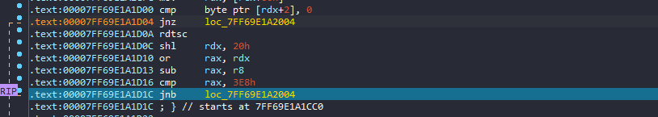

Để bypass thì tại jnz chỉnh cho ZeroFlag = 1, còn chổ jnb thì chỉnh CarryFlag = 1 là được

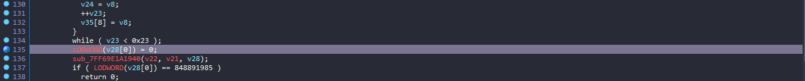

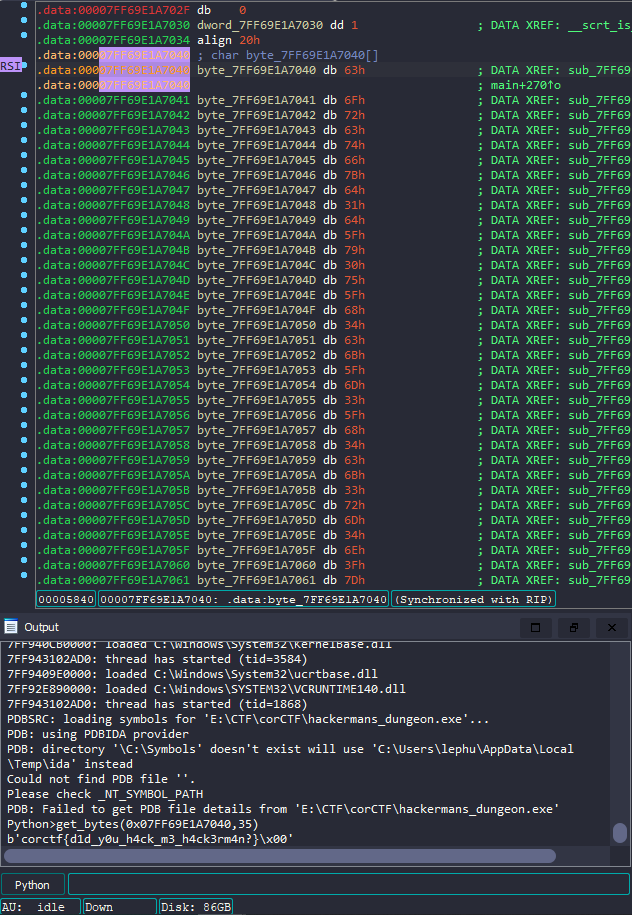

Flag: `corctf{d1d_y0u_h4ck_m3_h4ck3rm4n?}`

Done!