Dây là write-up toàn bộ mảng reverse của picoCTF, và cũng là bài mình viết cho người mới bắt đầu.

Mục lục:

1. [file-run1](https://github.com/lephuduc/Write-up-PicoCTF2022#file-run1)
2. [file-run2](https://github.com/lephuduc/Write-up-PicoCTF2022#file-run2)
3. [GDB Test Drive](https://github.com/lephuduc/Write-up-PicoCTF2022#gdb-test-drive)
4. [patchme.py](https://github.com/lephuduc/Write-up-PicoCTF2022#patchmepy)
5. [Safe Opener](https://github.com/lephuduc/Write-up-PicoCTF2022#safe-opener)
6. [unpackme.py](https://github.com/lephuduc/Write-up-PicoCTF2022#unpackmepy)
7. [bloat.py](https://github.com/lephuduc/Write-up-PicoCTF2022#bloatpy)
8. [Fresh Java](https://github.com/lephuduc/Write-up-PicoCTF2022#fresh-java)
9. [Bbbbloat](https://github.com/lephuduc/Write-up-PicoCTF2022#bbbbloat)
10. [Unpackme](https://github.com/lephuduc/Write-up-PicoCTF2022#unpackme)
11. [Keygenme](https://github.com/lephuduc/Write-up-PicoCTF2022#keygenme)
12. [Wizardlike](https://github.com/lephuduc/Write-up-PicoCTF2022#wizardlike)

**Trước hết bạn cần có các tools cần thiết để dùng reverse:**
- IDA Pro
- Detect it easy (DIE)
- Máy ảo (Ubuntu 20.04 hoặc Kali Linux)

## file-run1

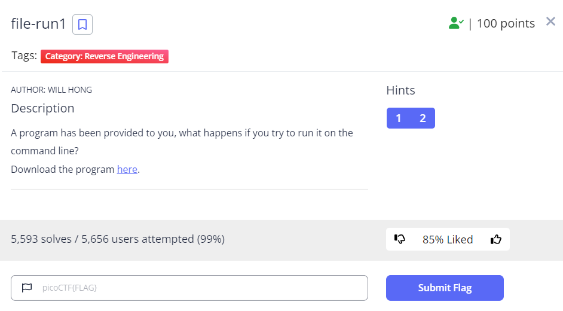

Đây chỉ là bài warm-up nên sẽ khá là dễ nên ta chỉ cần dùng các lệnh mà `hints` có:

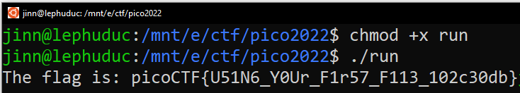

GIải thích:

- `chmod +x <file>`: cấp quyền chạy cho file
- `./<file>`: chạy file thực thi trên linux

## file-run2

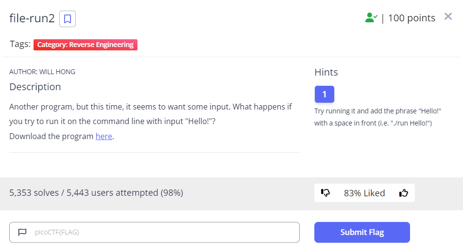

Ở bài này, ta không thể chạy như bài trước nữa

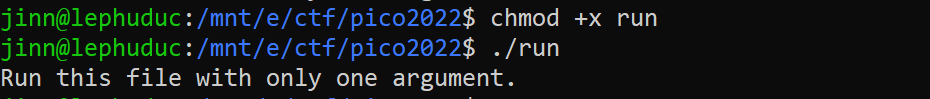

thay vào đó ta cần truyền cho file một `parameter` là “Hello!” (theo như đề bài gợi ý), cú pháp như sau:

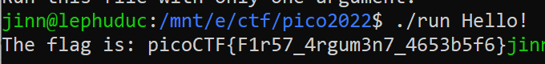

Giải thích:

Cú pháp truyền **parameter** khi chạy chương trình: 

`./<file> <parameter1> <parameter2> ...`

trong đó ta có hàm `main` như sau:

```python
int main(int argc, char *argv[]) {
//something
}
```

Các parameter này sẽ lưu theo thứ tự vào `argv[1] argv[2]... ...` , mặc định `argv[0]` sẽ là file chương trình. Các parameter sẽ được lưu vào argv[] dưới kiểu chuỗi và được sử dụng vào các mục đích khác nhau tùy người viết chương trình. 

## **GDB Test Drive**

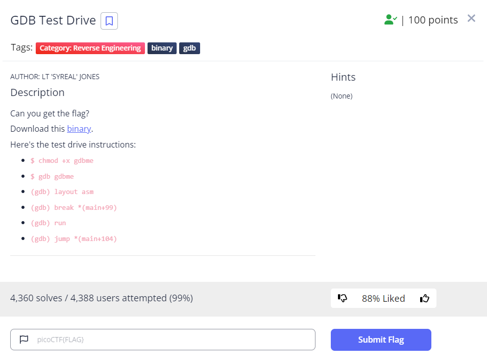

Bài này ta chỉ cần dùng các câu lệnh có sẵn của đề, nhưng sau đây tôi sẽ kèm theo các lời giải thích

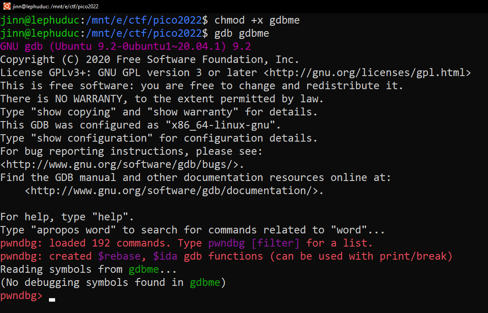

Tại đây, đối với những bạn chưa cài `gdb` và bị báo lỗi thì dùng lệnh`sudo apt-get install gdb` linux để cho máy tự cài gdb, sau đó chạy lại các lệnh trên.

> BTW, [pwndbg](https://github.com/pwndbg/pwndbg#:~:text=Pwndbg%20is%20a%20Python%20module,to%20fill%20some%20these%20gaps.) cũng là một tools quan trọng nếu bạn muốn chơi reverse tốt, sử dụng kết hợp cùng với IDA
> 

Dùng `layout asm` ta được màn hình như sau:

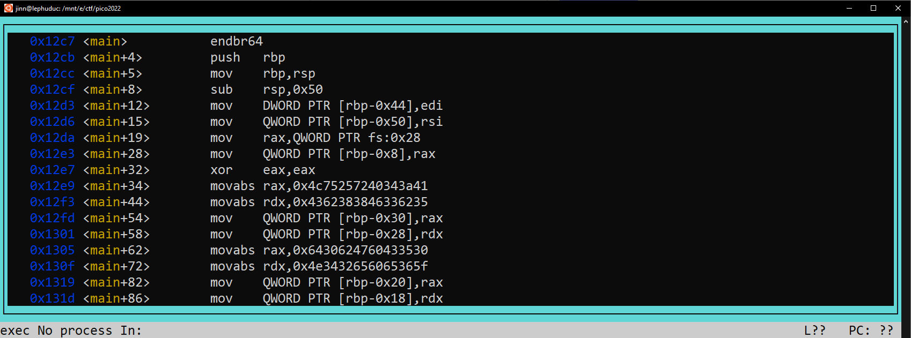

`break *(main+99):` đặt breakpoint tại vị trí (`main` +99)

Sau khi dùng `run`: ta được màn hình như sau:

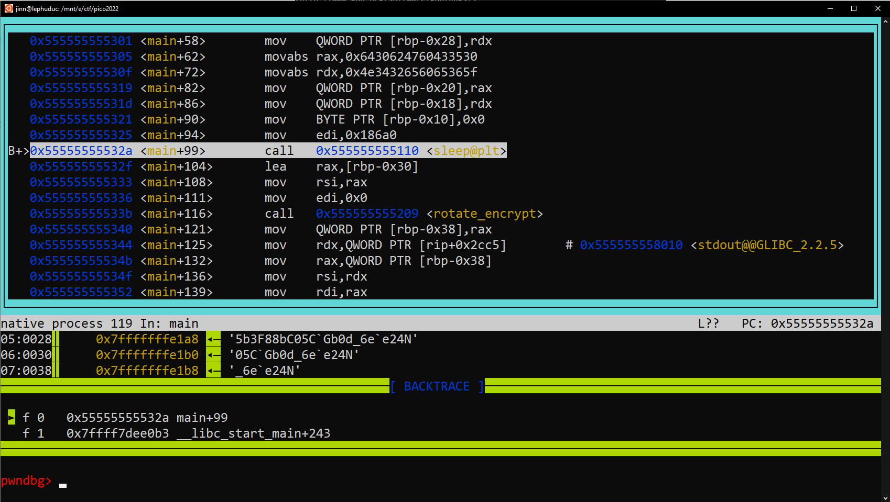

Tại đây, để bỏ qua lời gọi hàm `sleep` thì ta dùng `jump *(main+104)` để nhảy trực tiếp đến câu lệnh tiếp theo`jump` chỉ đổi thanh ghi con trỏ lệnh của tiến trình đang chạy, file trên đĩa không hề bị sửa. Chạy lại bình thường thì hàm `sleep` vẫn ở đó., từ đây, chương trình sẽ có thể in ra flag.

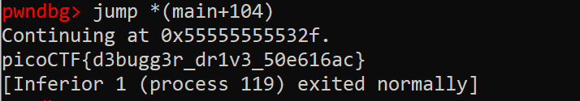

## patchme.py

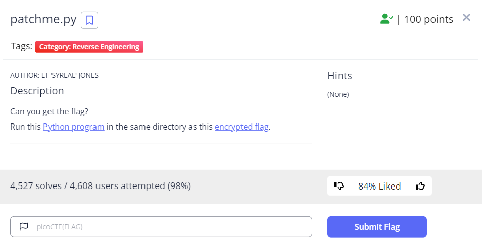

Ở bài này ta tải 2 file về và đặt chung vào cùng 1 folder, và bạn cần cài thêm [python](http://python.org) phiên bản 3. trở lên

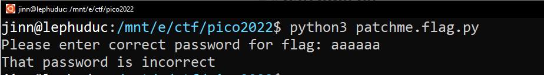

Chạy file, ta thấy file kiểm tra password ta nhập vào, mở file bằng [VScode](https://code.visualstudio.com/):

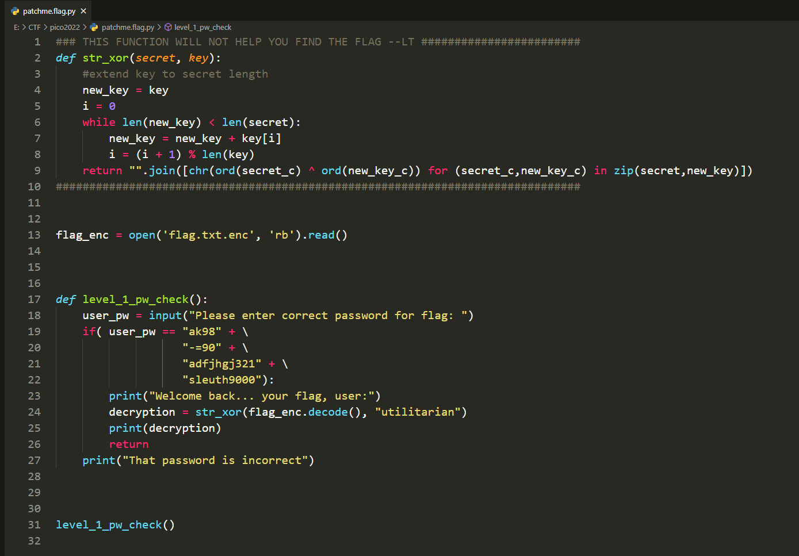

Ta không cần phải rev hàm str_xor, chương trình này khi ta nhập đúng `password` , flag sẽ tự động được giải mã và in ra màn hình.

Chương trình sẽ lấy input của chúng ta và so sánh với chuỗi khác:

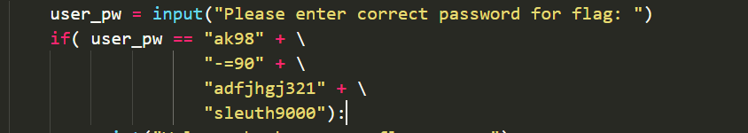

ta có password: `ak98-=90adfjhgj321sleuth9000`

Nhập password, ta được flag:

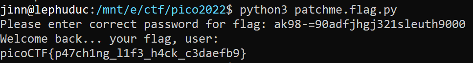

## Safe Opener

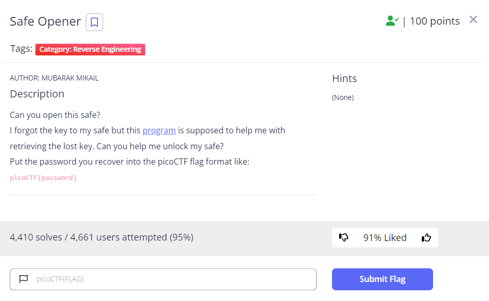

Tải file về ta thấy đó là 1 file java, nhưng trong bài này ta không cần phải chạy file

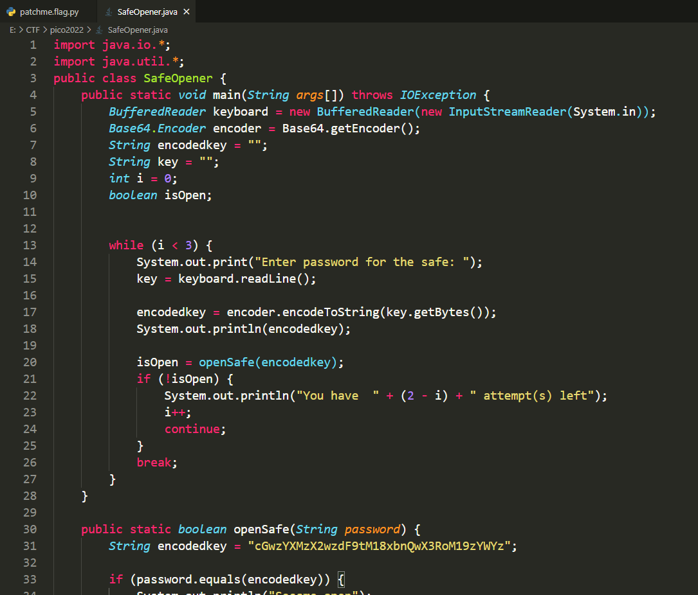

Đọc code ta thấy đề sẽ lấy `password` từ input của người dùng sau đó mã hóa và so sánh với chuỗi đã được mã hóa sẵn của chương trình.

Để ý ta sẽ thấy chương trình dùng base64 để encodeBase64 là mã hoá chứ không phải mật mã. Nó chỉ đổi dữ liệu nhị phân sang 64 kí tự in được, không cần khoá, ai cũng giải ngược được. Thấy chuỗi toàn chữ số và kết thúc bằng `=` thì nên thử decode trước tiên.

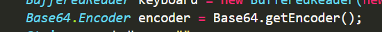

Đồng nghĩa với ta sẽ có đoạn mã base64 của password:

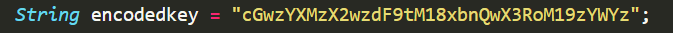

Decode base64 của đoạn này ta được password: 

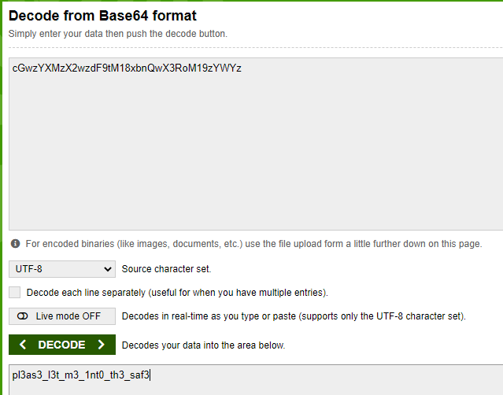

Flag: `picoCTF{pl3as3_l3t_m3_1nt0_th3_saf}`

## unpackme.py

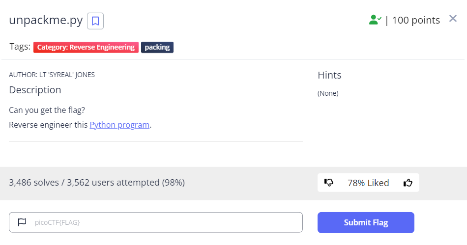

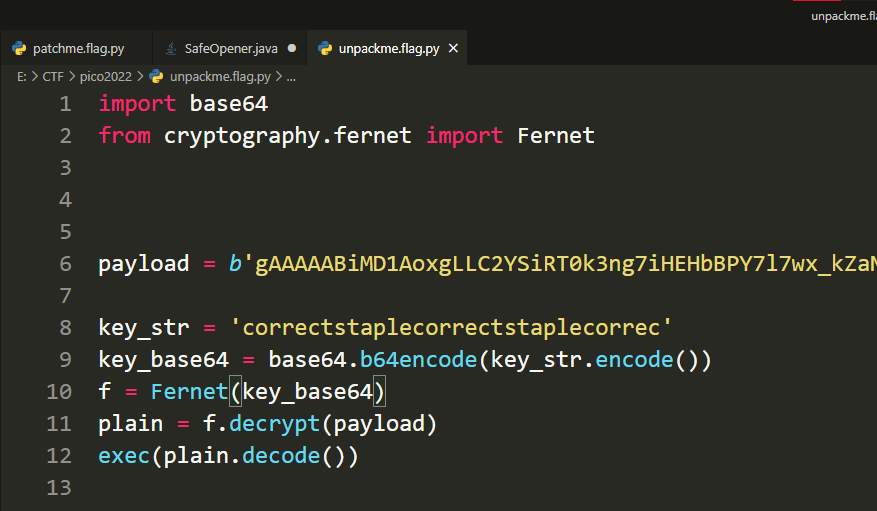

Mở file lên ta thấy chương trình dịch mã đoạn text dài trên và dùng hàm `exec()` để thực thi đoạn mã đó, thay vì thực thi, ta thử `print` nó ra:

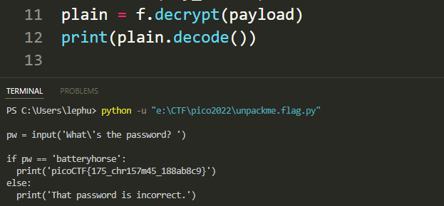

Và thay vì chạy, ta có ngay flag của bài!

## bloat.py

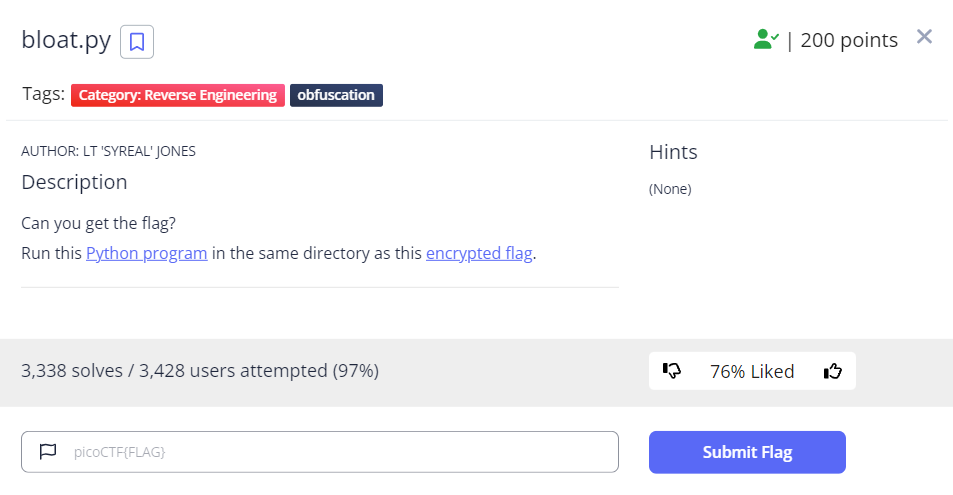

Tải 2 file về đặt trong cùng 1 thư mục:

Mở file `[bloat.flag.py](http://bloat.flag.py)` ta được đoạn code đã bị [obfuscate](https://en.wikipedia.org/wiki/Obfuscation_(software))

```python
import sys
a = "!\"#$%&'()*+,-./0123456789:;<=>?@ABCDEFGHIJKLMNOPQRSTUVWXYZ"+ \
            "[\\]^_`abcdefghijklmnopqrstuvwxyz{|}~ "
def arg133(arg432):
  if arg432 == a[71]+a[64]+a[79]+a[79]+a[88]+a[66]+a[71]+a[64]+a[77]+a[66]+a[68]:
    return True
  else:
    print(a[51]+a[71]+a[64]+a[83]+a[94]+a[79]+a[64]+a[82]+a[82]+a[86]+a[78]+\
a[81]+a[67]+a[94]+a[72]+a[82]+a[94]+a[72]+a[77]+a[66]+a[78]+a[81]+\
a[81]+a[68]+a[66]+a[83])
    sys.exit(0)
    return False
def arg111(arg444):
  return arg122(arg444.decode(), a[81]+a[64]+a[79]+a[82]+a[66]+a[64]+a[75]+\
a[75]+a[72]+a[78]+a[77])
def arg232():
  return input(a[47]+a[75]+a[68]+a[64]+a[82]+a[68]+a[94]+a[68]+a[77]+a[83]+\
a[68]+a[81]+a[94]+a[66]+a[78]+a[81]+a[81]+a[68]+a[66]+a[83]+\
a[94]+a[79]+a[64]+a[82]+a[82]+a[86]+a[78]+a[81]+a[67]+a[94]+\
a[69]+a[78]+a[81]+a[94]+a[69]+a[75]+a[64]+a[70]+a[25]+a[94])
def arg132():
  return open('flag.txt.enc', 'rb').read()
def arg112():
  print(a[54]+a[68]+a[75]+a[66]+a[78]+a[76]+a[68]+a[94]+a[65]+a[64]+a[66]+\
a[74]+a[13]+a[13]+a[13]+a[94]+a[88]+a[78]+a[84]+a[81]+a[94]+a[69]+\
a[75]+a[64]+a[70]+a[11]+a[94]+a[84]+a[82]+a[68]+a[81]+a[25])
def arg122(arg432, s):
    arg433 = arg423
    i = 0
    while len(arg433) < len(arg432):
        arg433 = arg433 + arg423[i]
        i = (i + 1) % len(arg423)        
    return "".join([chr(ord(arg422) ^ ord(arg442)) for (arg422,arg442) in zip(arg432,arg433)])
arg444 = arg132()
arg432 = arg232()
arg133(arg432)
arg112()
arg423 = arg111(arg444)
print(arg423)
sys.exit(0)
```

Quan sát ta thấy có 1 hàm dùng để kiểm tra 2 chuỗi có bằng nhau hay không, ta tạm đặt tên hàm là check:

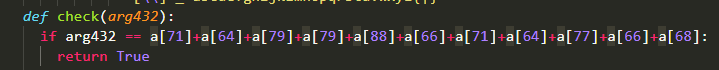

`print` chuỗi đó ra, ta được: `happychance`

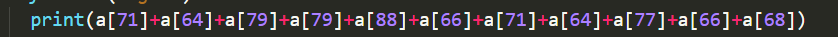

Nhập password vào chương trình, ta được flag:

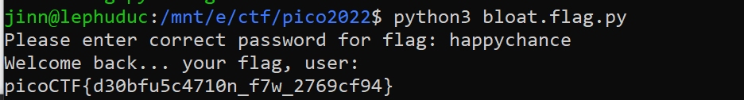

## **Fresh Java**

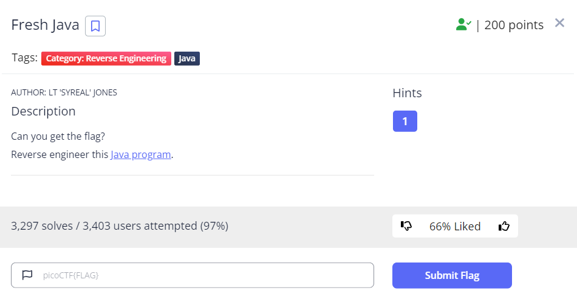

Đề sẽ cho mình một file `.class`, chúng ta có thể dùng tool để phân tích thành file `.java`File `.class` là bytecode của JVM, vẫn giữ nguyên tên lớp, tên hàm và kiểu dữ liệu. Nhờ vậy decompile ra gần như code gốc, khác hẳn binary C đã bị strip.Tham khảo: [định dạng file class của Java](https://en.wikipedia.org/wiki/Java_class_file), phần mô tả constant pool.

hoặc dùng [Java Decompier Online](http://www.javadecompilers.com/) này.

Ta có file `.java` như sau:

```java
import java.util.Scanner;

// 
// Decompiled by Procyon v0.5.36
// 

public class KeygenMe
{
    public static void main(final String[] array) {
        final Scanner scanner = new Scanner(System.in);
        System.out.println("Enter key:");
        final String nextLine = scanner.nextLine();
        if (nextLine.length() != 34) {
            System.out.println("Invalid key");
            return;
        }
        if (nextLine.charAt(33) != '}') {
            System.out.println("Invalid key");
            return;
        }
        if (nextLine.charAt(32) != '7') {
            System.out.println("Invalid key");
            return;
        }
        if (nextLine.charAt(31) != '0') {
            System.out.println("Invalid key");
            return;
        }
        if (nextLine.charAt(30) != '6') {
            System.out.println("Invalid key");
            return;
        }
        if (nextLine.charAt(29) != '5') {
            System.out.println("Invalid key");
            return;
        }
        if (nextLine.charAt(28) != '7') {
            System.out.println("Invalid key");
            return;
        }
        if (nextLine.charAt(27) != '4') {
            System.out.println("Invalid key");
            return;
        }
        if (nextLine.charAt(26) != '2') {
            System.out.println("Invalid key");
            return;
        }
        if (nextLine.charAt(25) != 'c') {
            System.out.println("Invalid key");
            return;
        }
        if (nextLine.charAt(24) != '_') {
            System.out.println("Invalid key");
            return;
        }
        if (nextLine.charAt(23) != 'd') {
            System.out.println("Invalid key");
            return;
        }
        if (nextLine.charAt(22) != '3') {
            System.out.println("Invalid key");
            return;
        }
        if (nextLine.charAt(21) != 'r') {
            System.out.println("Invalid key");
            return;
        }
        if (nextLine.charAt(20) != '1') {
            System.out.println("Invalid key");
            return;
        }
        if (nextLine.charAt(19) != 'u') {
            System.out.println("Invalid key");
            return;
        }
        if (nextLine.charAt(18) != 'q') {
            System.out.println("Invalid key");
            return;
        }
        if (nextLine.charAt(17) != '3') {
            System.out.println("Invalid key");
            return;
        }
        if (nextLine.charAt(16) != 'r') {
            System.out.println("Invalid key");
            return;
        }
        if (nextLine.charAt(15) != '_') {
            System.out.println("Invalid key");
            return;
        }
        if (nextLine.charAt(14) != 'g') {
            System.out.println("Invalid key");
            return;
        }
        if (nextLine.charAt(13) != 'n') {
            System.out.println("Invalid key");
            return;
        }
        if (nextLine.charAt(12) != '1') {
            System.out.println("Invalid key");
            return;
        }
        if (nextLine.charAt(11) != 'l') {
            System.out.println("Invalid key");
            return;
        }
        if (nextLine.charAt(10) != '0') {
            System.out.println("Invalid key");
            return;
        }
        if (nextLine.charAt(9) != '0') {
            System.out.println("Invalid key");
            return;
        }
        if (nextLine.charAt(8) != '7') {
            System.out.println("Invalid key");
            return;
        }
        if (nextLine.charAt(7) != '{') {
            System.out.println("Invalid key");
            return;
        }
        if (nextLine.charAt(6) != 'F') {
            System.out.println("Invalid key");
            return;
        }
        if (nextLine.charAt(5) != 'T') {
            System.out.println("Invalid key");
            return;
        }
        if (nextLine.charAt(4) != 'C') {
            System.out.println("Invalid key");
            return;
        }
        if (nextLine.charAt(3) != 'o') {
            System.out.println("Invalid key");
            return;
        }
        if (nextLine.charAt(2) != 'c') {
            System.out.println("Invalid key");
            return;
        }
        if (nextLine.charAt(1) != 'i') {
            System.out.println("Invalid key");
            return;
        }
        if (nextLine.charAt(0) != 'p') {
            System.out.println("Invalid key");
            return;
        }
        System.out.println("Valid key");
    }
}
```

Tại đây, ta sẽ dễ dàng nhìn thấy các kí tự của flag, Sắp xếp các kí tự theo index từ 0→33 ta được flag cần tìm.

## Bbbbloat

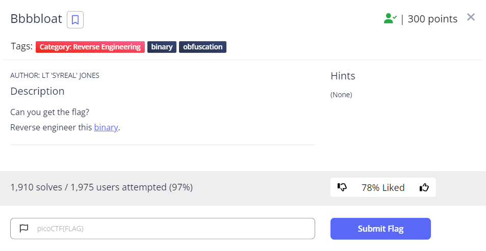

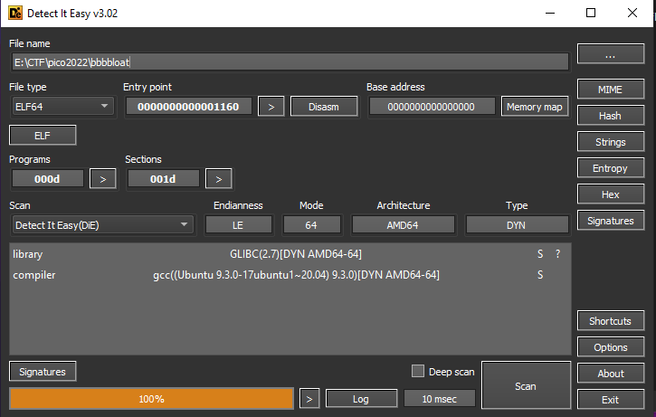

Kiểm tra file bằng Detect it Easy, ta biết được đây là file ELF64, mở file bằng IDA64bit:

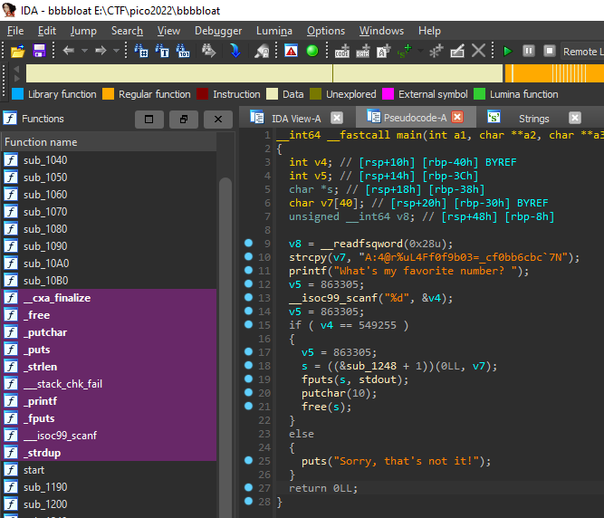

Chọn hàm main và bấm `F5` ta được đoạn code C như trên;

Phân tích code ta thấy chương trình bắt ta nhập vào 1 con số, nếu đúng với số của chương trình thì sẽ trả về flag, ta dễ dàng thấy con số đó cũng chính là `549255`

Chạy file và nhập `549255` ta được flag:

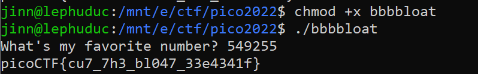

## unpackme

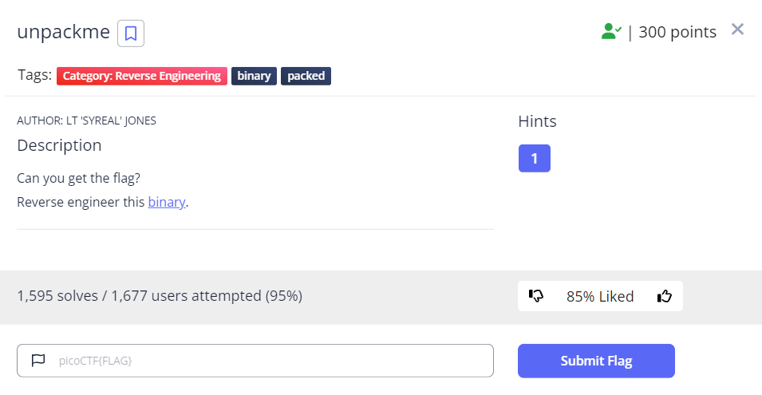

Mở file bằng Detect it Easy:

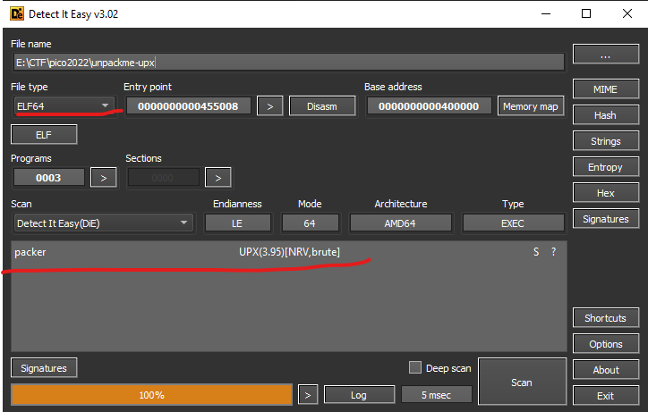

Ta thấy vẫn là file ELF64 và bị pack bởi UPX 3.95

UPX: một chương trình được sử dụng để nén các tệp thực thi, chứa một tệp thực thi được đóng gói.

Để unpack file này, ta dùng [UPX](https://github.com/upx/upx/releases/tag/v3.96) (tải và giải nén):

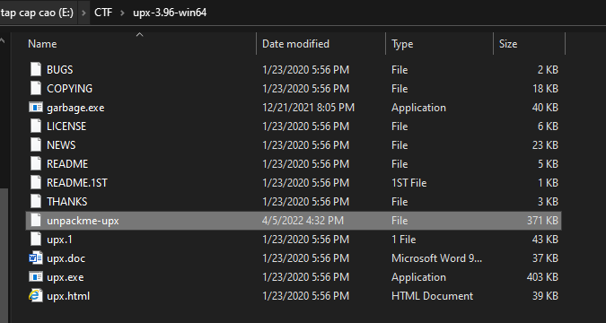

copy file `unpackme-upx` và để chung thư mục với upx, mở cmd tại folder đó lên:

dùng câu lệnh: `upx.exe -d unpackme-upx`

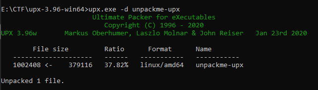

ta được file mới đã unpack, mở file này bằng IDA64:

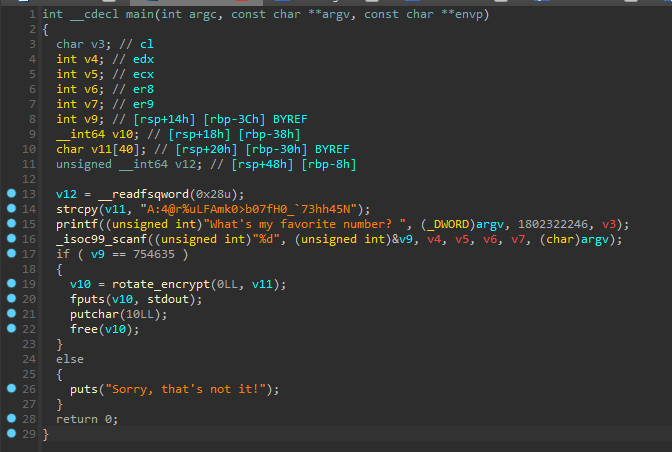

Tương tự với bài trước ta tìm thấy con số cần nhập là `754653`:

Chạy chương trình và nhập số vào ta được flag

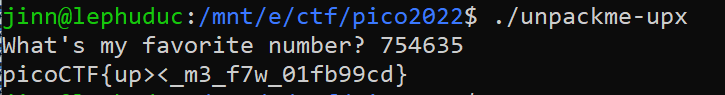

## **Keygenme**

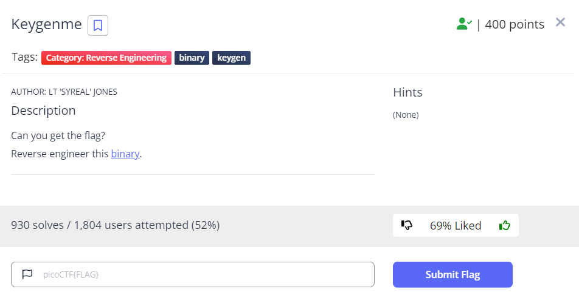

Xem thông tin file bằng Detect it Easy:

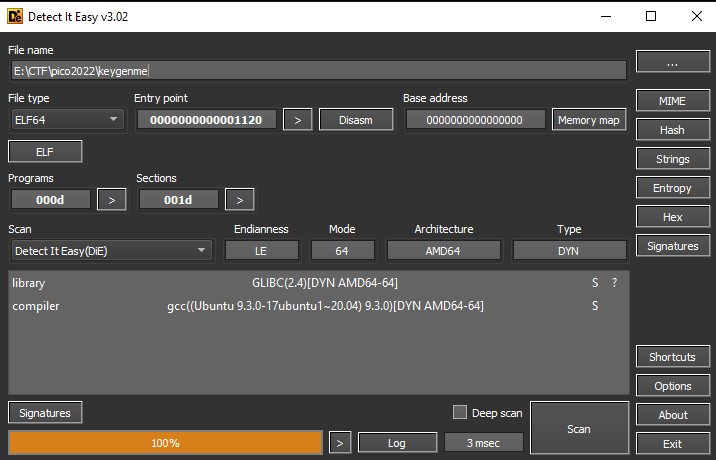

Mở file bằng IDA64, ta có hàm main:

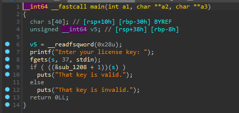

và ta thấy hàm kiểm tra cũng chưa thấy gì:

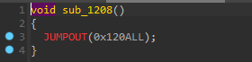

Đặt breakpoint tại lệnh `if` và thử debug bằng Remote Linux debuger:

- Vào thư mục `dbgsrv` trong folder chứa IDA, tìm file `linux_server64` và đưa vào máy ảo
- trên máy ảo: dùng lệnh `ifconfig` ,copy ip tìm được
- Chạy file `linux_server64` trên linux
- tại IDA, chọn Debugger→Process Option: paste ip tìm được vào ô Hostname, bấm `Ok, use found`.

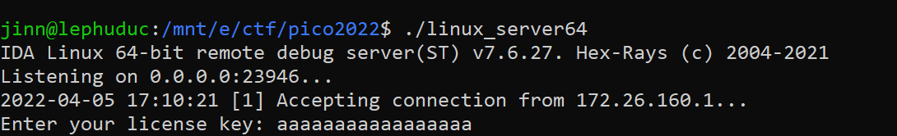

Kết quả là file đang được debug, nhập key rác bất kì

  
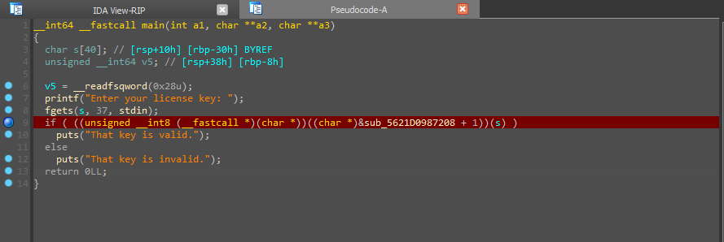


Khi chương trình chạy đến dòng lệnh `if` ta bấm F7 để step into (vào bên trong hàm) `sub_5621D0987208()`

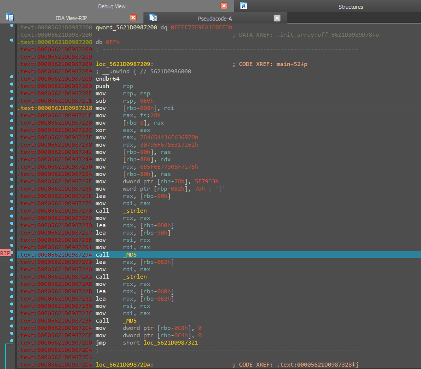

ta sẽ thấy xuất hiện nhiều lệnh `mov` và lệnh `lea` 2 lệnh này 

Khi chạy hết các lệnh cho đến lệnh `jump` thì ta dừng lại để kiểm tra, lúc này trên stack ta xem thanh ghi `rax` thì ta thấy 1 phần của flag:

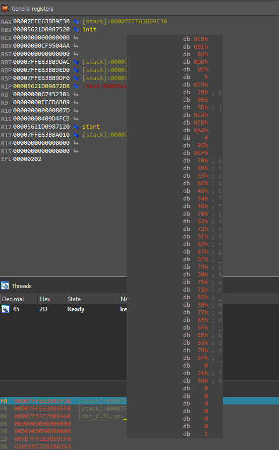

Khi decompile được hàm trên, ta được đoạn code C như sau:

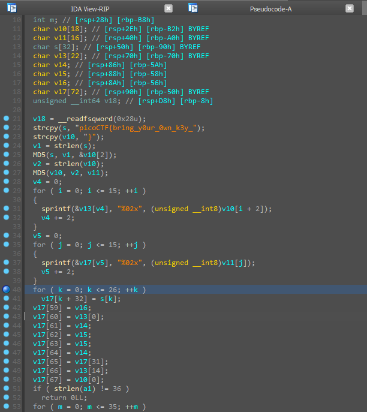

ta sẽ thấy tại đây khúc cuối có 1 loạt phép gán được thực hiện, kiểm tra phần giá trị gán thì ta thấy đó là những kí tự cuối cùng của flag

Chạy hết đoạn này và ta xem giá trị của`v17`, và nó cũng chứa flag:

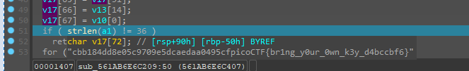

## Wizardlike

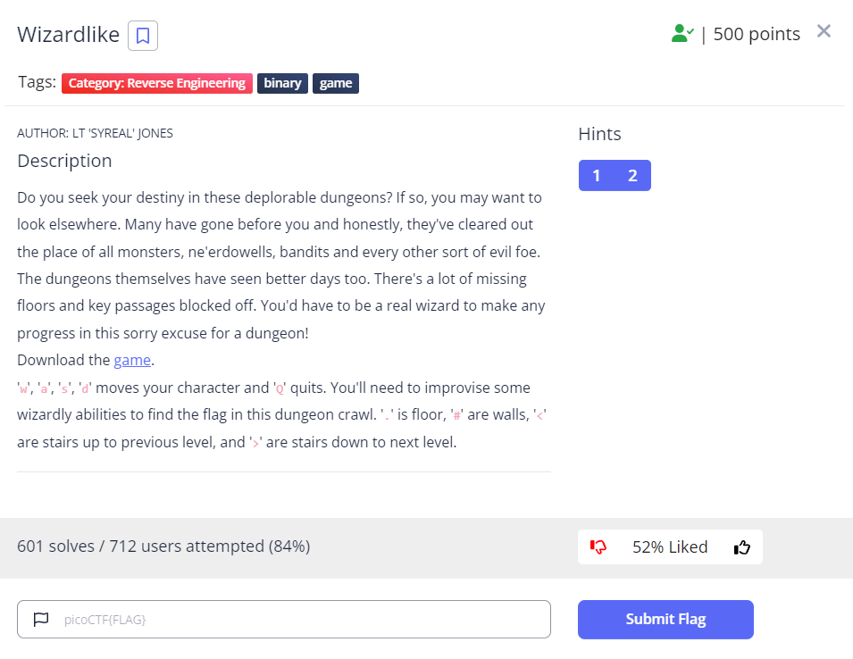

Chạy file, ta được 1 trò chơi như sau:

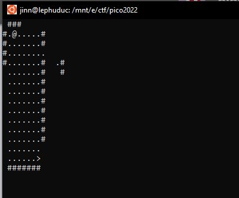

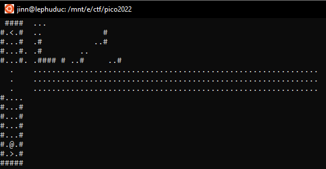

Khi nhân vật di chuyển đến `>` sẽ qua màn chơi tiếp theo, `<` sẽ quay lại màn chơi phía trước

Tuy nhiên tại màn chơi thứ 4, ta không tiếp cận đươc `>`

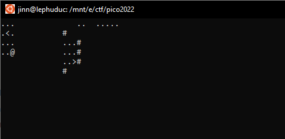

Mình thử kiểm tra file thì vẫn là ELF64 và không bị pack, đưa vào IDA64 ta được đoạn code như sau:Với game kiểu này, thứ đáng tìm không phải là màn chơi mà là hàm kiểm tra vị trí nhân vật. Tìm được nó là biết luôn bản đồ được lưu ở đâu, khỏi cần chơi thật.

```c
__int64 __fastcall main(int a1, char **a2, char **a3)
{
  int v3; // eax
  int v4; // eax
  WINDOW *v5; // rdi
  __int64 v6; // rdx
  __int64 v7; // rdx
  __int64 v8; // rdx
  __int64 v9; // rdx
  __int64 v10; // rdx
  __int64 v11; // rdx
  __int64 v12; // rdx
  __int64 v13; // rdx
  __int64 v14; // rdx
  __int64 v15; // rdx
  char v17; // [rsp+16h] [rbp-2Ah]
  char v18; // [rsp+17h] [rbp-29h]
  int i; // [rsp+18h] [rbp-28h]
  int j; // [rsp+1Ch] [rbp-24h]
  int k; // [rsp+20h] [rbp-20h]
  int m; // [rsp+24h] [rbp-1Ch]
  int v23; // [rsp+28h] [rbp-18h]
  int v24; // [rsp+2Ch] [rbp-14h]
  int v25; // [rsp+30h] [rbp-10h]
  char v26[2]; // [rsp+36h] [rbp-Ah] BYREF
  unsigned __int64 v27; // [rsp+38h] [rbp-8h]

  v27 = __readfsqword(0x28u);
  v17 = 1;
  sub_1291(asc_7740, a2, a3);
  ((void (__fastcall *)(char *))((char *)&sub_1228 + 1))(asc_7740);
  initscr();
  if ( stdscr )
    v3 = stdscr->_maxy + 1;
  else
    v3 = -1;
  v23 = v3;
  if ( stdscr )
    v4 = stdscr->_maxx + 1;
  else
    v4 = -1;
  v24 = v4;
  dword_1FE98 = v4;
  dword_1FE9C = v23;
  noecho();
  v5 = 0LL;
  curs_set(0);
  while ( v17 )
  {
    if ( dword_1FE78 != tele )
    {
      switch ( tele )
      {
        case 1:
          ((void (__fastcall *)(WINDOW *))((char *)&sub_1228 + 1))(v5);
          sub_1291(asc_7740, a2, v6);
          dword_1FE70 = 2;
          dword_1FE74 = 1;
          dword_1FE90 = 0;
          dword_1FE94 = 0;
          dword_1FE78 = 1;
          break;
        case 2:
          ((void (__fastcall *)(WINDOW *))((char *)&sub_1228 + 1))(v5);
          sub_1291(asc_9E60, a2, v7);
          dword_1FE70 = 1;
          dword_1FE74 = 2;
          dword_1FE90 = 0;
          dword_1FE94 = 0;
          dword_1FE78 = 2;
          break;
        case 3:
          ((void (__fastcall *)(WINDOW *))((char *)&sub_1228 + 1))(v5);
          sub_1291(asc_C580, a2, v8);
          dword_1FE70 = 2;
          dword_1FE74 = 1;
          dword_1FE90 = 0;
          dword_1FE94 = 0;
          dword_1FE78 = 3;
          break;
        case 4:
          ((void (__fastcall *)(WINDOW *))((char *)&sub_1228 + 1))(v5);
          sub_1291(asc_ECA0, a2, v9);
          dword_1FE70 = 2;
          dword_1FE74 = 1;
          dword_1FE90 = 0;
          dword_1FE94 = 0;
          dword_1FE78 = 4;
          break;
        case 5:
          ((void (__fastcall *)(WINDOW *))((char *)&sub_1228 + 1))(v5);
          sub_1291(asc_113C0, a2, v10);
          dword_1FE70 = 2;
          dword_1FE74 = 1;
          dword_1FE90 = 0;
          dword_1FE94 = 0;
          dword_1FE78 = 5;
          break;
        case 6:
          ((void (__fastcall *)(WINDOW *))((char *)&sub_1228 + 1))(v5);
          sub_1291(asc_13AE0, a2, v11);
          dword_1FE70 = 2;
          dword_1FE74 = 1;
          dword_1FE90 = 0;
          dword_1FE94 = 0;
          dword_1FE78 = 6;
          break;
        case 7:
          ((void (__fastcall *)(WINDOW *))((char *)&sub_1228 + 1))(v5);
          sub_1291(asc_16200, a2, v12);
          dword_1FE70 = 2;
          dword_1FE74 = 1;
          dword_1FE90 = 0;
          dword_1FE94 = 0;
          dword_1FE78 = 7;
          break;
        case 8:
          ((void (__fastcall *)(WINDOW *))((char *)&sub_1228 + 1))(v5);
          sub_1291(asc_18920, a2, v13);
          dword_1FE70 = 1;
          dword_1FE74 = 2;
          dword_1FE90 = 0;
          dword_1FE94 = 0;
          dword_1FE78 = 8;
          break;
        case 9:
          ((void (__fastcall *)(WINDOW *))((char *)&sub_1228 + 1))(v5);
          sub_1291(asc_1B040, a2, v14);
          dword_1FE70 = 2;
          dword_1FE74 = 1;
          dword_1FE90 = 0;
          dword_1FE94 = 0;
          dword_1FE78 = 9;
          break;
        case 10:
          ((void (__fastcall *)(WINDOW *))((char *)&sub_1228 + 1))(v5);
          sub_1291(&unk_1D760, a2, v15);
          dword_1FE70 = 1;
          dword_1FE74 = 1;
          dword_1FE90 = 0;
          dword_1FE94 = 0;
          dword_1FE78 = 10;
          break;
      }
    }
    for ( i = 0; i < v23; ++i )
    {
      for ( j = 0; j < v24; ++j )
        mvprintw(i, j, (const char *)&off_3000 + 4);
    }
    for ( k = 0; k < v23; ++k )
    {
      for ( m = 0; m < v24; ++m )
      {
        if ( dword_1FE90 + m > 99 || dword_1FE94 + k > 99 || dword_1FE90 + m < 0 || dword_1FE94 + k < 0 )
        {
          mvprintw(k, m, (const char *)&off_3000 + 4);
        }
        else if ( (unsigned __int8)sub_1332(
                                     (unsigned int)dword_1FE70,
                                     (unsigned int)dword_1FE74,
                                     (unsigned int)(m + dword_1FE90),
                                     (unsigned int)(dword_1FE94 + k))
               || byte_225C0[100 * dword_1FE94 + 100 * k + dword_1FE90 + m] )
        {
          byte_225C0[100 * dword_1FE94 + 100 * k + dword_1FE90 + m] = 1;
          *(_WORD *)v26 = 0;
          v26[0] = byte_1FEA0[100 * dword_1FE94 + 100 * k + dword_1FE90 + m];
          mvprintw(k, m, v26);
        }
      }
    }
    a2 = (char **)(unsigned int)(dword_1FE70 - dword_1FE90);
    mvprintw(dword_1FE74 - dword_1FE94, (int)a2, (const char *)&off_3000 + 6);
    wrefresh(stdscr);
    v5 = stdscr;
    v25 = wgetch(stdscr);
    switch ( v25 )
    {
      case 'Q':
        v17 = 0;
        break;
      case 'w':
        up(v5);
        break;
      case 's':
        down(v5);
        break;
      case 'a':
        left(v5);
        break;
      case 'd':
        right(v5);
        break;
    }
    v18 = byte_1FEA0[100 * dword_1FE74 + dword_1FE70];
    if ( v18 == '>' )
    {
      ++tele;
    }
    else if ( v18 == 60 )
    {
      --tele;
    }
  }
  endwin();
  return 0LL;
}
```

Bài này sử dụng `switch case` để di chuyển giữa các màn chơi, `case 1→10` tương ứng với 10 màn chơi, khi nhân vật gặp `>` thì biến `tele` tăng lên để di chuyển đến màn tiếp theo.

```c
switch ( v25 )
    {
      case 'Q':
        v17 = 0;
        break;
      case 'w':
        up(v5);
        break;
      case 's':
        down(v5);
        break;
      case 'a':
        left(v5);
        break;
      case 'd':
        right(v5);
        break;
    }
```

switch còn được sử dụng để gọi các hàm di chuyển cho nhân vật, ta xem thử hàm `up()`:

```c
__int64 up()
{
  __int64 result; // rax

  result = check((unsigned int)dword_1FE70, (unsigned int)(dword_1FE74 - 1));
  if ( (_BYTE)result )
  {
    if ( dword_1FE74 > dword_1FE9C / 2 && dword_1FE74 <= dword_1FE9C / -2 + 100 )
      --dword_1FE94;
    return (unsigned int)--dword_1FE74;
  }
  return result;
}
```

Trong hàm `up,down,...` còn có 1 hàm giống nhau là `check` :

```c
_BOOL8 __fastcall check(int a1, int a2)
{
  if ( a1 > 99 || a2 > 99 || a1 < 0 || a2 < 0 )
    return 0LL;
  return byte_1FEA0[100 * a2 + a1] != '#' && byte_1FEA0[100 * a2 + a1] != ' ';
}
```

Hàm này kiểm tra rằng bước tiếp theo có phải là `" "` hay là `"#"` không, nếu không thì sẽ thực hiện di chuyển, ngược lại thì không

Việc của mình bây giờ đơn giản chỉ cần vô hiệu hóa đoạn kiểm tra này để cho nhân vật có để đến mọi nơi trong game.

Có nhiều cách tiếp cận bài này, có thể chỉnh sửa byte trực tiếp bằng IDA:

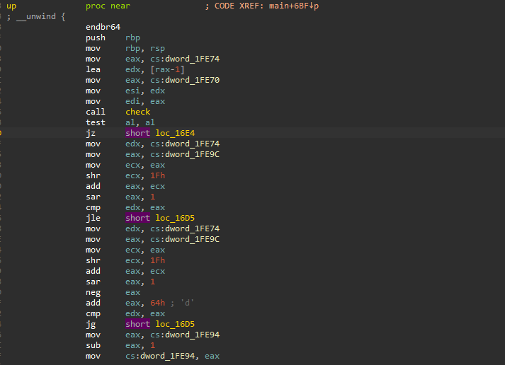

Xem hàm `up` dưới dạng asm, ta để ý lệnh `jz` (jump if zero) sẽ là đoạn kiểm tra của `if` trong code C, ta có thể bỏ qua lệnh bằng cách: chọn vào lệnh cần chỉnh sửa, vào Edit→Patch Program→Assemble

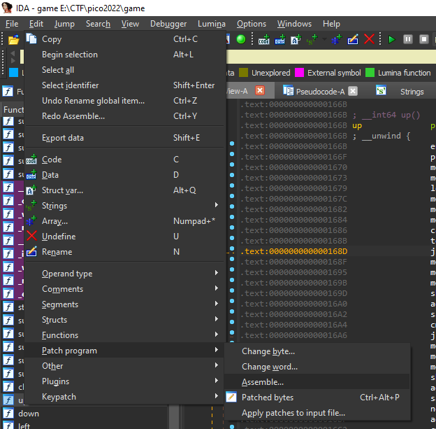
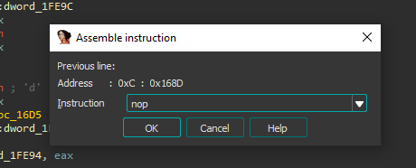

chỉnh sửa `Instruction` thành `nop`. Sau đó vào Edit→Patch Program→ Apply patches to input file để lưu thay đổi này vào file gốc.

Làm tương tự với các hàm `left(),right(),...` 

Ngoài ra, các bạn còn có thể làm bằng cách sử dụng plugin [keypatch](https://github.com/keystone-engine/keypatch) (lưu ý kĩ cách cài đặt để cài đặt thành công) để chỉnh sửa các lệnh một cách dễ dàng hơn, ví dụ:

Chọn 1 dòng code C cần thay đổi, bấm tổ hợp `Ctrl + Alt + K`, cửa sổ hiện lên:

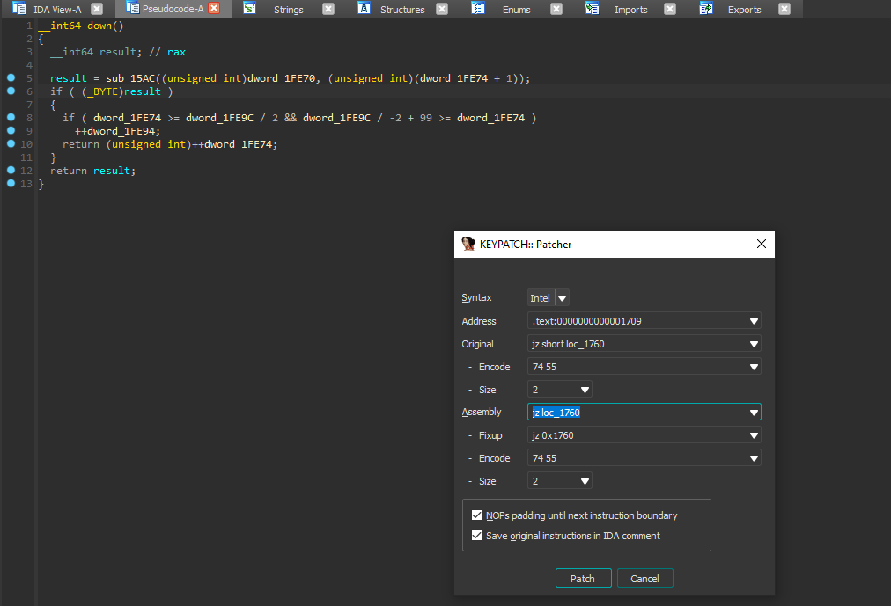

thay đổi thành `nop` và dùng `Apply patches to input file` để lưu file lại.

Và đây là thành quả sau khi chạy file.

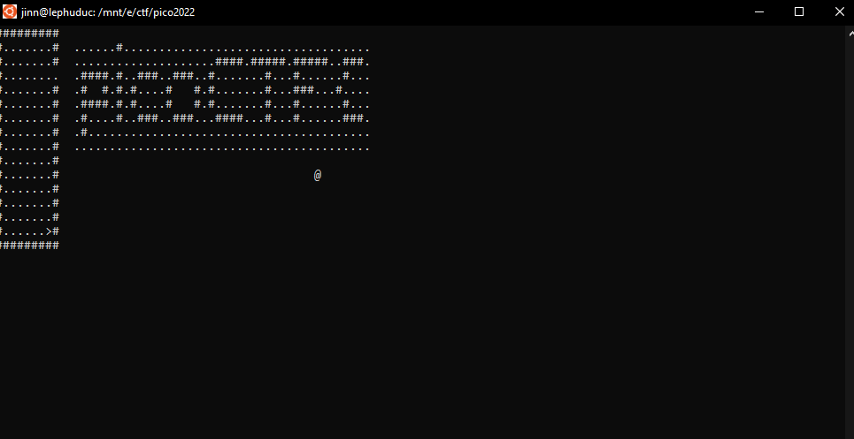

10 Màn chơi sẽ chứa các kí tự của flag theo thứ tự nhé. Chúc bạn thành công!

## Cảm ơn các bạn đã xem!