Reversing.kr là wargame mà mình dùng để học rev một cách có hệ thống, và đây là toàn bộ lời giải của mình, xếp theo đúng thứ tự của trang. Cái hay của nó là mỗi bài lại ném cho bạn một định dạng khác nhau: crackme thường, file ELF, AutoHotKey, C#, file bị packed, rồi cuối cùng là một driver Windows. Đi hết một lượt thì bạn gặp gần đủ những thứ hay gặp ngoài thực tế, nên mình nghĩ wargame này đáng làm theo đúng thứ tự chứ đừng nhảy cóc.

**Trước hết bạn cần có các tools cần thiết để dùng reverse:**
- IDA Pro
- Detect it easy (DIE)
- CTF Explorer
- Resource Hacker
- dnSpy

## Easy Crack - 100pts

Mở file lên thì ta biết đây là 1 file check password

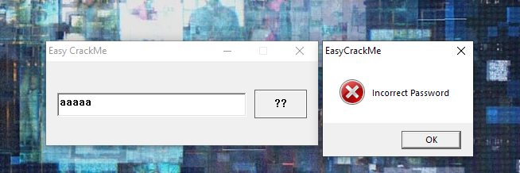

Kiểm tra bằng [DiE](https://github.com/horsicq/Detect-It-Easy) , ta thấy đây là 1 file PE32

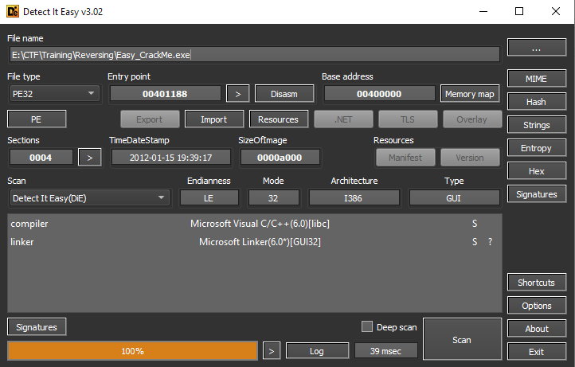

Mờ file bằng IDA 32bit, tại hàm `DialogFunc` có hàm `sub_401080`, nhìn sơ qua ta thấy hàm có sử dụng winapi `GetDlgItemTextA` và `MessageBoxA`, tức lấy thông tin từ ô nhập lưu vào biến `String`, kiểm tra và xuất thông báo

```c
int __cdecl sub_401080(HWND hDlg)
{
  CHAR String[97]; // [esp+4h] [ebp-64h] BYREF
  __int16 v3; // [esp+65h] [ebp-3h]
  char v4; // [esp+67h] [ebp-1h]

  memset(String, 0, sizeof(String));
  v3 = 0;
  v4 = 0;
  GetDlgItemTextA(hDlg, 1000, String, 100);
  if ( String[1] != 97 || strncmp(&String[2], Str2, 2u) || strcmp(&String[4], aR3versing) || String[0] != 69 )
    return MessageBoxA(hDlg, aIncorrectPassw, Caption, 0x10u);
  MessageBoxA(hDlg, Text, Caption, 0x40u);
  return EndDialog(hDlg, 0);
}
```
Dựa theo bảng ASCII và thứ tự các kí tự, ta truy xuất được pass như sau : `Ea5yR3versing`

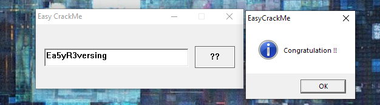

## Easy Keygen - 100pts
Đề cho ta 1 file `Readme.txt` và 1 file `Easy Keygen.exe`

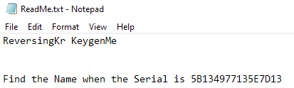

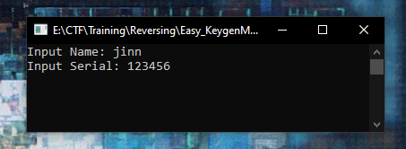


Trong bài này ta cần phải tìm hiểu cách mà chương trình tạo ra `serial` từ chính `name` mà người dùng nhập vào, đó cũng là bản chất của `keygen (Key generator)`

File `Easy Keygen.exe` là file PE32, thử mở bằng IDA:

```c
int __cdecl main(int argc, const char **argv, const char **envp)
{
  signed int v3; // ebp
  int i; // esi
  char v6; // [esp+Ch] [ebp-130h]
  char v7[2]; // [esp+Dh] [ebp-12Fh] BYREF
  char Var[100]; // [esp+10h] [ebp-12Ch] BYREF
  char Buffer[197]; // [esp+74h] [ebp-C8h] BYREF
  __int16 v10; // [esp+139h] [ebp-3h]
  char v11; // [esp+13Bh] [ebp-1h]

  memset(Var, 0, sizeof(Var));
  memset(Buffer, 0, sizeof(Buffer));
  v10 = 0;
  v11 = 0;
  v6 = 16;
  qmemcpy(v7, " 0", sizeof(v7));
  print(aInputName);
  scanf("%s", Var);
  v3 = 0;
  for ( i = 0; v3 < (int)strlen(Var); ++i )
  {
    if ( i >= 3 )
      i = 0;
    sprintf(Buffer, "%s%02X", Buffer, Var[v3++] ^ v7[i - 1]);
  }
  memset(Var, 0, sizeof(Var));
  print(aInputSerial);
  scanf("%s", Var);
  if ( !strcmp(Var, Buffer) )
    print(aCorrect);
  else
    print(aWrong);
  return 0;
}
```
Đọc kĩ thì mình thấy sau khi chương trình nhận `name` từ người dùng sau đó chương trình lấy từng kí tự của name `xor` với lại mảng `v7` đã được tạo từ trước

```c
sprintf(Buffer, "%s%02X", Buffer, Var[v3++] ^ v7[i - 1]);
```

Còn đây là cách khởi tạo của mảng `v7` dưới dạng code asm:

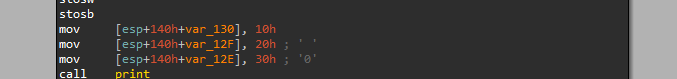

`v7 = [0x10,0x20,0x30]`

Vì `xor` có tính chất đối xứng, từ đó mình có thể viết ra được script solve như sau:

```py
serial = "5B134977135E7D13"
b = bytes.fromhex(serial)
v7 = [0x10,0x20,0x30]
for i in range(8):
    print(chr(int(b[i])^v7[i%3]),end ="") #K3yg3nm3
```
`Name: K3yg3nm3` 

## Easy Unpack - 100pts

Trong Reverse Engineering có 1 kĩ thuật tên là Unpack, nghĩa là file bị pack sẽ khiến ta không thể còn đọc code như bình thường nữa:

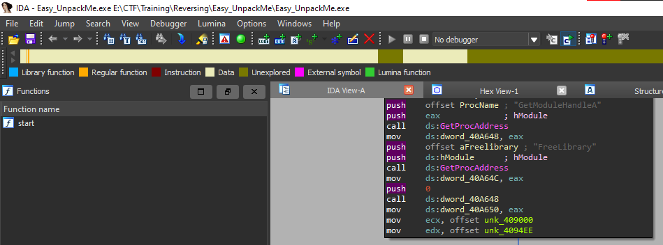

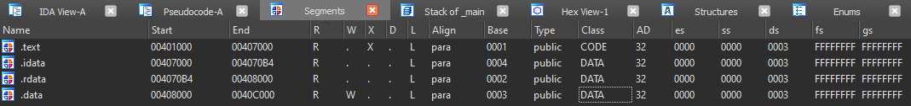

> Trong chương trình bình thường sẽ có 1 `EP(Entry Point)` gọi là điểm khởi đầu xuất phát của chương trình, tại điểm này trở đi, code sẽ được thực thi, trường hợp file bị pack, **EP** này có thể bị thay đổi.
 
> Tùy the packer, chương trình sau khi bị pack sẽ có 1 vùng data, **EP** này sẽ bắt đầu thực hiện giải mã data thành code chương trình gốc. Sau khi giải mã xong nó mới bắt đầu thực hiện chương trình bằng **EP** gốc hay còn gọi là `OEP(Original-Entry-Point)`.

Do đó, một trong những bước đầu tiên để unpack file đó chính là tìm ra **OEP** của chương trình, trong chall lần này đề chỉ yêu cầu tìm ra **OEP**:

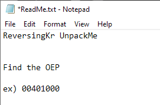

Dùng PE-Editor, mình tìm được EP hiện tại:

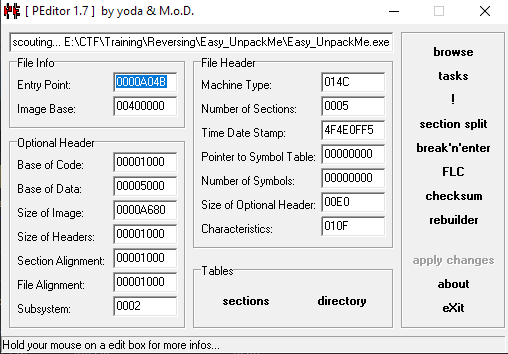

Mình tìm bằng cách dự đoán, nghĩa là code sau khi dược decrypt thì sẽ nhảy đến **OEP** để thực thi chương trình, tìm kĩ trong IDA ta thấy:


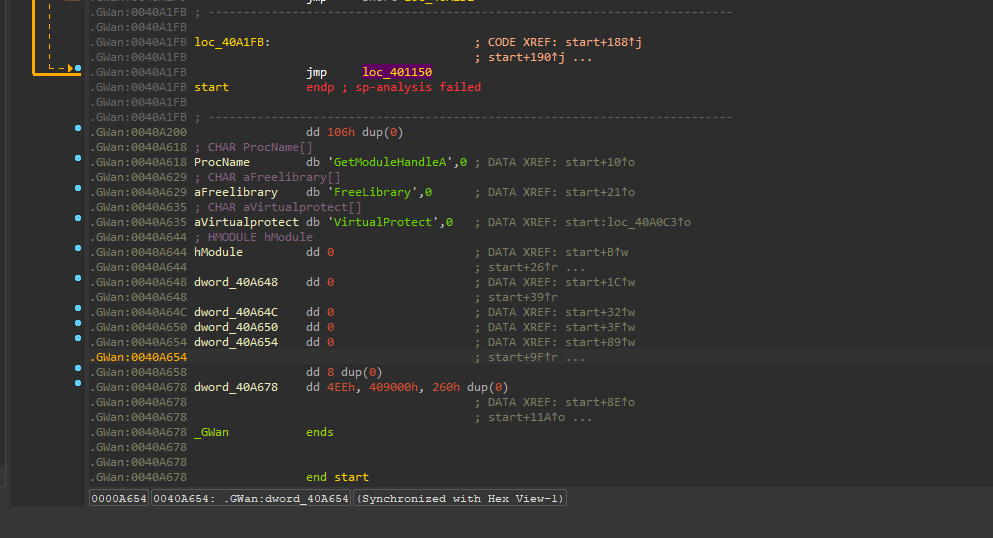

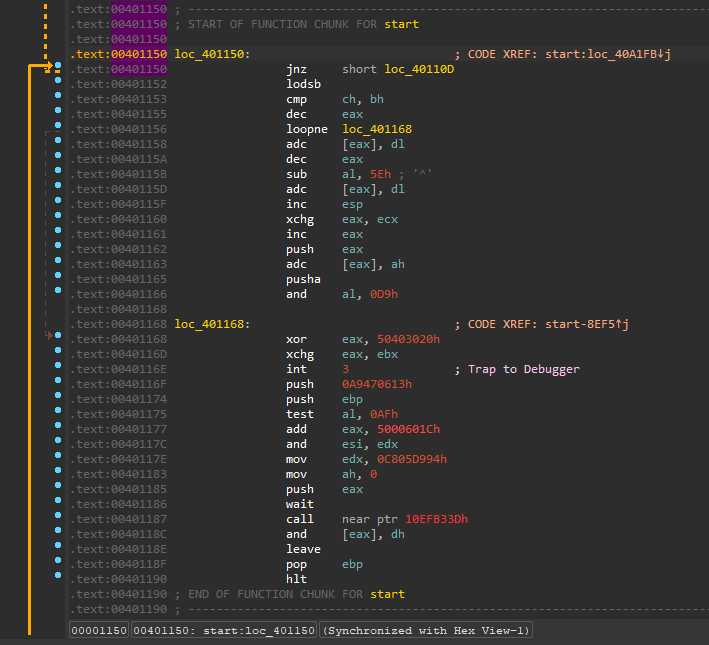

Tại khúc này mình thấy nó `jmp` thẳng từ dưới lên location 0x401150, mình dự đoán luôn, đây chính là **OEP**

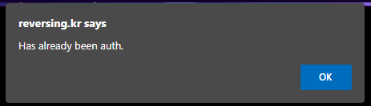

`OEP:00401150`

## Easy ELF - 100pts

Tương tự với file `exe` trên Windows, `ELF` sẽ là file thực thi trên hệ điều hành Linux

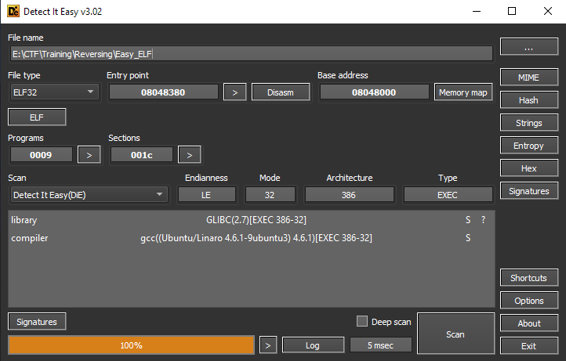

Vì là file ELF nên mới vào ta mở và kiếm ngay hàm `main` để decompile:

```c
int __cdecl main()
{
  write(1, "Reversing.Kr Easy ELF\n\n", 0x17u);
  sub_8048434();
  if ( sub_8048451() == 1 )
    sub_80484F7();
  else
    write(1, "Wrong\n", 6u);
  return 0;
}
```

Bên trong `sub_8048434` thật ra chỉ là hàm nhập bình thường (bài này sẽ là nhập vào 1 chuỗi) , mình đã đổi tên biến lại cho dễ quan sát:

```c
int sub_8048434()
{
  return __isoc99_scanf(&unk_8048650, &input);
}
```
Tại câu điều kiện `if` có 1 hàm dùng để kiểm tra `input` của người dùng:

```c
_BOOL4 CHECK()
{
  if ( byte_804A021 != 49 )
    return 0;
  input ^= 0x34u;
  byte_804A022 ^= 0x32u;
  byte_804A023 ^= 0x88u;
  if ( byte_804A024 != 88 )
    return 0;
  if ( byte_804A025 )
    return 0;
  if ( byte_804A022 != 124 )
    return 0;
  if ( input == 120 )
    return byte_804A023 == -35;
  return 0;
}
```
Mình thấy có mấy `byte` lạ lạ nên bấm vào xem thử, và mình thấy đây cũng chỉ là các kí tự tiếp theo của input vì nó nằm liên tiếp nhau:

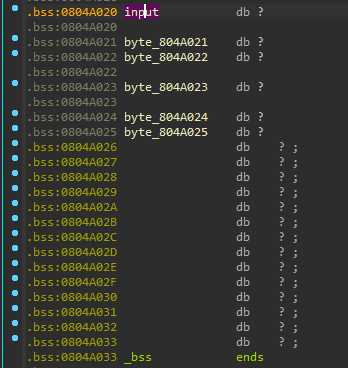

Mình đổi tên các biến lại, và giờ code đã dễ đọc hơn rất nhiều:

```c
_BOOL4 CHECK()
{
  if ( input1 != 49 )
    return 0;
  input ^= 0x34u;
  input2 ^= 0x32u;
  input3 ^= 0x88u;
  if ( input4 != 88 )
    return 0;
  if ( input5 )
    return 0;
  if ( input2 != 124 )
    return 0;
  if ( input == 120 )
    return input3 == -35;
  return 0;
}
```

Mình rev lại đoạn này xong viết script py để giải nó đơn giản như sau (Hoặc các bạn cũng có thể giải tay, nhớ chuyển -35 thành số dương):
```py
input = [0]*5
input[0] = 120^0x34
input[1] = 49
input[2] = 124^0x32
input[3] = (0xdd)^0x88
input[4] = 88
print("".join([chr(c) for c in input]))
```
Password: `L1NUX`

## Replace - 150pts

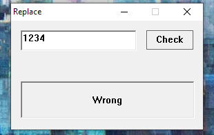

Bài này vẫn là check password (chỉ được nhập vào kí tự là số), tuy nhiên khi mở IDA tìm hàm check thì mình không thấy, debug thử thì khi bấm `Check` nó bị lỗi như này:

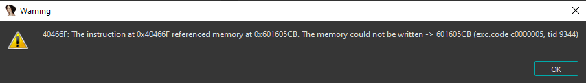

`40466F: Lệnh tại 0x40466F tham chiếu bộ nhớ tại 0x601605CB. Không thể ghi bộ nhớ -> 601605CB`

Thử nhập 1 số:

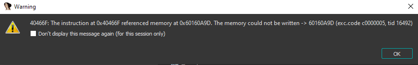

Vẫn là lỗi lệnh ở vị trí `40466F`,mình tìm thử trong data:

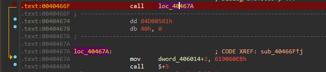

Tại đây chương trình thực hiện lệnh `call $+5` rất là lạ, mình đặt breakpoint và debug thử (input để trống):

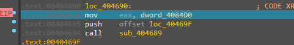

Sau khi tắt debug, chạy lại với input = 4567, mình để ý `dword_4084D0` nó sẽ có giá trị thay đổi dựa theo input, cụ thể là input+2 và được cộng với `601605C7h`:

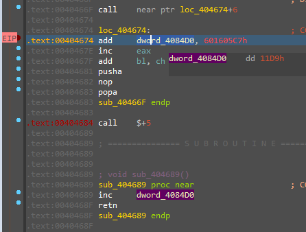

Và nó được tăng thêm 2 lần trước khi được push và call (chổ `inc eax` và `inc dword_4084D0`)

Nghĩa là lỗi kia do không thể tìm thấy offset chính xác để call, ta cần tính toán cụ thể để ra được đúng địa chỉ, qua tab string, ta có:

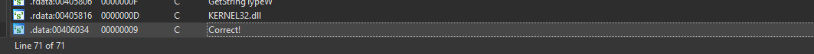
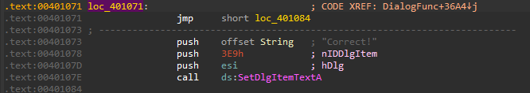

Địa chỉ chính xác của mình chính là `0x00401071`

Hộp thoại báo lỗi của chương trìn khi mình không nhập gì là `0x601605CB`, khi mình nhập `4567` thì sẽ là `0x601617A2` chính là `0x601605CB+ hex(4567)`

```
input + 2 + 0x601605C7 + 2 = 0x00401071
input = (0x00401071 - 2 - 2 - 0x601605C7) & 0xffffffff = 2687109798 // & với 0xffffffff chuyển thành số dương
```
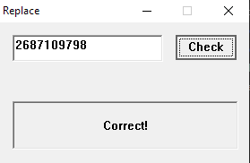

`input = 2687109798`

## ImagePrc - 120pts

Để xem đề cho cái gì đây

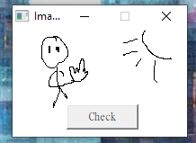

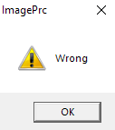

Một cái file có thể vẽ lên xong còn có nút `Check`, hmmm, mình đoán là nó sẽ so sánh hình mình vẽ với data có sẵn, vậy giờ kím data đó ở đâu?Ảnh, icon hay bất cứ dữ liệu tĩnh nào của chương trình Windows thường nằm trong resource section chứ không nằm trong code. Gặp bài so sánh với data có sẵn thì mở resource ra xem trước, nhanh hơn rev nhiều.

Trước tiên mình thử tìm hàm `check`:
```c
int __stdcall WinMain(HINSTANCE hInstance, HINSTANCE hPrevInstance, LPSTR lpCmdLine, int nShowCmd)
{
  int SystemMetrics; // eax
  HWND Window; // eax
  int v7; // [esp-1Ch] [ebp-64h]
  struct tagMSG Msg; // [esp+4h] [ebp-44h] BYREF
  WNDCLASSA WndClass; // [esp+20h] [ebp-28h] BYREF

  ::hInstance = hInstance;
  WndClass.cbClsExtra = 0;
  WndClass.cbWndExtra = 0;
  WndClass.hbrBackground = (HBRUSH)GetStockObject(0);
  WndClass.hCursor = LoadCursorA(0, (LPCSTR)0x7F00);
  WndClass.hInstance = hInstance;
  WndClass.hIcon = LoadIconA(0, (LPCSTR)0x7F00);
  WndClass.lpfnWndProc = sub_401130;
  WndClass.lpszClassName = lpWindowName;
  WndClass.lpszMenuName = 0;
  WndClass.style = 3;
  RegisterClassA(&WndClass);
  v7 = GetSystemMetrics(1) / 2 - 75;
  SystemMetrics = GetSystemMetrics(0);
  Window = CreateWindowExA(
             0,
             lpWindowName,
             lpWindowName,
             0xCA0000u,
             SystemMetrics / 2 - 100,
             v7,
             200,
             150,
             0,
             0,
             hInstance,
             0);
  ShowWindow(Window, 5);
  if ( !GetMessageA(&Msg, 0, 0, 0) )
    return Msg.wParam;
  do
  {
    TranslateMessage(&Msg);
    DispatchMessageA(&Msg);
  }
  while ( GetMessageA(&Msg, 0, 0, 0) );
  return Msg.wParam;
}
```
Trong Winmain có hàm `sub_401130` rất kì lạ, vào xem thử thì...

```c
case 1u:
          DC = GetDC(hWnd);
          hbm = CreateCompatibleBitmap(DC, 200, 150);
          hdc = CreateCompatibleDC(DC);
          h = SelectObject(hdc, hbm);
          Rectangle(hdc, -5, -5, 205, 205);
          ReleaseDC(hWnd, DC);
          ::wParam = (WPARAM)CreateFontA(12, 0, 0, 0, 400, 0, 0, 0, 0x81u, 0, 0, 0, 0x12u, pszFaceName);
          dword_4084E0 = (int)CreateWindowExA(
                                0,
                                ClassName,
                                WindowName,
                                0x50000000u,
                                60,
                                85,
                                80,
                                28,
                                hWnd,
                                (HMENU)0x64,
                                hInstance,
                                0);
          SendMessageA((HWND)dword_4084E0, 0x30u, ::wParam, 0);
          return 0;
```

Có chổ hàm `CreateCompatibleBitmap()` mình biết được kích thước tấm ảnh của mình và của chương trình là `200x150`

```c
if ( wParam == 100 )
    {
      GetObjectA(hbm, 24, pv);
      memset(&bmi, 0, 0x28u);
      bmi.bmiHeader.biHeight = cLines;
      bmi.bmiHeader.biWidth = v16;
      bmi.bmiHeader.biSize = 40;
      bmi.bmiHeader.biPlanes = 1;
      bmi.bmiHeader.biBitCount = 24;
      bmi.bmiHeader.biCompression = 0;
      GetDIBits(hdc, (HBITMAP)hbm, 0, cLines, 0, &bmi, 0);
      v8 = operator new(bmi.bmiHeader.biSizeImage);
      GetDIBits(hdc, (HBITMAP)hbm, 0, cLines, v8, &bmi, 0);
      ResourceA = FindResourceA(0, (LPCSTR)101, (LPCSTR)0x18);
      Resource = LoadResource(0, ResourceA);
      v11 = LockResource(Resource);
      v12 = 0;
      v13 = v8;
      v14 = v11 - (_BYTE *)v8;
      while ( *v13 == v13[v14] )
      {
        ++v12;
        ++v13;
        if ( v12 >= 90000 )
        {
          sub_401500(v8);
          return 0;
        }
      }
      MessageBoxA(hWnd, Text, Caption, 0x30u);
      sub_401500(v8);
      return 0;
    }
```
Còn đây sẽ là chổ so sánh từng `byte` với `bitmap` có sẵn, trước khi cmp thì hàm có dùng `GetDIBits,GetDIBits,FindResourceA,LoadResource`, xem như là lấy data lên trước khi so sánh, để xem được trong file có những vùng data nào thì mình dùng `ResourceHacker`:

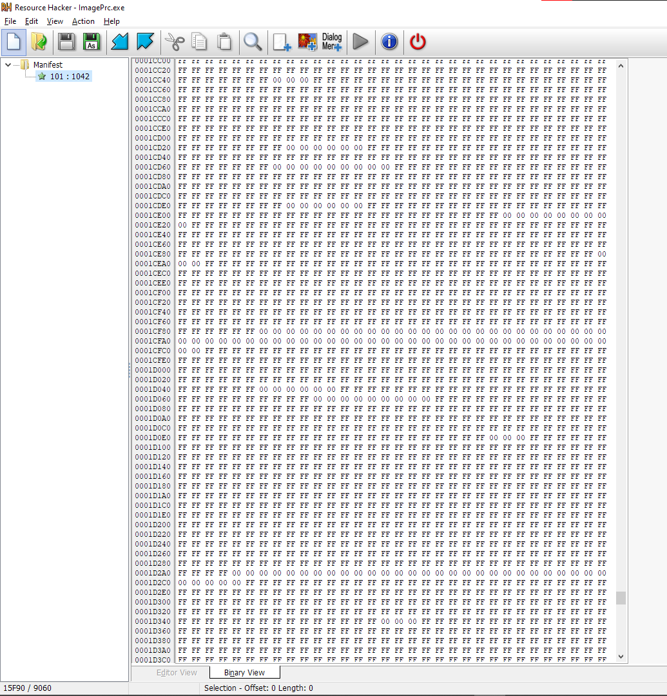

Rồi luôn, Nó đây, 0xFF đại diện cho màu trắng (màu sáng nhất) và ngược lại, giờ tì mình tìm cách để biến cái đống này thành bitmap có thể xem được

Để xem được ta cần có file header đúng chuẩn với header của bitmap, mình có thể lê mạng copy và thay vào hoặc là tạo 1 file bitmap bằng paint (nhớ điều chỉnh độ phân giải là 200x150 trước khi lưu):

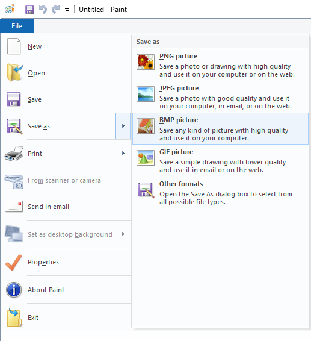

Sau khi lưu, mở file bằng Hxd (hoặc hex editor bất kì để chỉnh sửa hex):

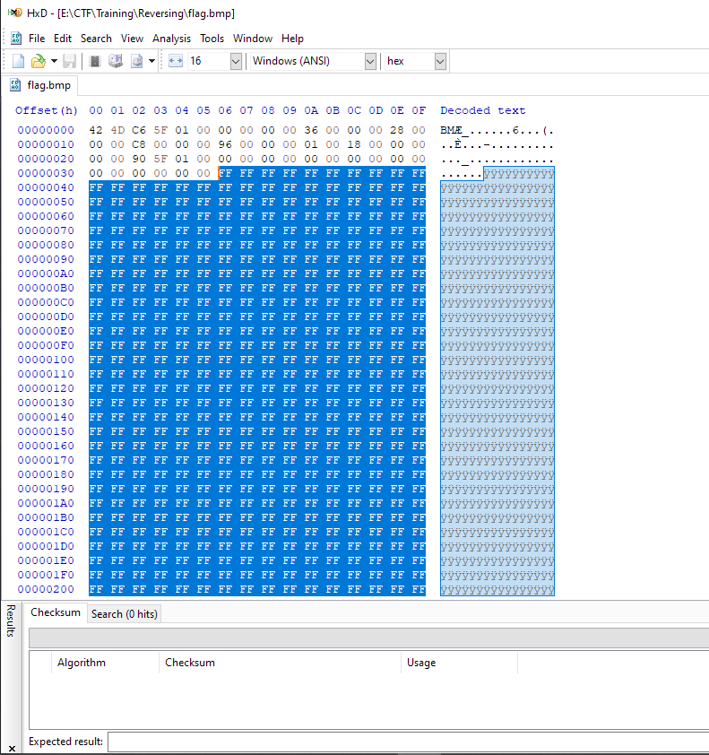

Copy data từ bên ResourceHacker qua và lưu lại thành tấm ảnh hoàn chỉnh.Mở lên thử hehe


`Key: GOT`

## Music Player - 150pts

Không hiểu sao bài này lại là bài làm mình stuck nhiều nhất

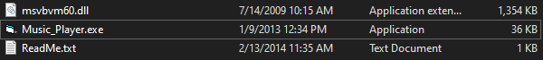

Trong file ReadMe có nói rõ là bài này ta sẽ tìm hàm check và pass qua chổ đó:
```
This MP3 Player is limited to 1 minutes.
You have to play more than one minute.

There are exist several 1-minute-check-routine.
After bypassing every check routine, you will see the perfect flag.
```
Khi chạy tới 1 phút sẽ có 1 cái MsBox hiện cái gì đó lên như thế này:

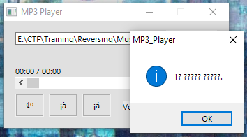

Vì hàm và tên hàm rất lộn xộn, mình lay hoay mãi mà không tìm đc chổ check, ban đầu mình tìm `Msbox` nhưng cũng không thấy

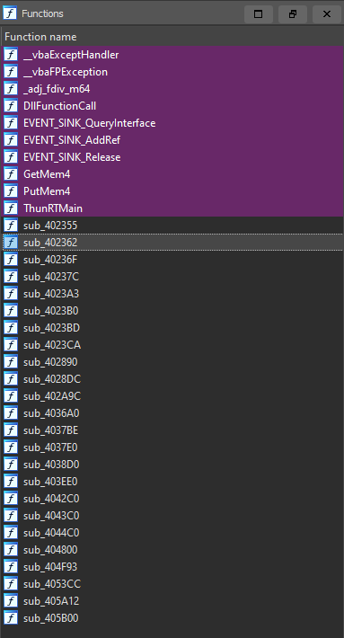

Chợt nhớ ra trong bài này có kèm theo 1 file `.dll`, vậy nên mình kiểm tra xem chương trình đã import những gì để sử dụng những, check thử tab import:

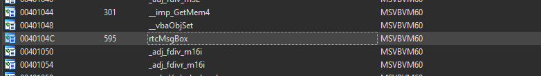

Mãi đến giờ thì mình mới thấy cái `WinAPI` này:))), giờ bấm đúp vào với dùng `xref`( bấm X) xem coi những thằng nào gọi nó:

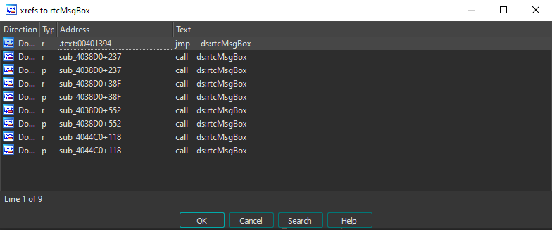

Một đống luôn:))

Sau khi check và debug một hồi thì mình tìm được chổ cái `msbox 1??????` mà nó từng hiện lên là cái này:

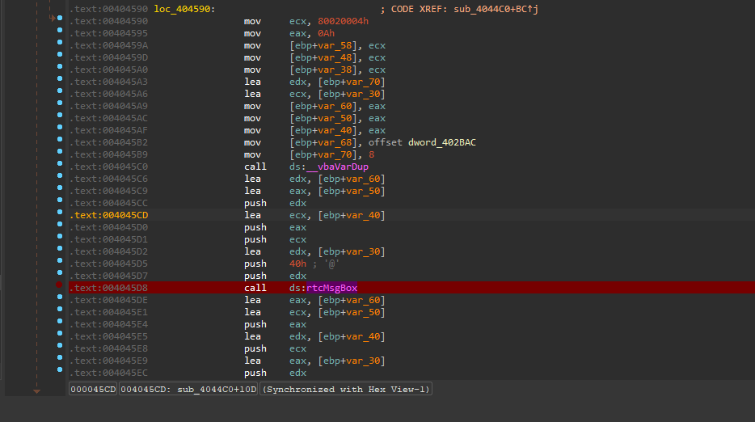

Mà để nhảy tới chổ này thì có câu điều kiện này:

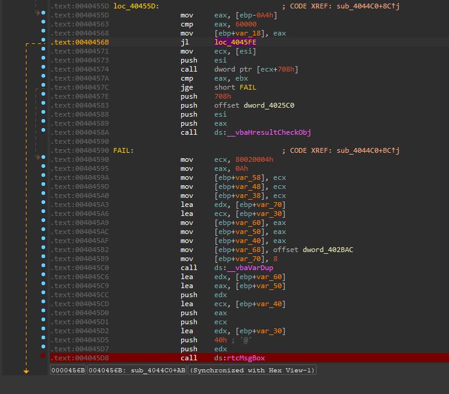

Vì sau lệnh này, nó bắt buộc phải nhảy tới block khác, nếu không nó sẽ nhảy vào block chứa `Msbox fail`

Trước đó nó có chổ `cmp eax, 60000` và cũng có nghĩa là cmp với `60000ms = 1p`, nếu lớn hơn thì không jump và đi vào `FAIL`, ngược lại thì jump.

Để bypass lệnh mình dùng Plugin IDA do người Việt viết có tên là [keypatch](https://github.com/keystone-engine/keypatch), cho phép mình chỉnh sửa lệnh trực tiếp bằng tổ hợp phím `Ctrl + Alt + K`, mình đổi lệnh `jl` thành `jmp`:

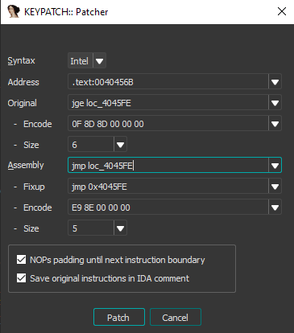

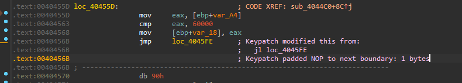

Lưu vào input file và chạy thử:

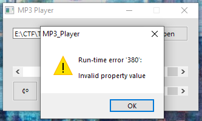

Vẫn còn lỗi ạ, stuck tiếp :<<<, mình nghĩ là vẫn còn thêm chổ check nữa,

Sau khi pass qua được chổ kia, mình lần theo `jmp` của nó thì thấy được thêm 1 chổ này:

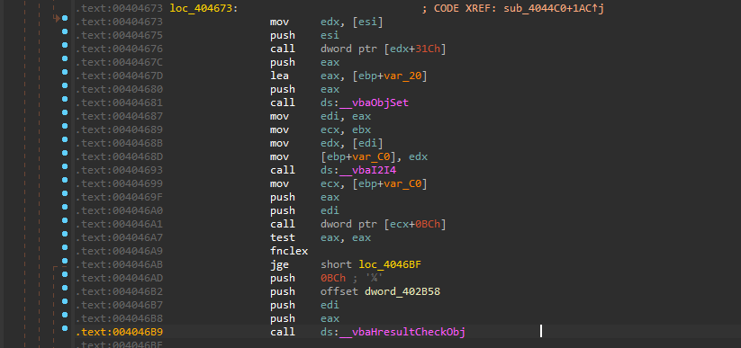

```call    ds:__vbaHresultCheckObj```

Chắc chổ này phá cái bài của mình, làm tương tự như bước trên, mình pass qua cái check này bằng lệnh `jmp` luôn:

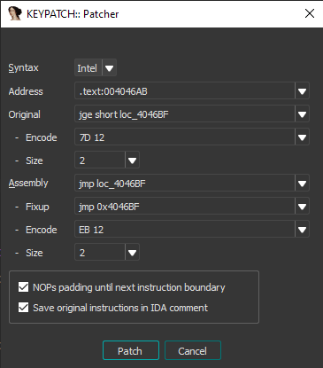

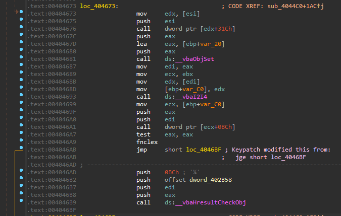

Chạy thử lần nữa:

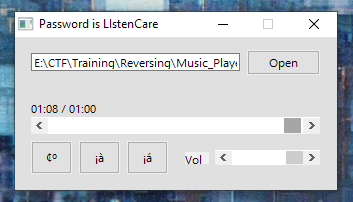

File lần này chạy mượt lắm nha, không có lỗi gi:)))

## CSHOP - 120pts

Bài này mình thấy khá dễ so với những bài ở trên, nhưng không hiểu sao lại ít người làm hơn

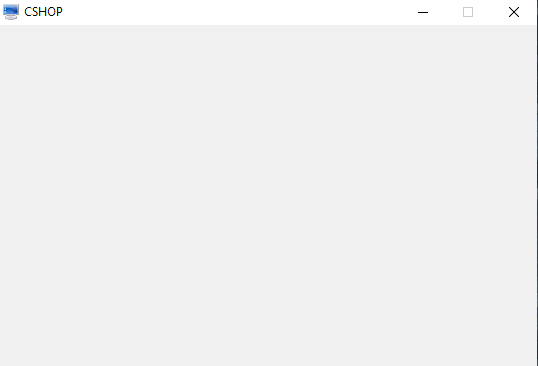

Một cái file trắng tinh tươm.....

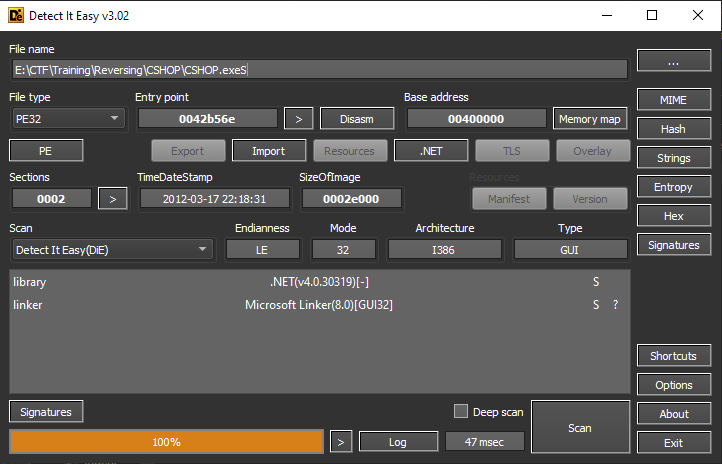

Bài này là dotNet nên mình đã dùng dnSpy để phân tích:Binary .NET là bytecode IL kèm đầy đủ metadata về lớp, hàm và kiểu, nên decompile ra gần như code C# gốc. dnSpy còn cho sửa IL rồi lưu lại, tức là vừa đọc vừa patch được ngay trong một chỗ.Tham khảo: [dnSpy](https://github.com/dnSpy/dnSpy), dùng cho cả bài CSHOP và CSHARP phía dưới.

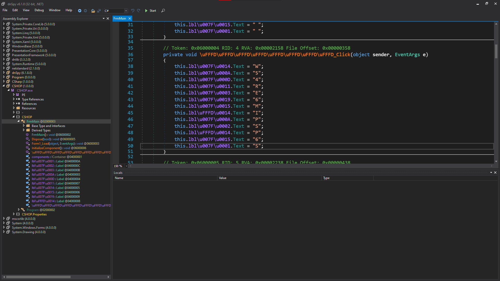

Theo kinh nghiệm của mình code của bài này đã bị obfuscate, ban đầu mình nghĩ là sẽ unobfuscate trước sau đó phân tích sau, nhưng khi đọc sơ qua thì mình thấy có 1 chổ hơi bất ổn:

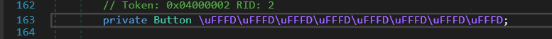

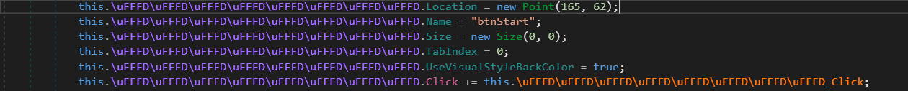

Đây là một cái `button` nhưng mà sao lại set size bằng 0,0 thế kia, mình thử chỉnh size to hơn một tí:

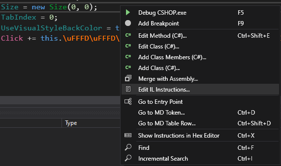

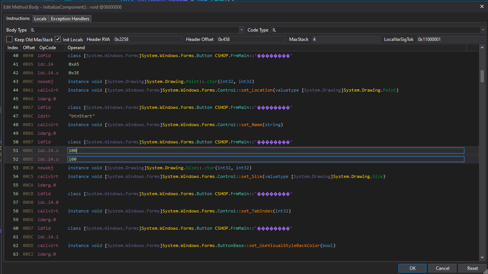

Sửa thành 100,100 sau đó lưu file lại

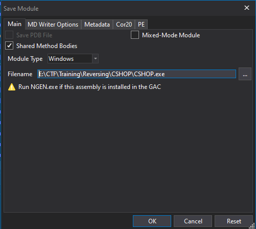

Chạy thử thấy cái nút to quá, bấm thử ra flag luôn:))

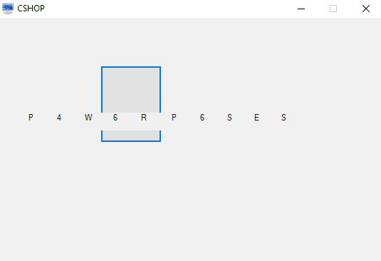

## Position - 160pts

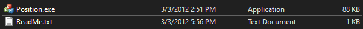

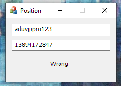

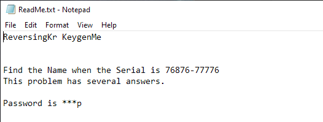

Tiếp tục là một bài keygen nữa

Lấy kinh nghiệm từ bài trước (Musicplayer), lần này mình check tab `import` và `string` trước và thứ mình cần tìm là chổ nào in ra `Wrong` hoặc là chổ nào sẽ nhận input của mình:

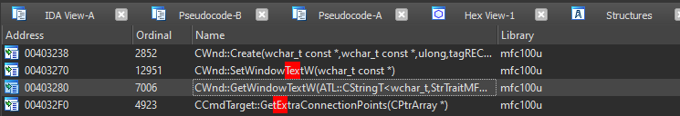

Mình thấy có chổ `GetWinDowTextW`, xref tới xem những thằng nào gọi nó:

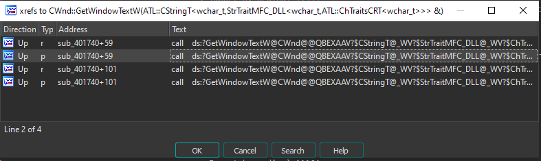

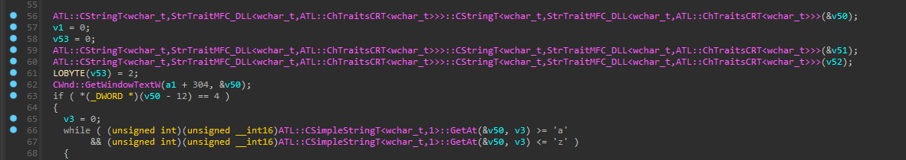

Có 2 chổ gọi và lưu vào biến `v50` và `v51`, trong đó `v50` có check điều kiện là `[a-z]` nên mình khá chắc đây là name, còn lại là serial, mình đã đổi tên lại cho dễ nhìn

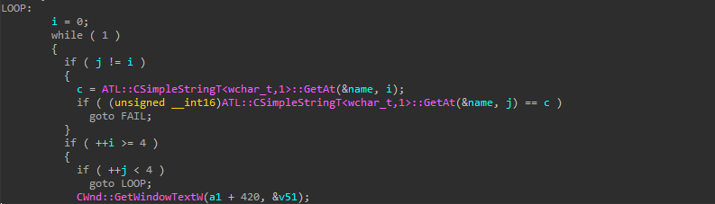

Đoạn này thật ra chỉ check xem name có kí tự nào trùng nhau hay không thôi

Rồi bây giờ mới bắt đầu check tên:

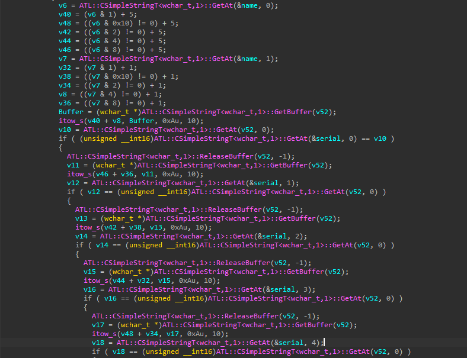

Mình ngẫm sơ qua 1 hồi thì, serial chỉ có thể có giá trị 6,7,8 vì điều kiện của kí tự đầu tiền luôn +5, kí tự tiếp theo +1


Mình đã copy và sửa tên thành tên khác dễ hiểu hơn:

```c
c1 = (name[0] & 1) + 5;
    c2 = ((name[0] & 0x10) != 0) + 5;
    c3 = ((name[0] & 2) != 0) + 5;
    c4 = ((name[0] & 4) != 0) + 5;
    c5 = ((name[0] & 8) != 0) + 5;
    c4_ = (name[1] & 1) + 1;
    c3_ = ((name[1] & 0x10) != 0) + 1;
    c2_ = ((name[1] & 2) != 0) + 1;
    c1_ = ((name[1] & 4) != 0) + 1;
    c5_ = ((name[1] & 8) != 0) + 1;
    check += ((c1 + c1_)== 7 );
    check += ((c5 + c5_)== 6 );
    check += ((c3 + c3_)== 8 );
    check += ((c4 + c4_)== 7 );
    check += ((c2 + c2_)== 6 );
```
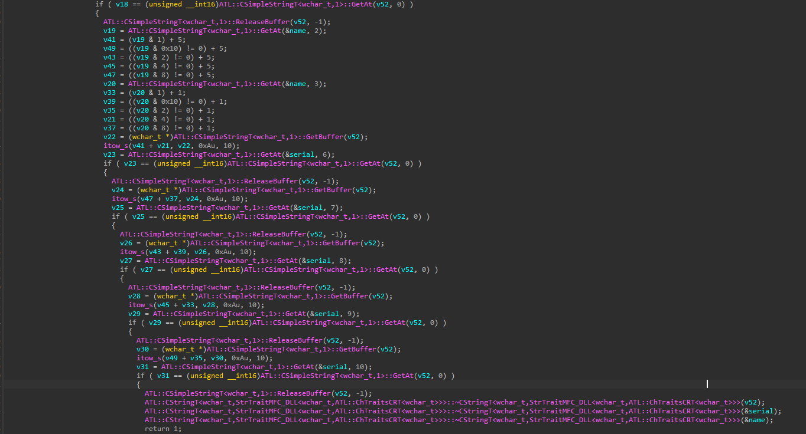

Tương tự với kí tự thứ 3 và kí tự cuối cùng

```c
c6 = (name[2] & 1) + 5;
    c7 = ((name[2] & 0x10) != 0) + 5;
    c8 = ((name[2] & 2) != 0) + 5;
    c9 = ((name[2] & 4) != 0) + 5;
    c10 = ((name[2] & 8) != 0) + 5;
    c9_ = (name[3] & 1) + 1;
    c8_ = ((name[3] & 0x10) != 0) + 1;
    c7_ = ((name[3] & 2) != 0) + 1;
    c6_ = ((name[3] & 4) != 0) + 1;
    c10_ = ((name[3] & 8) != 0) + 1;
    check += ((c6 + c6_)== 7 );
    check += ((c10 + c10_)== 7 );
    check += ((c8 + c8_)== 7 );
    check += ((c9 + c9_)== 7 );
    check += ((c7 + c7_)== 6 );
```

Tổng hợp lại, mình có hàm check như sau:

```c
bool check(string name){
    int c1,c2,c3,c4,c5,c1_,c2_,c3_,c4_,c5_,c6,c7,c8,c9,c10,c6_,c7_,c8_,c9_,c10_;
    int check = 0;
    c1 = (name[0] & 1) + 5;
    c2 = ((name[0] & 0x10) != 0) + 5;
    c3 = ((name[0] & 2) != 0) + 5;
    c4 = ((name[0] & 4) != 0) + 5;
    c5 = ((name[0] & 8) != 0) + 5;
    c4_ = (name[1] & 1) + 1;
    c3_ = ((name[1] & 0x10) != 0) + 1;
    c2_ = ((name[1] & 2) != 0) + 1;
    c1_ = ((name[1] & 4) != 0) + 1;
    c5_ = ((name[1] & 8) != 0) + 1;
    // 5 so dau cua serial
    check += ((c1 + c1_)== 7 );
    check += ((c5 + c5_)== 6 );
    check += ((c3 + c3_)== 8 );
    check += ((c4 + c4_)== 7 );
    check += ((c2 + c2_)== 6 );
    c6 = (name[2] & 1) + 5;
    c7 = ((name[2] & 0x10) != 0) + 5;
    c8 = ((name[2] & 2) != 0) + 5;
    c9 = ((name[2] & 4) != 0) + 5;
    c10 = ((name[2] & 8) != 0) + 5;
    c9_ = (name[3] & 1) + 1;
    c8_ = ((name[3] & 0x10) != 0) + 1;
    c7_ = ((name[3] & 2) != 0) + 1;
    c6_ = ((name[3] & 4) != 0) + 1;
    c10_ = ((name[3] & 8) != 0) + 1;
    //5 so sau cua serial
    check += ((c6 + c6_)== 7 );
    check += ((c10 + c10_)== 7 );
    check += ((c8 + c8_)== 7 );
    check += ((c9 + c9_)== 7 );
    check += ((c7 + c7_)== 6 );
    return check ==10;
}
```
Giờ mình bruteforce 3 kí tự đầu của pass thôi, 26^3 chắc nhanh mà :>

```c
#include <bits/stdc++.h>
using namespace std;
bool check(string name){
    int c1,c2,c3,c4,c5,c1_,c2_,c3_,c4_,c5_,c6,c7,c8,c9,c10,c6_,c7_,c8_,c9_,c10_;
    int check = 0;
    c1 = (name[0] & 1) + 5;
    c2 = ((name[0] & 0x10) != 0) + 5;
    c3 = ((name[0] & 2) != 0) + 5;
    c4 = ((name[0] & 4) != 0) + 5;
    c5 = ((name[0] & 8) != 0) + 5;
    c4_ = (name[1] & 1) + 1;
    c3_ = ((name[1] & 0x10) != 0) + 1;
    c2_ = ((name[1] & 2) != 0) + 1;
    c1_ = ((name[1] & 4) != 0) + 1;
    c5_ = ((name[1] & 8) != 0) + 1;
    // 5 so dau cua serial
    check += ((c1 + c1_)== 7 );
    check += ((c5 + c5_)== 6 );
    check += ((c3 + c3_)== 8 );
    check += ((c4 + c4_)== 7 );
    check += ((c2 + c2_)== 6 );
    c6 = (name[2] & 1) + 5;
    c7 = ((name[2] & 0x10) != 0) + 5;
    c8 = ((name[2] & 2) != 0) + 5;
    c9 = ((name[2] & 4) != 0) + 5;
    c10 = ((name[2] & 8) != 0) + 5;
    c9_ = (name[3] & 1) + 1;
    c8_ = ((name[3] & 0x10) != 0) + 1;
    c7_ = ((name[3] & 2) != 0) + 1;
    c6_ = ((name[3] & 4) != 0) + 1;
    c10_ = ((name[3] & 8) != 0) + 1;
    //5 so sau cua serial
    check += ((c6 + c6_)== 7 );
    check += ((c10 + c10_)== 7 );
    check += ((c8 + c8_)== 7 );
    check += ((c9 + c9_)== 7 );
    check += ((c7 + c7_)== 6 );
    return check ==10;
}
void brutePass(string name,int length,string set){
    if (name.size()==length) return;
    for (auto c:set){
        string temp = name+ c;
        if (check(temp) && temp[3]=='p'){
            cout<<temp<<endl;
            break;
        }
        brutePass(temp,length,set);
    }
}
int main(){
    string set = "abcdefghijklmnopqrstuvwxyz";
    brutePass("",4,set);
    return 0;
}
```
Có 4 kết quả:

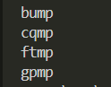

Thấy cái đầu hợp lí nhất nên thử luôn:

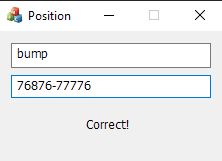

## Direct3D FPS - 140pts

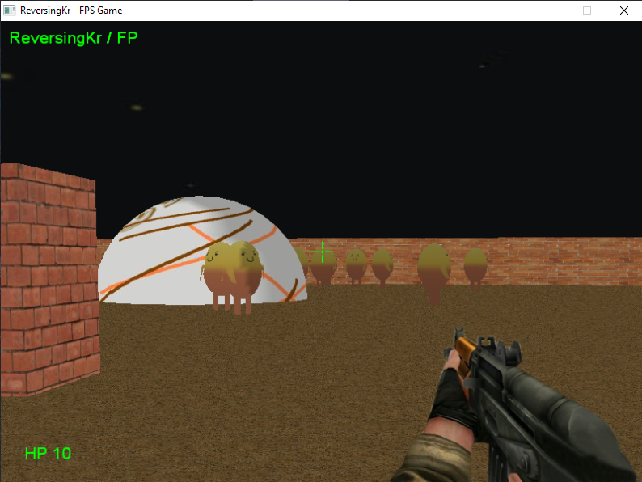

Adu tự nhiên có game fps chơi:)))

Nhiệm vụ của mình là đi clear mấy con này, bắn nào hết thì có pass:>

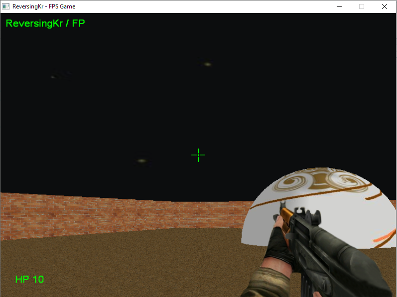

Bắn xong mình cũng k thấy cái gì luôn:))

Chơi zui xíu thôi, vào phân tích nào, thử tìm trong string mình có thấy cái này:

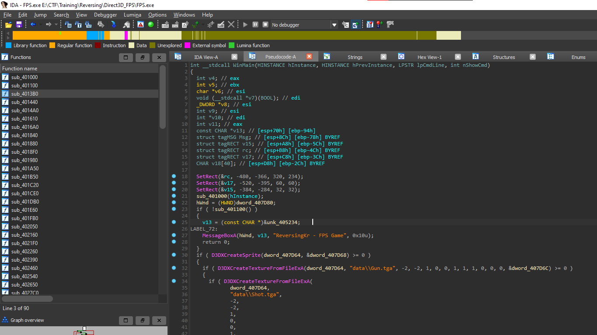

Mình trace ra thì thấy hàm `sub_4039C0` có gọi tới chổ này:
```c
int *sub_4039C0()
{
  int *result; // eax

  result = &dword_409194;
  while ( *result != 1 )
  {
    result += 132;
    if ( (int)result >= (int)&unk_40F8B4 )
    {
      MessageBoxA(hWnd, aCkfkbulileEZf, "Game Clear!", 0x40u);
      return (int *)SendMessageA(hWnd, 2u, 0, 0);
    }
  }
  return result;
}
```
Trong lúc xuất ra thông báo `Game Clear` thì cũng có kèm theo đoạn chuỗi này, nhưng nhìn có vẻ không ổn lắm:

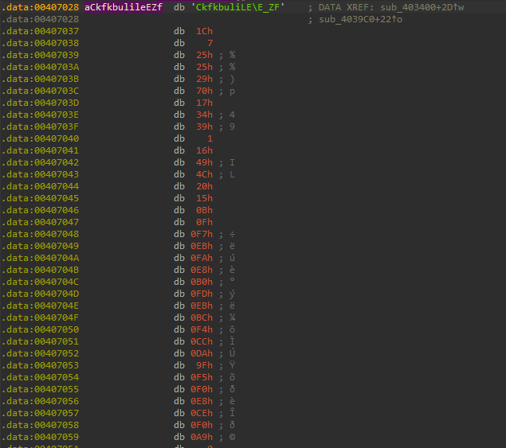

Mình thử xref thì thấy nó còn được đem đi xor, khác chắc là decryt

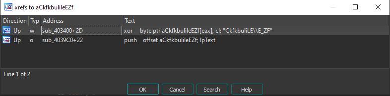

```c
int __thiscall sub_403400(void *this)
{
  int result; // eax
  int v2; // edx

  result = sub_403440(this);
  if ( result != -1 )
  {
    v2 = dword_409190[132 * result];
    if ( v2 > 0 )
    {
      dword_409190[132 * result] = v2 - 2;
    }
    else
    {
      dword_409194[132 * result] = 0;
      data[result] ^= byte_409184[528 * result];
    }
  }
  return result;
}
```
Mình đã đổi tên biến thành data cho dễ nhìn, nó được lấy từng kí tự đem đi xor với các `byte_409184`, xem thử chổ `byte_409184+528 này có gì`

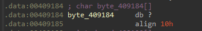

Mình thử dùng python có sẵn trong IDA thì được kết quả như này: (0x002D9184 là vị trí của byte_409184)
```
  Python>b = 0x002D9184 
  Python>get_bytes(b,1)
  b'\x00'
  Python>get_bytes(b+518,1)
  b'S'
  Python>b = 0x002D9184
  Python>get_bytes(b,1)
  b'\x00'
  Python>get_bytes(b+528,1)
  b'\x04'
  Python>get_bytes(b+528*2,1)
  b'\x08'
```
Mình dự đoán được rằng byte_409184 sẽ là một mảng từ 0,4,8,12,16...rồi dùng đem xor với data có sẵn mà chúng ta đã thấy

Minh viết scipt này để lấy data và `byte_409184` ra sau đó đem xor với nhau:

```py
data = 0x0407028 #data start address
j =0
for i in range(50):
    print(chr(int.from_bytes(get_bytes(data+i,1),"big")^j),end = "")
    j+=4
```
Dùng chức năng load script file của IDA để chạy file py:

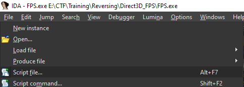

Kết quả là:

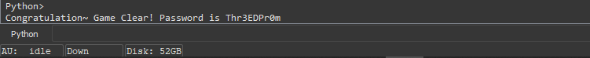

## Multiplicative - 170pts

Lần này ta sẽ rev file jar

Mình dùng `jadx` để `decompile` ra:

 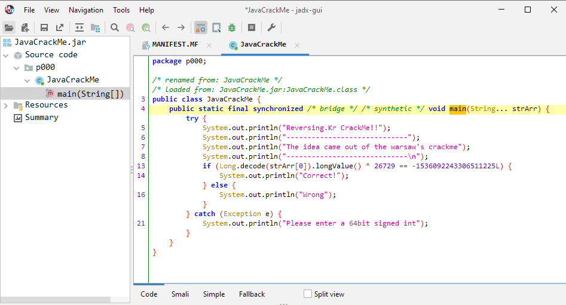

Nhìn sơ qua thì source code khá đơn giản chỉ là nhận vào rồi kiểm tra, tuy nhiên nó không dễ như bình thường

Mình đã thử

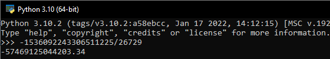

Bài này dùng phép nhân trước khi tính toán, nên mình chăc chắn đây là overflow luôn

Kiểu `long` có 64 bit cho nên số lớn nhất sẽ là 2^63-1, sau khi lớn hơn giá trị này nó sẽ quay về -2^63, vậy nên ta sẽ tính toán giá trị hợp lí cho nó quay về 
-1536092243306511225

Chuyển -1536092243306511225 sang số không dấu ta được 0xeaaeb43e477b8487

Theo như tính chất của overflow, thì (0xeaaeb43e477b8487 + 2^64.n) sẽ là bội số của 26729, vậy nên mình có script như sau:

```py
from ctypes import *
i = 0
while True:
    if ((2**64)*i + 0xeaaeb43e477b8487)%26729==0:
        print((2**64)*i + 0xeaaeb43e477b8487)
        break
    i+=1
print(c_int64(253087792599051741660295//26729))
```
Kết quả là
`-8978084842198767761`

## ransomware - 120pts

Còn về phần bài này, đề cho 1 `file` và 1 file `run.exe`, và file readme có nói rõ:

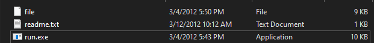

Vì đề bài là ransomware(1 loại virus phá hoại) mình biết là bằng cách nào đó, cái file này đã làm mã hóa `file` khiến cho nó không thể hoạt động được:

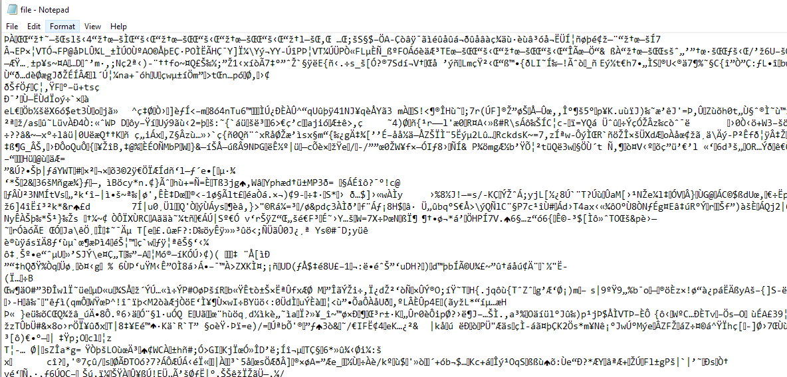

Còn đây là file exe, sau khi nhập key bừa thì mình phát hiện `file` đã bị thay đổi nội dung:

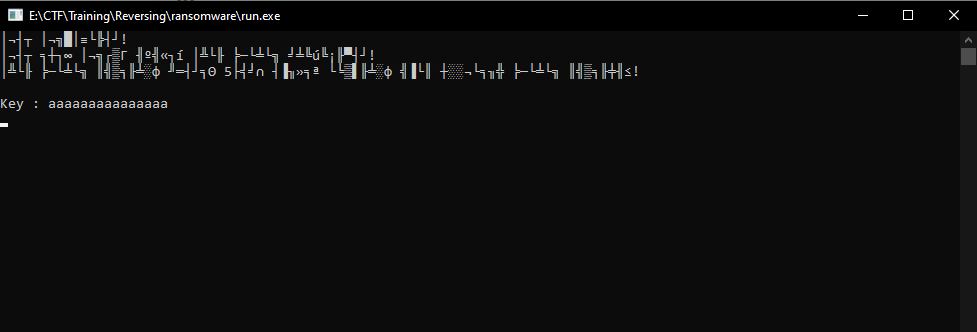

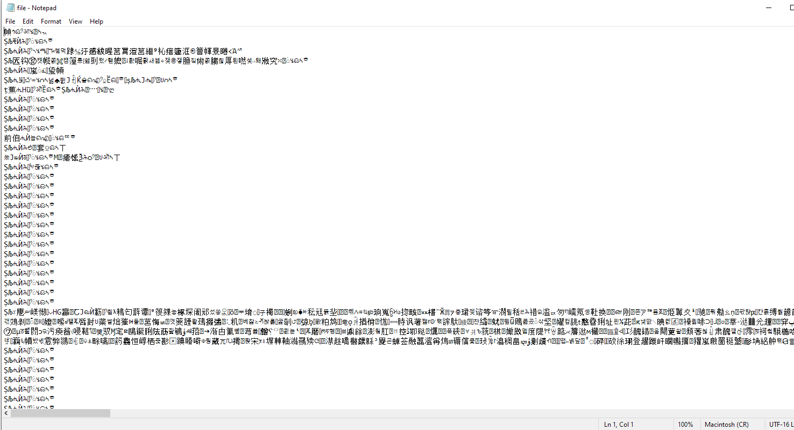

Giờ nhiệm vụ của mình là tìm đúng key để giải mã cái đống này thôi:>


File `run.exe` là file đã packed, mình dùng extentions có sẵn của `CFF Explorer` để unpack nó:Packer nén code rồi thêm một đoạn stub tự giải nén khi chạy. Vì vậy binary lúc tĩnh và lúc chạy khác hẳn nhau, và IDA nhìn vào file gốc gần như không thấy gì.

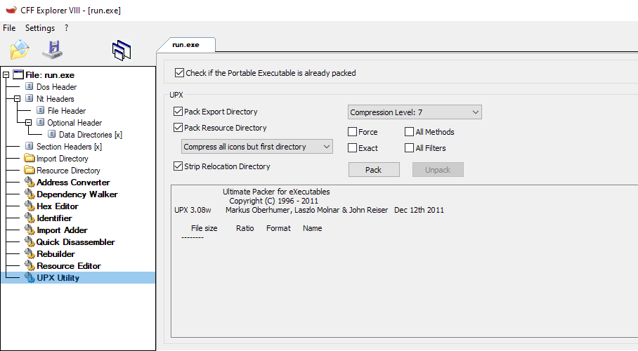

Lưu thành file mới và đưa vào `IDA` xem thử nào:

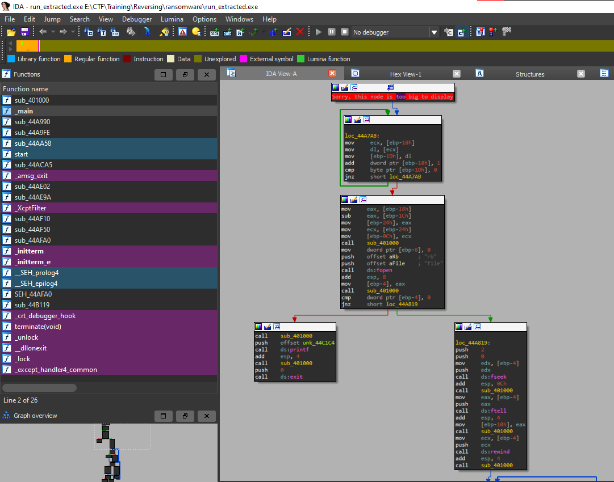

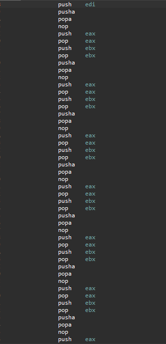


Đây là hàm main, phía trên còn có khúc `pusha` `popa` rất nhiều, tạm thời ta không cần quan tâm

Để ý các bạn có thể thấy, chương trình có đoạn dùng fopen mở file có tên là `file`, mode là `rb`, nghĩa là đọc bytes từ file mà đề cho

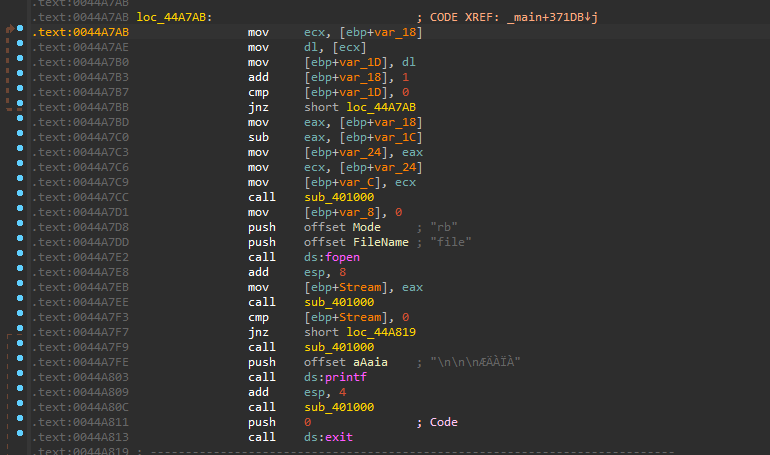

Trong suốt chương trình thì ta luôn thấy nó gọi tới hàm `sub_401000`, nhưng mà nội dung của nó cũng k có gì đặc biệt, ta bỏ qua tiếp

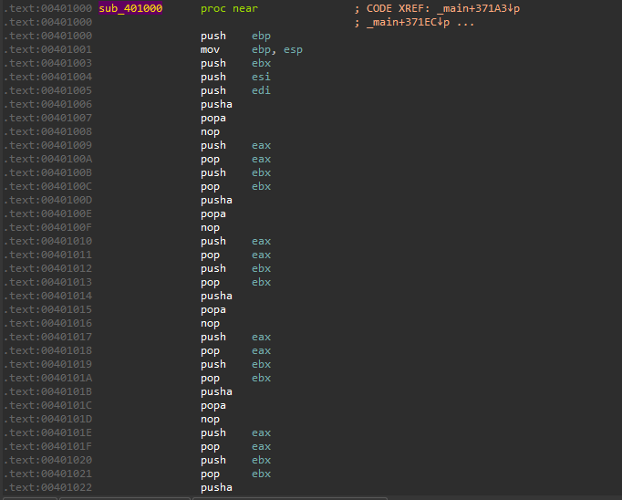

Quay trở lại vấn đề chính, sau khi gọi lệnh đọc file, thì đoạn này chương trình sẽ có vòng lặp lấy từng byte của file sau đó lưu vào `byte_5415B8`:

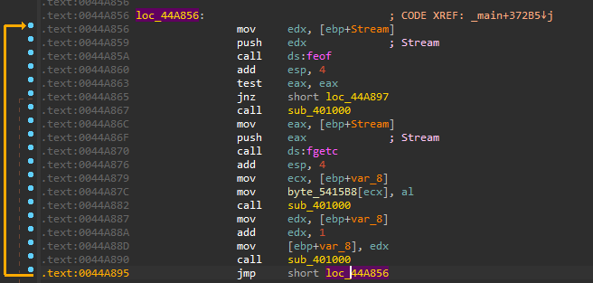

Sau khi đọc hết file, chương trình nhảy tới đoạn `loc_44A8A5`

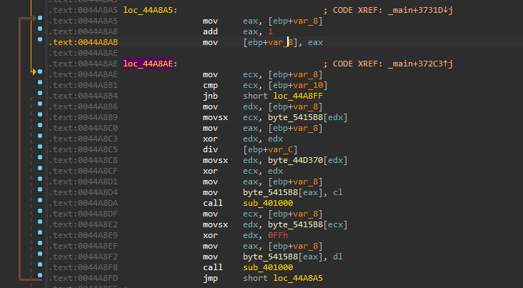

Qua quá trình debug thì mình mới biết `[ebp+var_8]` sẽ là biến đếm từ 0 tới `[ebp+var_10]`(độ dài của `file`), nếu nhỏ hơn thì tiếp tục vòng lặp, tạm gọi là `i` và `n`.

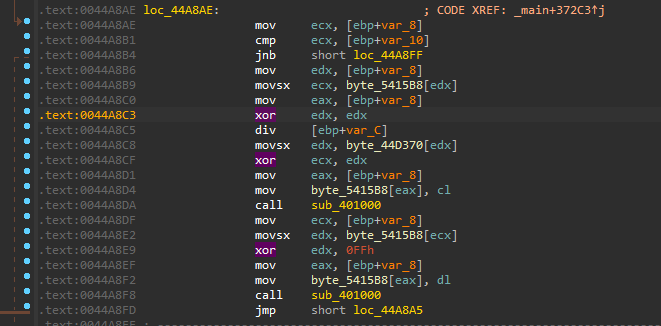

Đoạn này có 3 lệnh `xor`, tuy nhiên khúc `xor` đầu tiên chỉ là để clear thanh ghi `edx`, ngoài ra còn có đoạn dùng `div` cho `[ebp+var_C]` (độ dài của key từ người dùng), `div` sẽ lấy `eax` chia cho thanh ghi toán hạng nguồn, sau đó lưu số dư vào `edx`.

```
movsx   edx, byte_44D370[edx]
```
byte_44D370 chính là key của người dùng nhập vào,

Sau đó các file bytes của chúng ta còn được `xor` với 0xFF, tổng kết lại, mình đọc được đoạn nó encrypt như sau:
```c
byte[i] = byte[i]^key[i%len(key)]^0xFF
```
Trong đó `key` và `len(key)` đều không biết được, nên là mình đã nghĩ tởi bruteforce key, nhưng không được :V

Mình đã thử lấy file gốc `xor` với `0xFF` trước:

```py
b = bytearray(open('file', 'rb').read())
for i in range(len(b)):
    b[i] = b[i]^0xFF
open('file_new', 'wb').write(b)
```

Mở `file_new` bằng HxD, mình thấy có vài thứ hay ho:

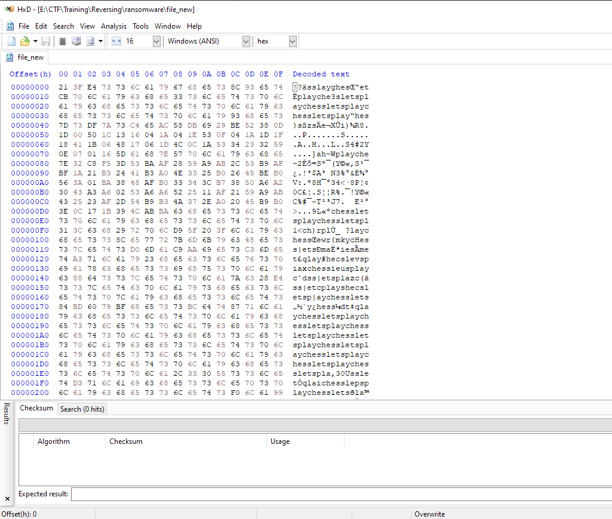

Mình thấy có 1 đoạn text có thể đọc được và lặp đi lặp lại rất nhiều lần, chắc chắn đây là key luôn, thử nhập vào file `run.exe`:

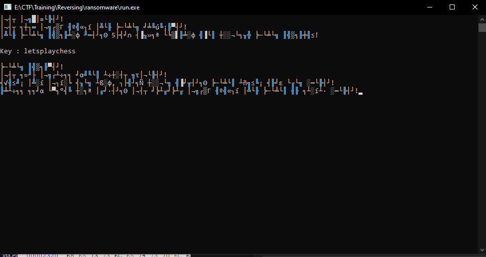

Mở `file` lên thử:

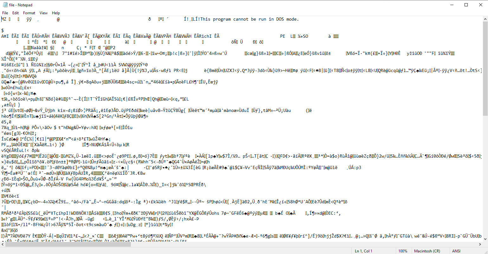

Có vẻ như là key đúng rồi, nhưng mà sao để chạy file này đây?


Dùng DiE thì mình thấy đây là file thực thi 32bits và packed, unpack và đưa vào ida xem thử:v

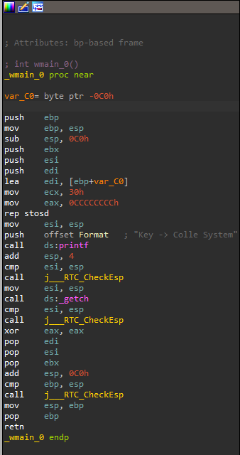

Có luôn:)) `Colle System`

## HateIntel - 150pts

Nghe tên bài và icons là mình biết bài này dùng cái gì luôn:

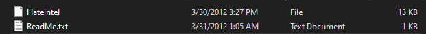

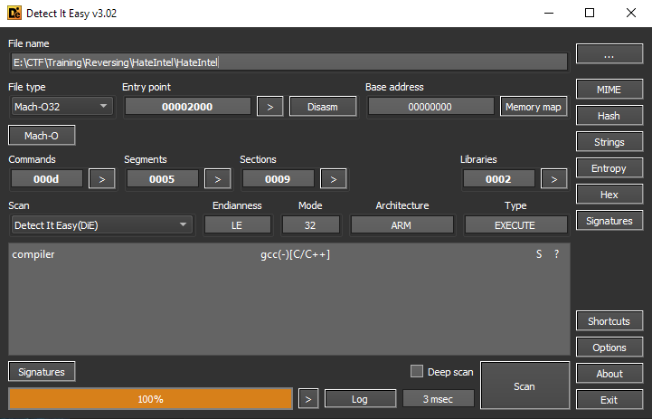

File đề cho là file thực thi trên `macOS`, tuy nhiên file dùng compiler là `gcc` nên code vẫn là code C như thông thường, IDA hoàn toàn có thể hỗ trợ decompile:

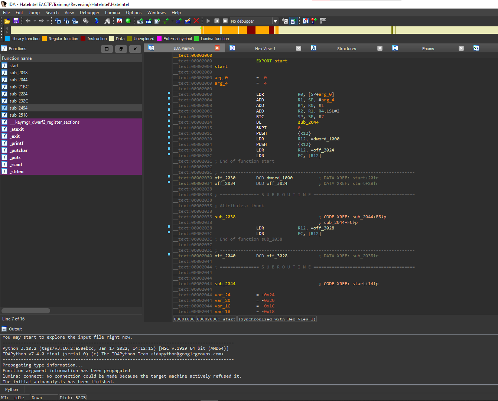

`macOS` sẽ dùng kiến trúc `ARM (arm architecture)` thay vì `intel_x86,_x64` mà mấy bài trước chúng ta rev, tập lệnh của `ARM` có đặc điểm nhận diện là thường viết HOA hết các lệnh, nhưng mà đây chỉ là kiến thức thêm, trong phạm vi bài này, ta chỉ đọc code C thuần nên không quan tâm lắm, còn đây là hàm `main()`:

```c
int sub_2224()
{
  char __s[80]; // [sp+4h] [bp-5Ch] BYREF
  int v2; // [sp+54h] [bp-Ch]
  int v3; // [sp+58h] [bp-8h]
  int i; // [sp+5Ch] [bp-4h]

  v2 = 4;
  printf("Input key : ");
  scanf("%s", __s);
  v3 = strlen(__s);
  sub_232C(__s, v2);
  for ( i = 0; i < v3; ++i )
  {
    if ( __s[i] != byte_3004[i] )
    {
      puts("Wrong Key! ");
      return 0;
    }
  }
  puts("Correct Key! ");
  return 0;
}
```

Chương trình lấy chuỗi của người dùng nhập vào, sau đó đưa vào hàm `sub_232C` (tạm gọi là hàm encrypt) xử lí, sau đó so sánh với các `byte` có sẵn trong data chương trình:

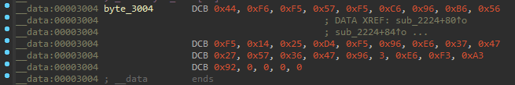

Vào trong hàm `encrypt` xem thử:

```c
signed __int32 __fastcall encrypt(signed __int32 result, int a2)
{
  char *__s; // [sp+4h] [bp-10h]
  int i; // [sp+8h] [bp-Ch]
  signed __int32 j; // [sp+Ch] [bp-8h]

  __s = (char *)result;
  for ( i = 0; i < a2; ++i )
  {
    for ( j = 0; ; ++j )
    {
      result = strlen(__s);
      if ( result <= j )
        break;
      __s[j] = sub_2494((unsigned __int8)__s[j], 1);
    }
  }
  return result;
}
```

Hàm này duyệt qua chuỗi 4 lần (a2 = 4), mỗi lần từng kí tự sẽ được thay đổi bởi hàm `sub_2494`:

```c
int __fastcall sub_2494(unsigned __int8 a1, int a2)
{
  int v3; // [sp+8h] [bp-8h]
  int i; // [sp+Ch] [bp-4h]

  v3 = a1;
  for ( i = 0; i < a2; ++i )
  {
    v3 *= 2;
    if ( (v3 & 0x100) != 0 )
      v3 |= 1u;
  }
  return (unsigned __int8)v3;
}
```

Hàm `sub_2494` cũng có 1 vòng lặp, nhưng a2 = 1, nên ta xem như không có vòng lặp, ta chỉ quan tâm logic của hàm, mình thấy có đoạn `v3 |= 1u;` nên mình nghĩ hàm này sẽ xử lí thao tác bit:

Code của hàm sẽ trông dễ hiểu hơn:

```c
int rotate(char c){
    c <<=1;
    if ( (c & 0x100) != 0 ) c |= 1u;
    return (unsigned __int8)c; // lấy 8 bits cuối
}
```
Cả đoạn này hiểu như sau: dịch 8 bits của kí tự sang trái, lấy bit đầu tiên thêm vào cuối, hay nói cách khác là `rotate bits`, khi rotate 4 lần thì 4 bits đầu thành 4 bits cuối và ngược lại, với data `bytes` có sẵn, mình có script để rev như sau:

```py
b = [0x44, 0xF6, 0xF5, 0x57, 0xF5, 0xC6, 0x96, 0xB6, 0x56,0xF5, 0x14, 0x25, 0xD4, 0xF5, 0x96, 0xE6, 0x37, 0x47,0x27, 0x57, 0x36, 0x47, 0x96, 3, 0xE6, 0xF3, 0xA3,0x92]
for byte in b:
    last = byte>>4
    first = byte&0xF
    s = (first<<4) | last 
    print(chr(s),end = "") #Do_u_like_ARM_instructi0n?:)
```
Result: `Do_u_like_ARM_instructi0n?:)`

## x64 Lotto - 140pts

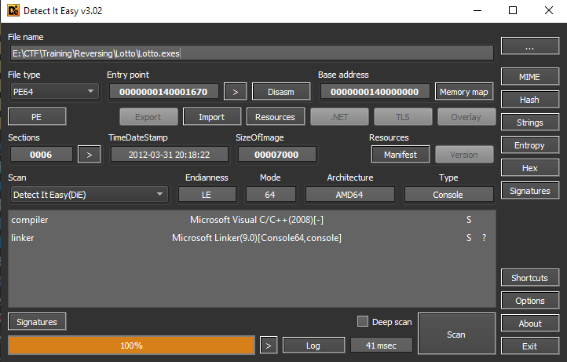
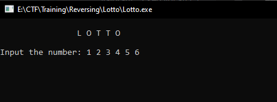

Đề cho mình 1 file PE64, sau khi nhập bừa thì màn hình quay về ban đầu và bắt nhập lại, thử đưa vào ida:

```c
__int64 wmain()
{
  unsigned int v0; // eax
  __int64 i; // rbx
  char v2; // r8
  int v3; // edx
  __int64 k; // rcx
  _BYTE *v5; // rdx
  __int64 j; // rcx
  char v7; // al
  int v8; // ecx
  __int16 *v9; // rdx
  __int16 v10; // ax
  __int16 v11; // ax
  int n1; // [rsp+40h] [rbp-78h] BYREF
  int n2; // [rsp+44h] [rbp-74h] BYREF
  int n3; // [rsp+48h] [rbp-70h] BYREF
  int n4; // [rsp+4Ch] [rbp-6Ch] BYREF
  int n5; // [rsp+50h] [rbp-68h] BYREF
  int n6; // [rsp+54h] [rbp-64h] BYREF
  int v19[3]; // [rsp+58h] [rbp-60h]
  int v20; // [rsp+64h] [rbp-54h]
  int v21; // [rsp+68h] [rbp-50h]
  int v22; // [rsp+6Ch] [rbp-4Ch]
  __int16 v23[25]; // [rsp+70h] [rbp-48h] BYREF
  __int16 v24; // [rsp+A2h] [rbp-16h]

  n1 = 0;
  n2 = 0;
  n3 = 0;
  n4 = 0;
  n5 = 0;
  n6 = 0;
  v19[0] = 0;
  v19[1] = 0;
  v19[2] = 0;
  v20 = 0;
  v21 = 0;
  v22 = 0;
  v0 = time64(0i64);
  srand(v0);
  do
  {
    wprintf(L"\n\t\tL O T T O\t\t\n\n");
    wprintf(L"Input the number: ");
    wscanf_s(L"%d %d %d %d %d %d", &n1, &n2, &n3, &n4, &n5, &n6);
    wsystem(L"cls");
    Sleep(500u);
    for ( i = 0i64; i < 6; v19[i - 1] = rand() % 100 )
      ++i;
    v2 = 1;
    v3 = 0;
    k = 0i64;
    byte_7FF658B935F0 = 1;
    while ( v19[k] == *(&n1 + k * 4) )
    {
      ++k;
      ++v3;
      if ( k >= 6 )
        goto LABEL_9;
    }
    v2 = 0;
    byte_7FF658B935F0 = 0;
LABEL_9:
    ;
  }
  while ( v3 != 6 );
  v5 = byte;
  v23[1] = 92;
  v23[0] = 184;
  v23[2] = 139;
  v23[5] = 184;
  v23[3] = 107;
  j = 0i64;
  v23[4] = 66;
  v23[6] = 56;
  v23[7] = 237;
  v23[8] = 219;
  v23[9] = 91;
  v23[10] = 129;
  v23[11] = 41;
  v23[12] = 160;
  v23[13] = 126;
  v23[14] = 80;
  v23[15] = 140;
  v23[16] = 27;
  v23[17] = 134;
  v23[18] = 245;
  v23[19] = 2;
  v23[20] = 85;
  v23[21] = 33;
  v23[22] = 12;
  v23[23] = 14;
  v23[24] = 242;
  v24 = 0;
  do
  {
    v7 = byte[j - 1];
    j += 5i64;
    *(&v20 + j + 1) ^= (v7 - 12);
    *(&v21 + j) ^= (byte[j - 5] - 12);
    *(&v21 + j + 1) ^= (byte[j - 4] - 12);
    v23[j - 2] ^= (byte[j - 3] - 12);
    v23[j - 1] ^= (byte[j - 2] - 12);
  }
  while ( j < 25 );
  if ( v2 )
  {
    v8 = 0;
    v9 = v23;
    do
    {
      v10 = *v9++;
      v11 = v8++ + (v10 ^ 0xF);
      *(v9 - 1) = v11;
    }
    while ( v8 < 25 );
    v24 = 0;
    wprintf(L"%s\n", v23);
  }
  wprintf(L"\n", v5);
  return 1i64;
}
```
Mình đã đổi tên mọt số biến để dễ nhìn hơn, cụ thể là, chương trình bắt mình nhập 6 số:
```c
wscanf_s(L"%d %d %d %d %d %d", &n1, &n2, &n3, &n4, &n5, &n6);
```
Và sau đó 6 số này sẽ lần lượt được so sánh với 6 số ngẫu nhiên được khởi tạo:
```c
for ( i = 0i64; i < 6; v19[i - 1] = rand() % 100 )
      ++i;
```
May mắn là, mình phát hiện 6 số này không sử dụng mục đích nào khác ngoài kiểm tra xem có đúng không, thế nên là mình bỏ qua luôn.

Ngoài ra mình thấy có đoạn khởi tạo giá trị và decrypt password của mình:

```c
do
  {
    v7 = byte[j - 1];
    j += 5i64;
    *(&v20 + j + 1) ^= (v7 - 12);
    *(&v21 + j) ^= (byte[j - 5] - 12);
    *(&v21 + j + 1) ^= (byte[j - 4] - 12);
    v23[j - 2] ^= (byte[j - 3] - 12);
    v23[j - 1] ^= (byte[j - 2] - 12);
  }
  ```

Thử đặt breakpoint chổ này để thiết lập cho nó thoát khỏi vòng lặp nhập input:

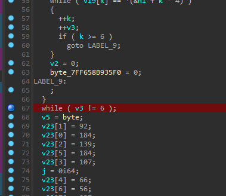

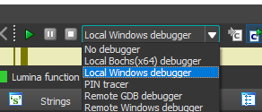

Chọn `Local windows debugger` và bắt đầu debug

Sau khi nhập bừa 6 số, quay lại màn hình debug:

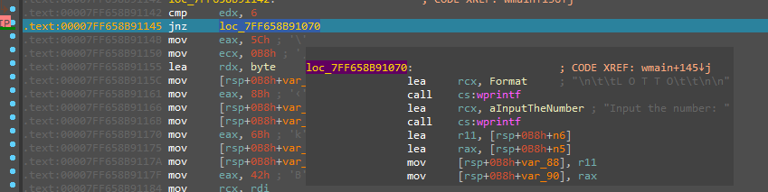

Chổ này chương trình kiểm tra xem 6 số có dúng hết không, nó đã dùng lệnh `jnz`, nếu không phải 0 (ZF = 0) thì sẽ jump tới chổ nhập input:

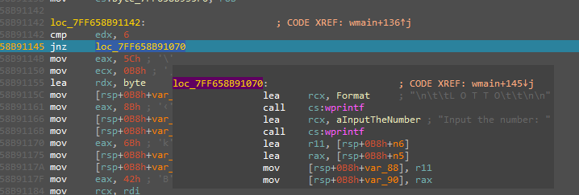

Để bypass chổ này, mình sửa ZeroFlag bằng 1:

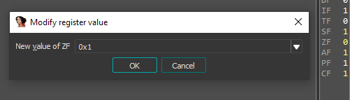

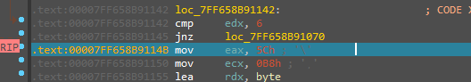

Ngoài ra, sau khi decrypt vẫn còn 1 điều kiện khác nữa:

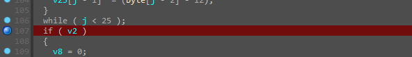

Đặt breakpoint và làm tương tự với chổ này:

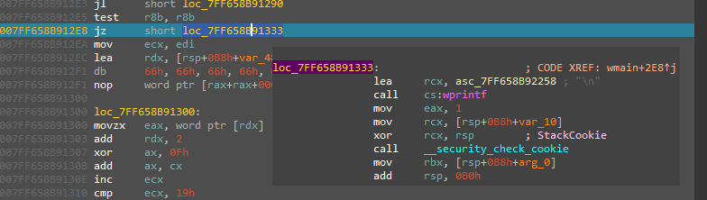

Lần này chương trình dùng lệnh `jz` (jump if zero, ZF = 1), chỉ cần sửa ngược lại so với lệnh ở trên là dc:

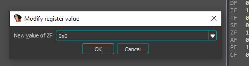

Chổ này chương trình sẽ in ra thứ gì đó có vẻ giống password:))

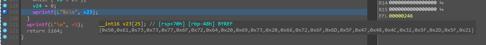

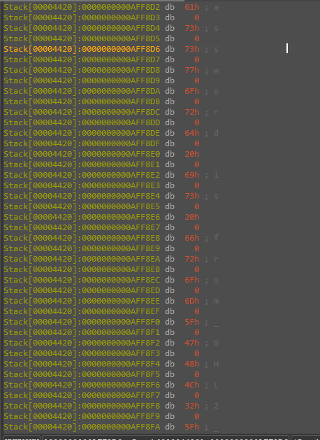

Password: `from_GHL2_-_!`

Nói chung là bài này khá cơ bản, các bạn không cần phải rev hết chương trình, chỉ cần chú tâm đến vài chổ quan trọng thay đổi flow cả chương trình rồi rev từ đó ra là được, Chúc các bạn thành công

## AutoHotKey1 - 130pts

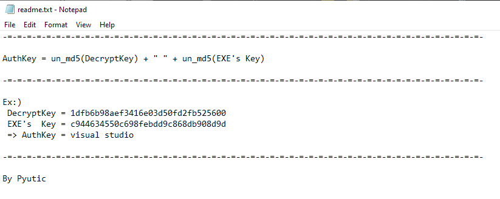


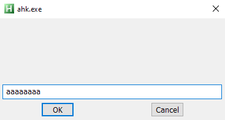

Sau khi mình nhập input bừa thì chương trình dừng ngay lập tức

Đề cho mình 1 file packed bằng UPX:UPX có sẵn lệnh `-d` để giải nén, nhưng chỉ chạy được khi header còn nguyên. Đề thường sửa vài byte trong header cho `upx -d` báo lỗi, lúc đó phải tự dump lúc chạy.

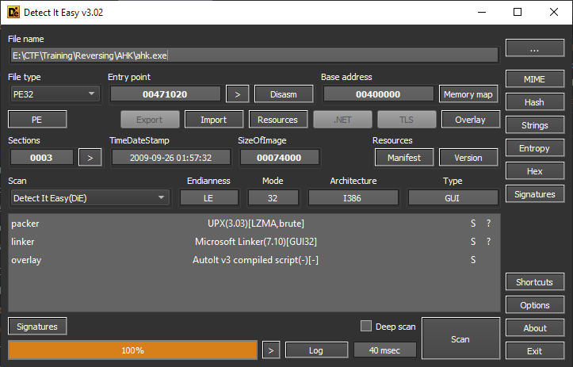

Mình thử dùng UPX 3.96 để unpack file này ra nhưng sau khi chạy thì nó hiện thông báo lỗi: 

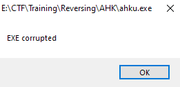

Mình thử tìm trong string doạn `Exe corrupted` và xref thử thì có 2 hàm này dùng tới nó:

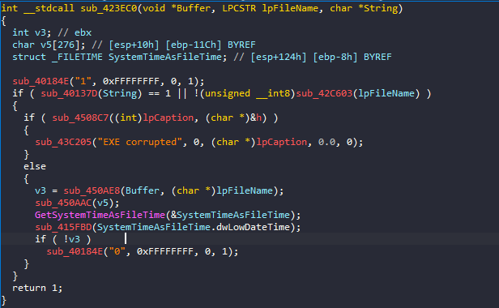

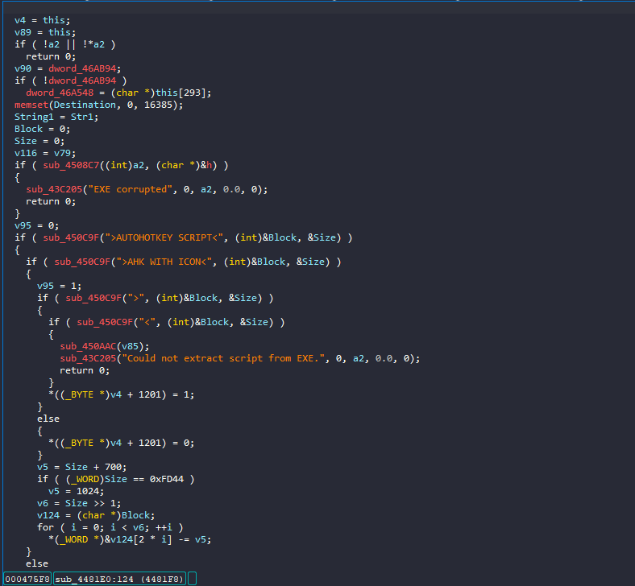

Dựa vào offset biết được, mình dùng x32dbg để debug file này và trace cho tới đoạn này:

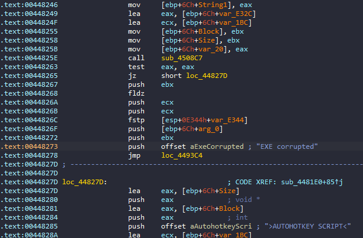

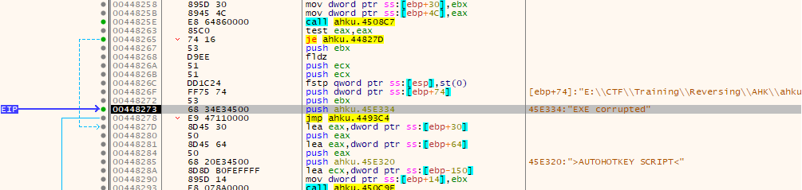

Nhìn kĩ lên trên một chút thì ta thấy có đoạn `je` sẽ jump qua khỏi đoạn kiểm tra này, nên mình đặt breakpoint tại đấy và chỉnh `ZeroFlag = 1`:

Sau khi pass qua được thì khi chạy 1 lúc, bạn sẽ thấy MD5 của `DecryptKey` xuất hiện:

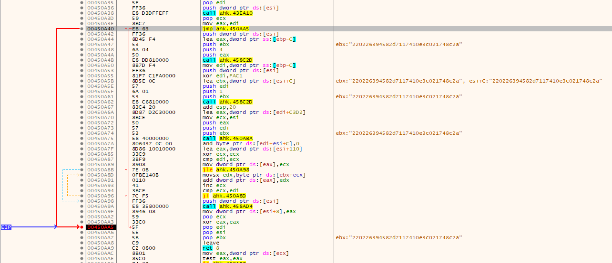

```220226394582d7117410e3c021748c2a```

Decrypt MD5 bằng tool online (https://md5decrypt.net/), ta được:


Tìm nốt phần còn lại thôi:)))

Lần này mình quay lại chương trình gốc, sau khi các đoạn code được mã hoắ, debug thì mình biết được chương trình sẽ thực hiện khi gọi hàm này:

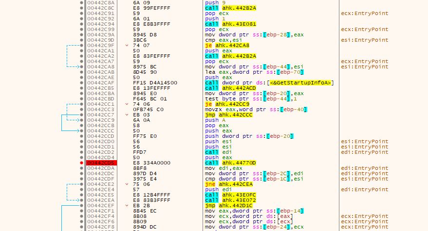

Thử đặt breakpoint, step into là làm tương tự:


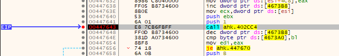

Tới đây thì mình thấy được đoạn so sánh `pwd hash`, tương tự, decrypt md5 của đoạn này:
```54593f6b9413fc4ff2b4dec2da337806```
Kết quả:


Password: `isolated pawn`

## CSHARP - 160pts

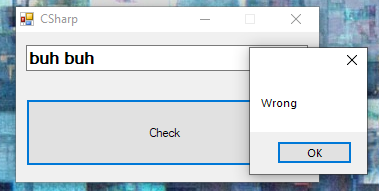

Vì là Csharp nên mình dùng dnSpy64:

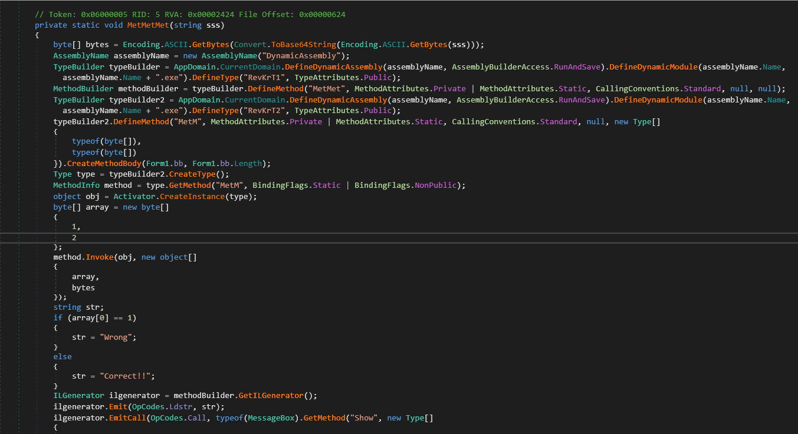

Sau khi file nhận input của mình thì nó sẽ chuyển thành bytes base64, và sau đó chạy qua hàm Invoke này để kiểm tra:

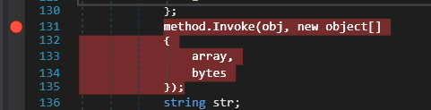

Đặt breakpoint tại chổ gọi hàm và debug:

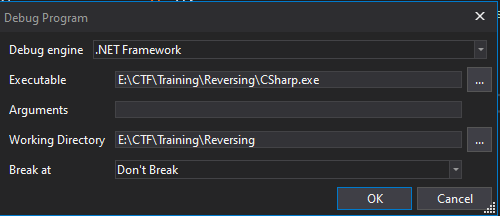

Bấm F11 để step into thân hàm:

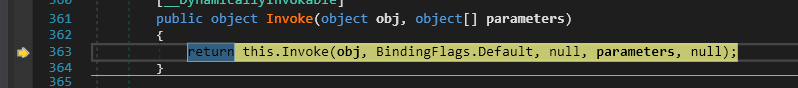

Tiếp tục F11:

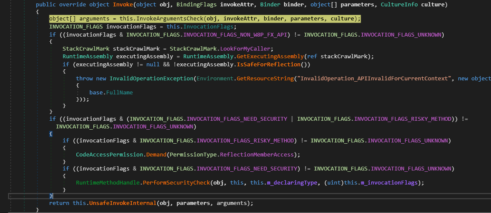

Tại đây thì chương trình nó làm một vài thao tác check cơ bản nhưng nói chung là mình không quan tâm, chỉ quan tâm đoạn return của hàm:

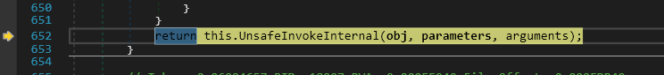

Step into:

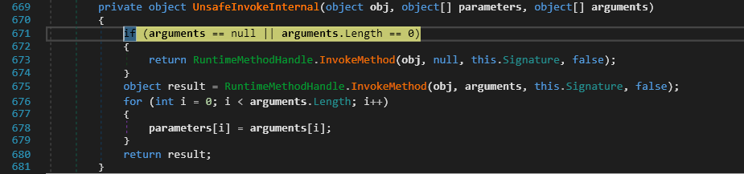

Trong hàm này, ta thấy có đoạn `RuntimeMethodHandle` khá đáng nghi, nên mình nghĩ chương trình này dùng hàm trong lúc chạy nên lúc trước mình không thể static analysis được:

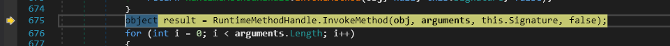

Step into:

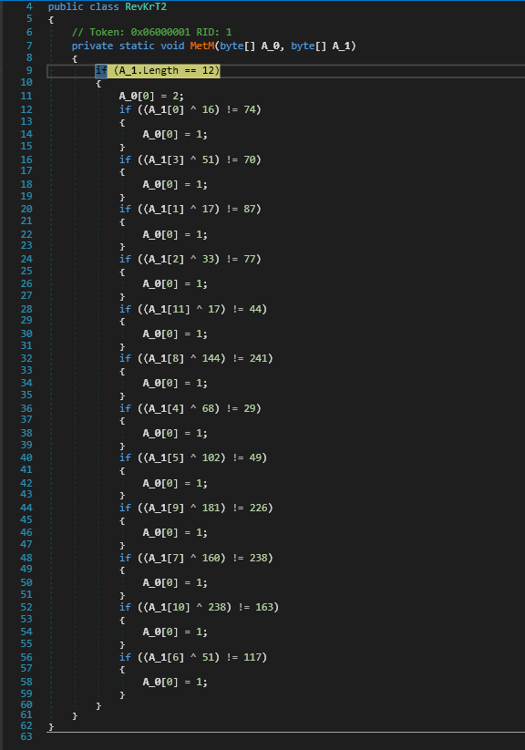

Copy qua python và chỉnh sửa lại:

```py
from base64 import b64decode
flag = [0]*12
flag[0] = 16 ^ 74

flag[3] = 51 ^ 70

flag[1] = 17 ^ 87

flag[2] = 33 ^ 77

flag[11] = 17 ^ 44

flag[8] = 144 ^ 241

flag[4] = 68 ^ 29

flag[5] = 102 ^ 49

flag[9] = 181 ^ 226

flag[7] = 160 ^ 238

flag[10] = 238 ^ 163

flag[6] = 51 ^ 117
print(b64decode("".join([chr(i) for i in flag])).decode())
#dYnaaMic
```

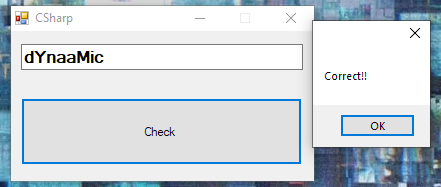

Password: `dYnaaMic`

## Twist1 - 190pts
Bài này trong lúc mình đang làm khá stuck nên mình có thử tham khảo vài nguồn trên internet và làm như sau:

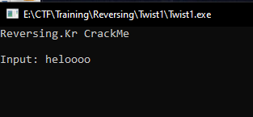

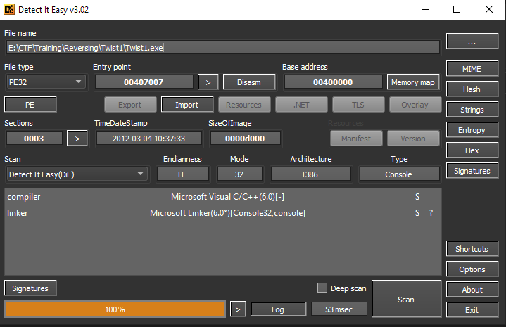

Bài này sẽ thuộc dạng input-check cơ bản

Thử đưa vào ida xem thử:

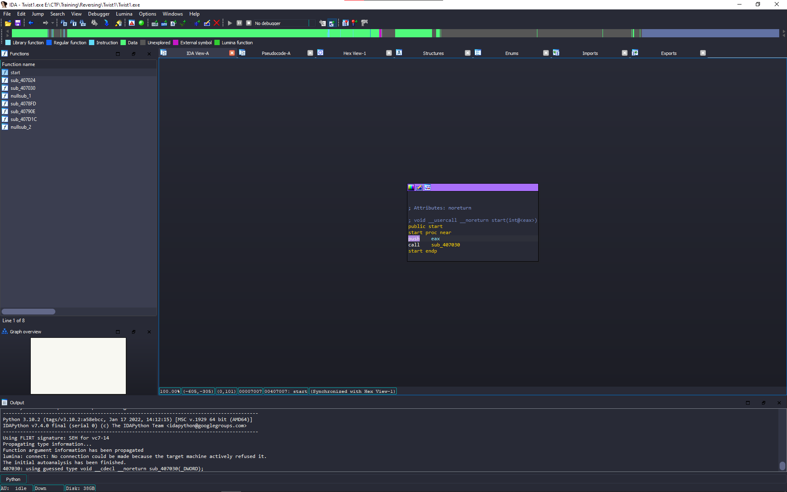

Rất ít hàm và cũng không tìm thấy OEP nên mình nghĩ là đây là một file packed bằng 1 cách nào đóOEP là địa chỉ lệnh đầu tiên của chương trình thật, trước khi bị packer bọc lại. Tìm được OEP là tìm được chỗ để dump bộ nhớ ra thành file chạy độc lập. 

Khi chạy thì nó hiện ra lỗi như này:

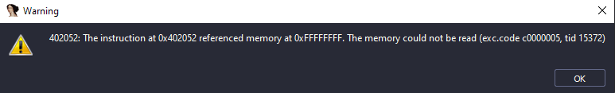

Chương trình dừng ở ngay lệnh `pop ss`:

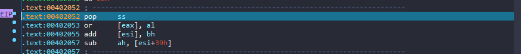

Qua tìm hiểu thì mình biết thêm một số thứ về [pop ss](https://daehee87.tistory.com/23):

> `pop ss` sẽ thực hiện lệnh tiếp theo và ngăn lệnh hiện tại cho tới khi lệnh tiếp theo được thực hiện

 Ngoài ra, khi mình debug có thấy đoạn vòng lặp chổ `loc_407063`, khi chạy đoạn này thì các đoạn code lần lượt xuất hiện phía bên dưới, đây sẽ là đoạn decryot, nên mình đăt breakpoint tại `0040706F` để lấy được toàn bộ code hoàn thiện.
 
 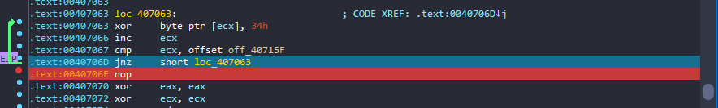

Bài này sẽ thuần theo tên bài luôn, nó sẽ có rất nhiều kĩ thuật anti-debug phổ biến.

Chuyển sang x32dbg, sau khi các đoạn code được decrypt, mình nhận thấy có một chổ `mov eax,dword ptr fs:[30]` kì lạ:

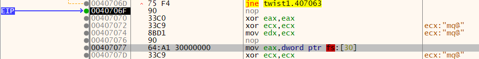

Vẫn là sau khi tim hiểu trên (stackoverflow)[https://stackoverflow.com/questions/14496730/mov-eax-large-fs30h], mình mới biết đây tiếp tục là một cơ chế antidebug.

Đoạn này có nghĩa là eax được thiết lập để chỉ ra một điểm trong cấu trúc của PEB trong process.

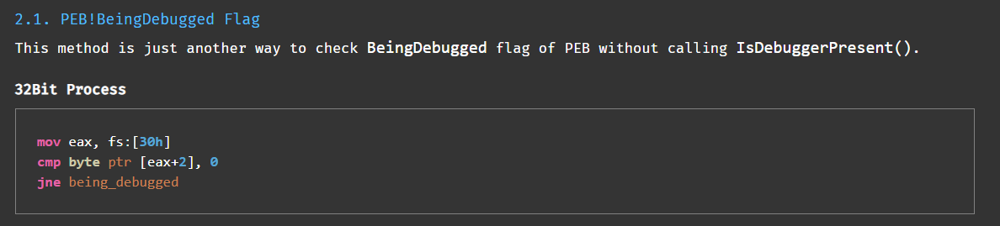

Sau lệnh trên, eax có giá trị là:

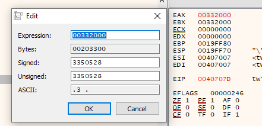

Như vậy địa chỉ cấu trúc của PEB sẽ là `0x332000`:

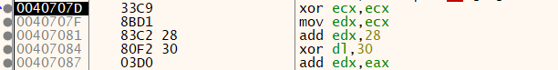

`edx` được mov giá trị 0 sau khi `ecx` được clear,sau đó nó sẽ được mov giá trị 0x28, kết quả này đem xor với 0x30 (result = 0x18) rồi được cộng trực tiếp vào eax hay địa chỉ của PEB, hay nói cách khác, nó được trỏ tới `địa chỉ của PEB + 0x18`.

Cấu trúc PEB được cấu hình hơi khác nhau trong các phiên bản x32 và x64 khác nhau. Trong trường hợp này, ta xét trên cấu trúc 32bit, trong trường hợp này, edx sẽ trỏ tới `ProcessHeap (PEB + 0x18)`.

Tại trong `twist1.40709F`, ProcessHeap sẽ được cộng thêm 0xC và so sánh với `2`:

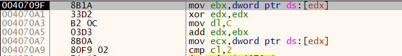

> +0x000 Entry : _HEAP_ENTRY

> +0x008 Signature : Uint4B

> +0x00c Flags : Uint4B

> +0x010 ForceFlags : Uint4B

> +0x014 VirtualMemoryThreshold : Uint4B

> +0x018 SegmentReverse : Uint4B

> +0x01c SegmentCommit : Uint4B

> +0x020 DecommitFreeBlockThreshold : Uint4B

Vậy nó sẽ trỏ đến Flags, nên là đoạn so sánh sẽ xác minh rằng tiến trình đang chạy bình thường.

Tương tự tại `004070D5` cũng sẽ có đoạn ProcessHeap + 0x10 để truy cập tới ForceFlags và xác minh tương tự.

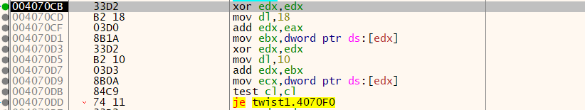

Để bypass qua đoạn test này, bạn cần chỉnh cho tanh ghi ecx có giá trị bằng với ebx:

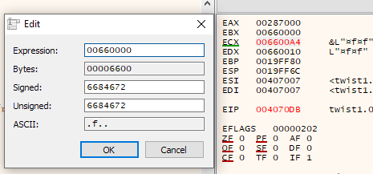

Tiếp theo, ta có 1 đoạn khác là:

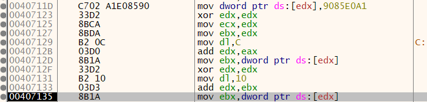

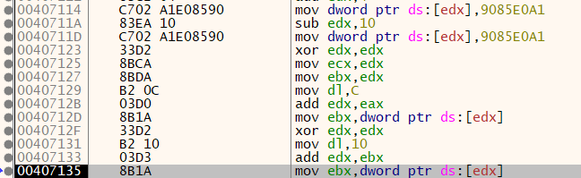

Lân này,con trỏ edx- 0x10 để quay về PEB gốc, sau đó chương trình dùng PEB + 0xC, nó sẽ trỏ tới `_PEB_LDR_DATA`, tiếp theo `_PEB_LDR_DATA + 0x10` để dùng `InInitializationOrderLinks`(dựa vào LDR_DATA_TABLE_ENTRY để tìm kiếm).

Ldr thực hiện kiểm tra xem có đang debug hay không bằng cách liên tục so sánh với lại 0xEEFEEEFE hay 0xABABABAB không để check xem debugger có lắp đầy phần không sử dụng của heap bằng 0xABABABAB hoặc 0xEEFEEEFE hay không, cụ thể là nó so sánh 0x1F4 lần:

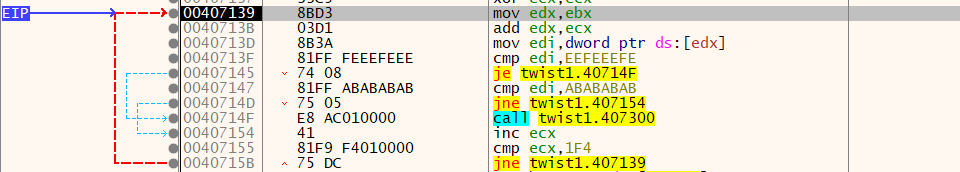

Tại vị trí `407183` vẫn còn 1 vòng lặp, đặt breakpoint tại nop để thoát khỏi vòng lặp:

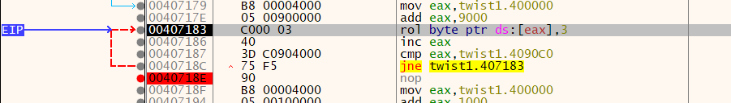

Sau đó, chương trình nhảy tới `40157C` và dường như đây chính là entrypoint, tới đây, xem như chương trình đã được unpack hoàn toàn:

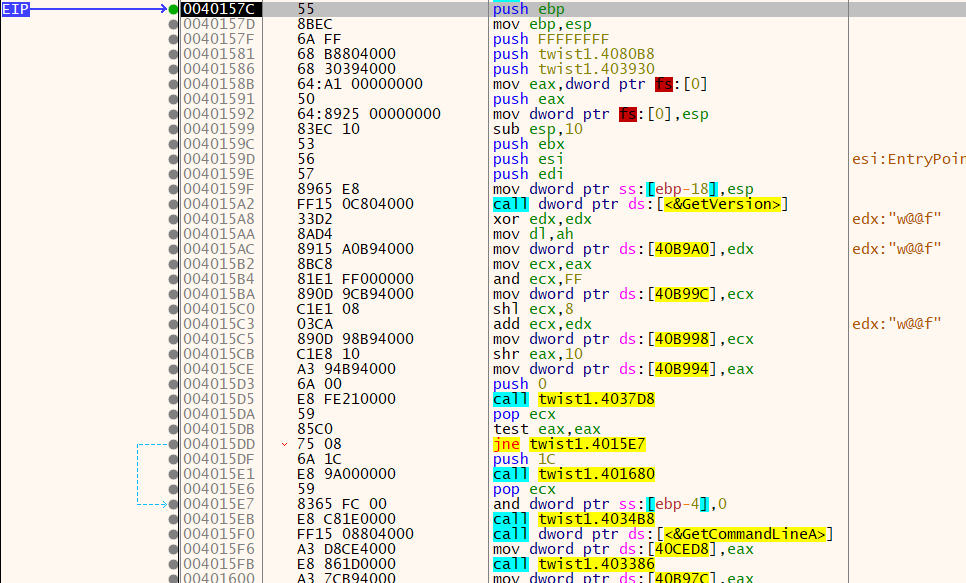

Khi cho chương trình chạy tới lệnh tại vị trí `40129B` thì nó bị lỗi như này:

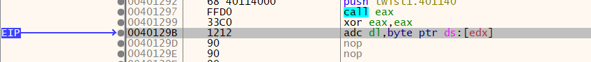

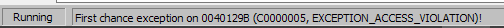

Nó nói rằng không thể tham chiếu đến địa chỉ hiện tại của edx, trên edx lại có 1 địa chỉ rất lạ, thử đổi thành địa chỉ kế tiếp của lệnh là `40129D`:

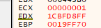

Tiếp theo ta sẽ thấy chổ nhập input:

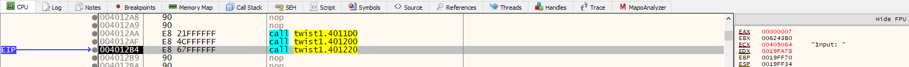

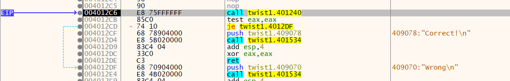

`twis1.401240` sẽ là hàm kiểm tra input của mình.
Khi debug vào bên trong, tại đây mình sẽ thấy nơi chứa input của mình:

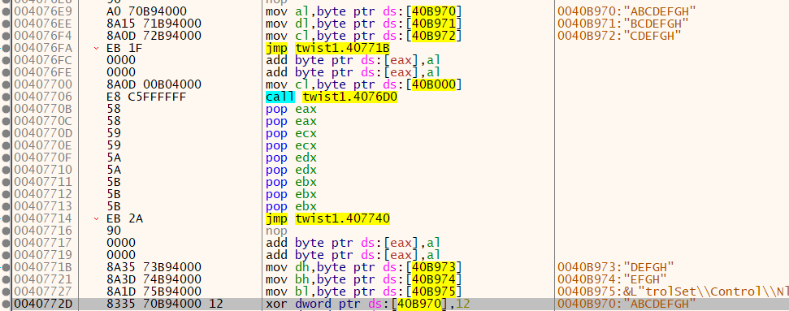

Vị trí của input là:

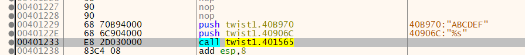

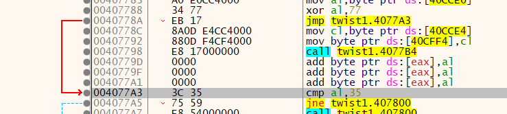

Tại đây ta sẽ tìm đc al = 0x77^0x35 = "B"; (Kí tự thứ 3)

Khi debug, ta sẽ thấy có đoạn gọi hàm này:


Pass qua đoạn này để không bị vướng vào debug trap:

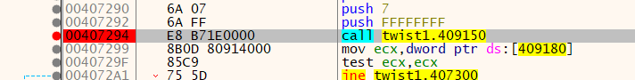


Làm tương tự với các kí tự còn lại, ta được chuối tương ứng

Input: `RIBENA`.

Bài này tương đối khó, mình thật sự stuck rất nhiều ở bài này

## PEpassword - 150pts

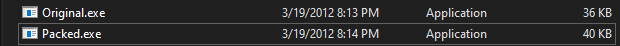

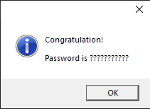

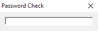

### Original.exe:

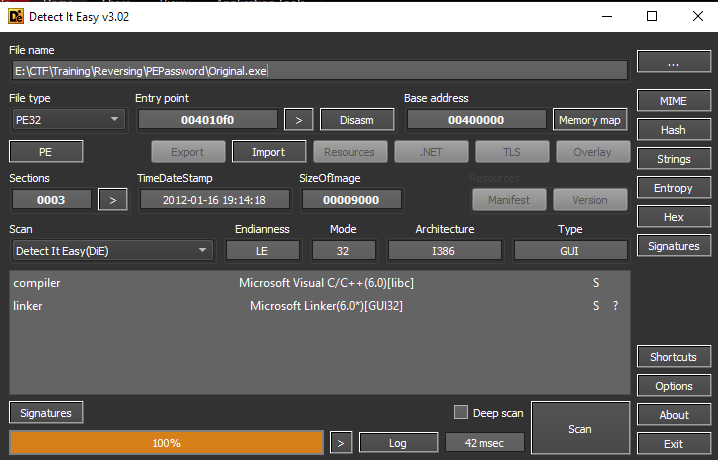

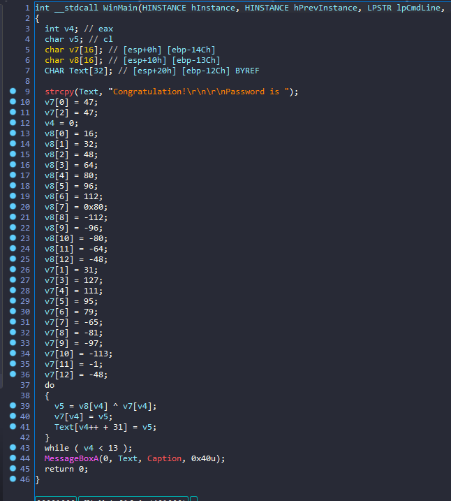

File Original sẽ là file trước khi packed, cơ bản thì nó xor 2 mảng với nhau, còn đây là khi mình đặt breakpoint để xem giá trị nó trước khi print:

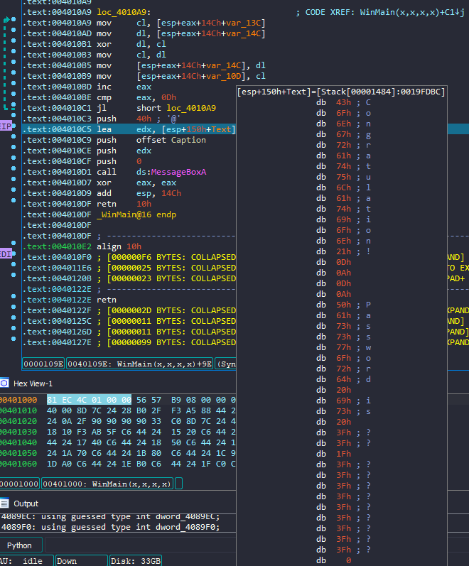

Chỉ toàn là `?` (giống như lúc đầu, nên mình cũng không phân tích gì thêm)

### Packed.exe:

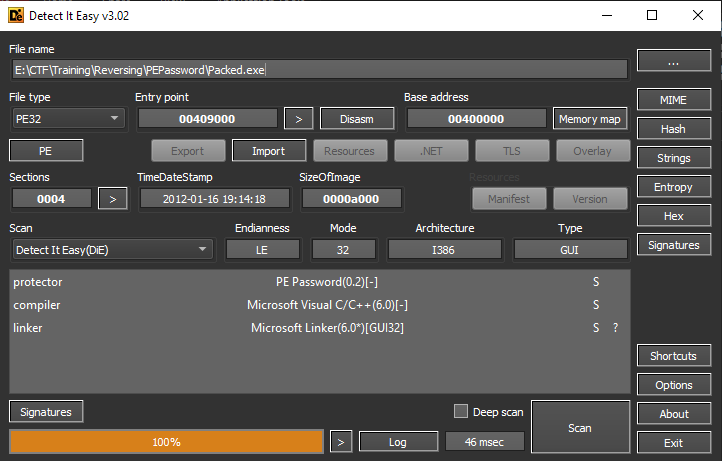

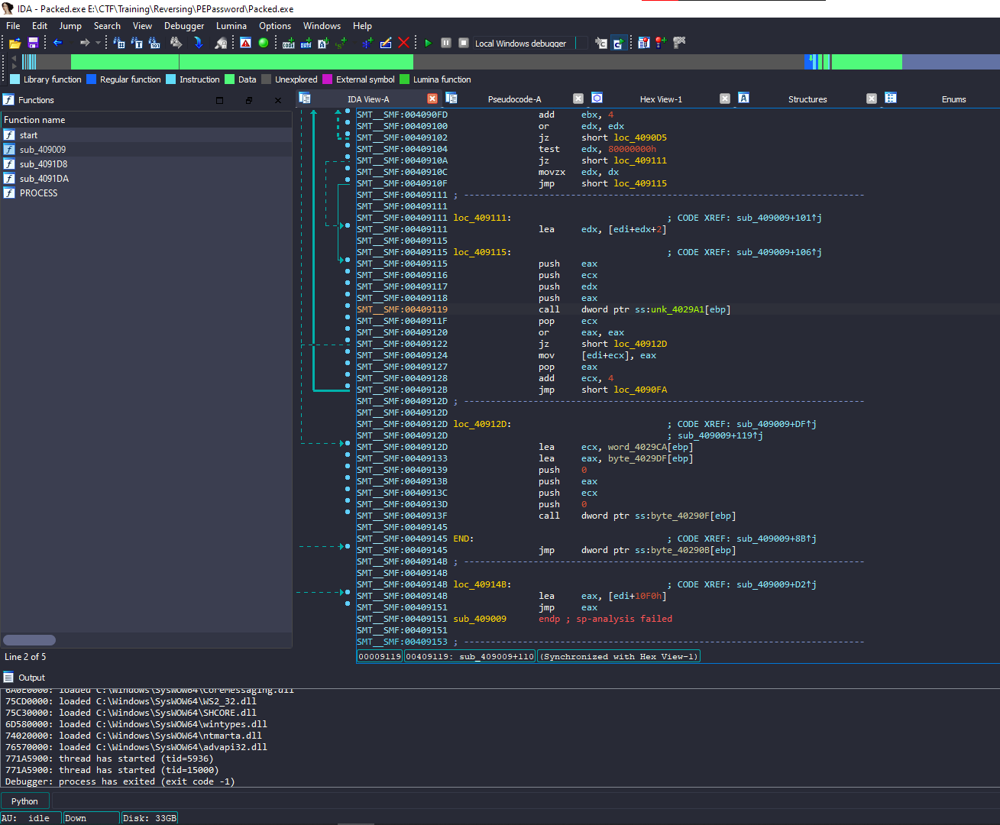

Vì là file packed nên là lúc đầu file bắt nhập pass, mình đoán là nó sẽ lấy pass này để decrypt cái file thành file gốc, file gốc đơn giản và không cần rev gì thêm

Sau khi debug thì mình tìm được chổ để file nó lấy input của mình:

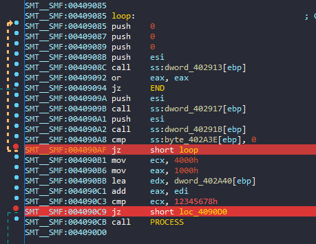

Mình đã đổi tên cho dễ hiểu, tạm thời mình bỏ qua đoạn nhập pass word và đi thẳng đến đoạn nó lấy password xử lí bằng cách pass qua các lệnh `jz` bằng cách mod giá trị `ZF` và trace tới hàm process:

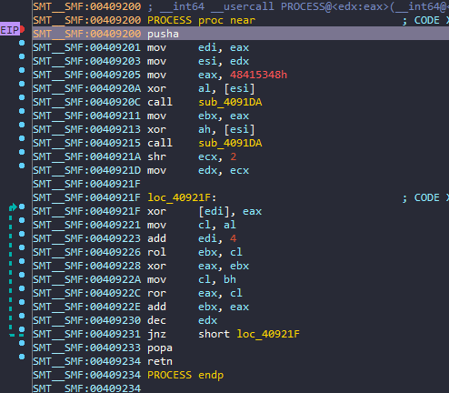

Hàm này sẽ lấy input của mình lưu vào ebx và eax để xử lí, nó sẽ thao tác hàng loạt giữa `eax` và `ebx`(4bits) và giá trị trả về của hàm này sẽ là `eax` (ebx cố định):

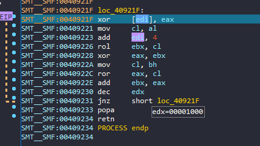

Trong trường hợp này, return `eax` sẽ sử dụng giải mã cho đoạn 0x401004 và có giá trị là 0x5a5a7e05

Và vì 1 lí do là sau khi xor eax với `.text` ở packed xong thì đoạn đó sẽ trở thành đoạn ở original, nên là mình dùng HxD để trace tới 2 đoạn đó:

Original.exe:

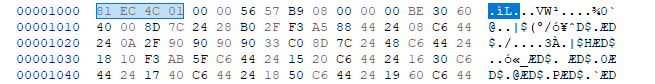

Packed.exe:

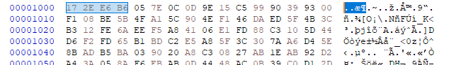

`eax = Packed(0x014cec81) ^ Original(0xb6e62e17) = 0xb7aac296`

Và vì có `eax`, `ebx` cố định nên mình có thể brutefroce để tìm ebx:

```c
#include <iostream>
using namespace std;

unsigned int  rol(unsigned int x, int count) {
	unsigned int num1 = (x << count) & 4294967295;
	unsigned int num2 = x >> (32 - count);

	return num1 | num2;
}
unsigned int ror(unsigned int x, int count) {
	return rol(x, 32 - count);
}
//funtion : internet

int main() {
	for (unsigned int i = 0; i < 0xffffffff; i++) {
		unsigned int ebx = i;
		unsigned int eax = 0xb7aac296;
		unsigned int al = eax & 0xff;
		ebx = rol(ebx, al % 32);
		eax = eax ^ ebx;
		unsigned int bh = (ebx & 0xffff) >> 8;
		eax = ror(eax, bh % 32);
		if (eax == 0x5a5a7e05)
			printf("ebx : 0x%08x\n", i);
	}
	return 0;
}
```
```
ebx : 0xa1beee22
ebx : 0xc263a2cb
```
Có 2 giá trị hợp lí, mình đã thử cả 2, thay vào `eax` và `ebx` tại lệnh tại vị trí `0040921F`:

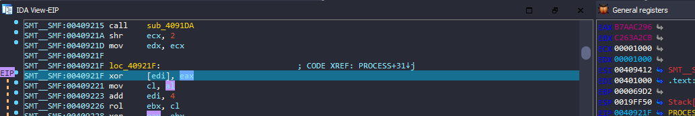

Cho chương trình chạy:

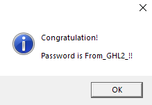

Password: `From_GHL2_!!`
(Tham khảo)

## WindowKernel - 220pts

### Overview

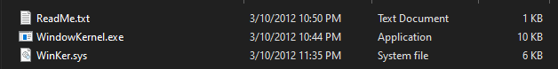

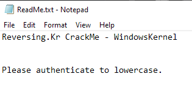

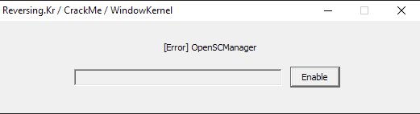

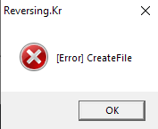

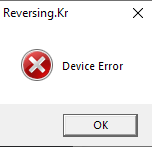


### Approach
Check file `WindowKernel.exe` bằng DiE và mở bằng ida:

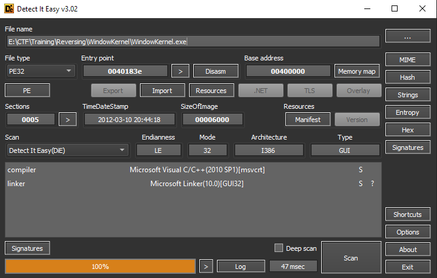

```c=
INT_PTR __stdcall DialogFunc(HWND hWnd, UINT a2, WPARAM a3, LPARAM a4)
{
  if ( a2 == 272 )
  {
    SetDlgItemTextW(hWnd, 1001, L"Wait.. ");
    SetTimer(hWnd, 0x464u, 0x3E8u, 0);
    return 1;
  }
  if ( a2 != 273 )
  {
    if ( a2 == 275 )
    {
      KillTimer(hWnd, 0x464u);
      sub_401310();
      return 1;
    }
    return 0;
  }
  if ( (unsigned __int16)a3 == 2 )
  {
    SetDlgItemTextW(hWnd, 1001, L"Wait.. ");
    sub_401490();
    EndDialog(hWnd, 2);
    return 1;
  }
  if ( (unsigned __int16)a3 == 1002 )
  {
    if ( HIWORD(a3) == 1024 )
    {
      Sleep(0x1F4u);
      return 1;
    }
    return 1;
  }
  if ( (unsigned __int16)a3 != 1003 )
    return 0;
  sub_401110(hWnd);
  return 1;
}
```

Nếu xem các hàm lướt qua thì các bạn có thể biết là `sub_401310();` và `sub_401490();` sẽ không có gì đặc biệt ngoài báo lỗi và check các thứ.

Riêng hàm `sub_401110(hWnd);` sẽ có chổ `Correct!`

```c=
HWND __thiscall sub_401110(HWND hDlg)
{
  HWND result; // eax
  HWND v3; // eax
  HWND v4; // eax
  HWND DlgItem; // eax
  WCHAR String[256]; // [esp+8h] [ebp-204h] BYREF

  GetDlgItemTextW(hDlg, 1003, String, 512);
  if ( lstrcmpW(String, L"Enable") )
  {
    result = (HWND)lstrcmpW(String, L"Check");
    if ( !result )
    {
      if ( sub_401280(0x2000) == 1 )
        MessageBoxW(hDlg, L"Correct!", L"Reversing.Kr", 0x40u);
      else
        MessageBoxW(hDlg, L"Wrong", L"Reversing.Kr", 0x10u);
      SetDlgItemTextW(hDlg, 1002, &word_4021F0);
      DlgItem = GetDlgItem(hDlg, 1002);
      EnableWindow(DlgItem, 0);
      return (HWND)SetDlgItemTextW(hDlg, 1003, L"Enable");
    }
  }
  else if ( sub_401280(4096) )
  {
    v3 = GetDlgItem(hDlg, 1002);
    EnableWindow(v3, 1);
    SetDlgItemTextW(hDlg, 1003, L"Check");
    SetDlgItemTextW(hDlg, 1002, &word_4021F0);
    v4 = GetDlgItem(hDlg, 1002);
    return SetFocus(v4);
  }
  else
  {
    return (HWND)MessageBoxW(hDlg, L"Device Error", L"Reversing.Kr", 0x10u);
  }
  return result;
}
```

Theo như mình debug được thì `lstrcmpW(String, L"Enable")` và `lstrcmpW(String, L"Check");` sẽ là lúc mà mình bấm nút "Enable" cùa file `WindowKernel.exe`.

Mình chỉ để ý đến hàm `sub_401280(0x2000) == 1`, để kiểm tra điều kiện và trả về giá trị đúng để in ra "Correct!":Bài cuối của wargame này là bài duy nhất bắt phải đụng tới kernel. Phần check nằm trong driver, còn file exe chỉ là cái vỏ gửi IOCTL xuống, nên đọc mỗi exe thì không bao giờ ra.

```c=
int __usercall sub_401280@<eax>(HWND a1@<edi>, DWORD dwIoControlCode)
{
  HANDLE FileW; // esi
  DWORD BytesReturned; // [esp+4h] [ebp-8h] BYREF
  int OutBuffer; // [esp+8h] [ebp-4h] BYREF

  FileW = CreateFileW(L"\\\\.\\RevKr", 0xC0000000, 0, 0, 3u, 0, 0);
  if ( FileW == (HANDLE)-1 )
  {
    MessageBoxW(a1, L"[Error] CreateFile", L"Reversing.Kr", 0x10u);
    return 0;
  }
  else if ( DeviceIoControl(FileW, dwIoControlCode, 0, 0, &OutBuffer, 4u, &BytesReturned, 0) )
  {
    CloseHandle(FileW);
    return OutBuffer;
  }
  else
  {
    MessageBoxW(a1, L"[Error] DeviceIoControl", L"Reversing.Kr", 0x10u);
    return 0;
  }
}
```
Ở đây có đoạn nó tạo file và để cho nó trả về 1 thì mình để ý chổ này:

```c
DeviceIoControl(FileW, dwIoControlCode, 0, 0, &OutBuffer, 4u, &BytesReturned, 0)
```
Cơ bản thì nó là viết tắt của Device In Out Control, quay lại check file `WinKer.sys`:

```c=
NTSTATUS __stdcall DriverEntry(_DRIVER_OBJECT *DriverObject, PUNICODE_STRING RegistryPath)
{
  int v3; // edi
  PDEVICE_OBJECT v4; // ecx
  char *v5; // et1
  char *v6; // et1
  char *v7; // et1
  char v8; // al
  struct _KDPC *v9; // esi
  char *v10; // et1
  struct _UNICODE_STRING DestinationString; // [esp+Ch] [ebp-134h] BYREF
  union _LARGE_INTEGER Interval; // [esp+14h] [ebp-12Ch] BYREF
  PDEVICE_OBJECT DeviceObject; // [esp+1Ch] [ebp-124h] BYREF
  PVOID P; // [esp+20h] [ebp-120h]
  CCHAR Number[4]; // [esp+24h] [ebp-11Ch]
  struct _OSVERSIONINFOW VersionInformation; // [esp+28h] [ebp-118h] BYREF

  DbgSetDebugFilterState(0x65u, 3u, 1u);
  DbgPrint("Driver Load!! \n");
  DriverObject->DriverUnload = (PDRIVER_UNLOAD)sub_1131C;
  dword_13030 = 0;
  VersionInformation.dwOSVersionInfoSize = 276;
  if ( RtlGetVersion(&VersionInformation) )
  {
    MajorVersion = VersionInformation.dwMajorVersion;
    MinorVersion = VersionInformation.dwMinorVersion;
  }
  else
  {
    PsGetVersion(&MajorVersion, &MinorVersion, 0, 0);
  }
  RtlInitUnicodeString(&DestinationString, "\\");
  P = (PVOID)IoCreateDevice(DriverObject, 4u, &DestinationString, 0x22u, 0, 0, &DeviceObject);
  if ( (int)P >= 0 )
  {
    RtlInitUnicodeString(&SymbolicLinkName, L"\\DosDevices\\RevKr");
    v3 = IoCreateSymbolicLink(&SymbolicLinkName, &DestinationString);
    if ( v3 >= 0 )
    {
      v4 = DeviceObject;
      DriverObject->MajorFunction[14] = (PDRIVER_DISPATCH)sub_11288;
      DriverObject->MajorFunction[0] = (PDRIVER_DISPATCH)sub_112F8;
      DriverObject->MajorFunction[2] = (PDRIVER_DISPATCH)sub_112F8;
      *(_DWORD *)v4->DeviceExtension = 0;
      SystemArgument2 = DeviceObject->DeviceExtension;
      *(_DWORD *)SystemArgument2 = DeviceObject;
      v5 = *(char **)&KeNumberProcessors;
      ::P = ExAllocatePool(NonPagedPool, 4 * *v5);
      KeInitializeDpc(&DeviceObject->Dpc, sub_11266, DeviceObject);
      v6 = *(char **)&KeNumberProcessors;
      P = ExAllocatePool(NonPagedPool, 32 * *v6);
      if ( P )
      {
        v7 = *(char **)&KeNumberProcessors;
        Interval.QuadPart = -10000000i64;
        v8 = *v7;
        Number[0] = 0;
        if ( v8 > 0 )
        {
          do
          {
            v9 = (struct _KDPC *)((char *)P + 32 * Number[0]);
            KeInitializeDpc(v9, sub_113E8, 0);
            KeSetTargetProcessorDpc(v9, Number[0]);
            KeInsertQueueDpc(v9, 0, 0);
            KeDelayExecutionThread(0, 0, &Interval);
            v10 = *(char **)&KeNumberProcessors;
            ++Number[0];
          }
          while ( Number[0] < *v10 );
        }
        ExFreePoolWithTag(P, 0);
      }
      return 0;
    }
    else
    {
      IoDeleteDevice(DriverObject->DeviceObject);
      return v3;
    }
  }
  else
  {
    DbgPrint("IoCreateDevice Error\n");
    return (NTSTATUS)P;
  }
}
```

Mình thấy đoạn `DbgPrint("IoCreateDevice Error\n");` nên cơ bản là cái file này sẽ tạo `IoCreateDevice` rồi check và gửi thông tin cho file `WindowKernel`.

Check kĩ file, mình thấy có vài hàm khả nghi:

```c=
int __stdcall sub_111DC(char a1)
{
  int result; // eax
  bool v2; // zf

  result = 1;
  if ( dword_1300C != 1 )
  {
    switch ( dword_13034 )
    {
      case 0:
      case 2:
      case 4:
      case 6:
        goto LABEL_3;
      case 1:
        v2 = a1 == -91;
        goto LABEL_6;
      case 3:
        v2 = a1 == -110;
        goto LABEL_6;
      case 5:
        v2 = a1 == -107;
LABEL_6:
        if ( !v2 )
          goto LABEL_7;
LABEL_3:
        ++dword_13034;
        break;
      case 7:
        if ( a1 == -80 )
          dword_13034 = 100;
        else
LABEL_7:
          dword_1300C = 1;
        break;
      default:
        result = sub_11156(a1);
        break;
    }
  }
  return result;
}
```

```c=
int __stdcall sub_11156(char a1)
{
  int result; // eax
  bool v2; // zf
  char v3; // [esp+8h] [ebp+8h]

  v3 = a1 ^ 0x12;
  result = dword_13034 - 100;
  switch ( dword_13034 )
  {
    case 'd':
    case 'f':
    case 'h':
    case 'j':
      goto LABEL_2;
    case 'e':
      v2 = v3 == -78;
      goto LABEL_4;
    case 'g':
      v2 = v3 == -123;
      goto LABEL_4;
    case 'i':
      v2 = v3 == -93;
LABEL_4:
      if ( !v2 )
        goto LABEL_5;
LABEL_2:
      ++dword_13034;
      break;
    case 'k':
      if ( v3 == -122 )
        dword_13034 = 200;
      else
LABEL_5:
        dword_1300C = 1;
      break;
    default:
      result = sub_110D0(v3);
      break;
  }
  return result;
}
```

```c=
int __stdcall sub_110D0(char a1)
{
  int result; // eax
  char v2; // cl
  bool v3; // zf

  result = dword_13034 - 200;
  v2 = a1 ^ 5;
  switch ( dword_13034 )
  {
    case 200:
    case 202:
    case 204:
    case 206:
      goto LABEL_2;
    case 201:
      v3 = v2 == -76;
      goto LABEL_4;
    case 203:
    case 205:
      v3 = v2 == -113;
LABEL_4:
      if ( v3 )
        goto LABEL_2;
      goto LABEL_10;
    case 207:
      if ( v2 != -78 )
        goto LABEL_10;
      dword_13024 = 1;
LABEL_2:
      ++dword_13034;
      break;
    case 208:
      dword_13024 = 0;
LABEL_10:
      dword_1300C = 1;
      break;
    default:
      return result;
  }
  return result;
}
```

Cả 3 hàm này đều dùng chung 1 biến count là `dword_13024` và nó sẽ là duyệt từ đầu input tới cuối.

Quay trở lại hàm đầu tiên, thì biến count bắt đầu từ 0 => hàm check đầu tiên, tiếp theo nó set `count = 100` và qua hàm thứ 2 thì `count-100`và dử dụng nó => xem như input được chia thành 3 đoạn và kiểm tra bằng 3 hàm.

Xem đầu vào của hàm đầu tiên:

```c=
void __stdcall sub_11266(_KDPC *Dpc, PVOID DeferredContext, PVOID SystemArgument1, PVOID SystemArgument2)
{
  char v4; // al

  v4 = READ_PORT_UCHAR((PUCHAR)0x60);
  first(v4);
}
```

Nó nhận tính hiệu từ API `READ_PORT_UCHAR` , nếu tra trên mạng thì nó sẽ nhận char từ port 60 và trả về ` scancodes`.

Các bạn xem `scancodes-keys map table` [tại đây](https://wiki.osdev.org/PS/2_Keyboard).

Dựa theo tín hiệu và hàm check đầu tiên, mình tìm được 4 kí tự đầu:

```c=
int __stdcall first(char a1)
{
  int result; // eax
  bool v2; // zf

  result = 1;
  if ( dword_1300C != 1 )
  {
    switch ( count )
    {
      case 0:
      case 2:
      case 4:
      case 6:
        goto LABEL_3;
      case 1:
        v2 = a1 == (char)0xA5;                  // K realeased (phím K)
        goto LABEL_6;
      case 3:
        v2 = a1 == (char)0x92;                  // E realeased
        goto LABEL_6;
      case 5:
        v2 = a1 == (char)0x95;                  // Y realeased
LABEL_6:
        if ( !v2 )
          goto LABEL_7;
LABEL_3:
        ++count;
        break;
      case 7:
        if ( a1 == (char)0xB0 )                 // B realeased
          count = 100;
        else
LABEL_7:
          dword_1300C = 1;
        break;
      default:
        result = second(a1);
        break;
    }
  }
  return result;
}
```
Tương tự:

```c=
int __stdcall second(char a1)
{
  int result; // eax
  bool v2; // zf
  char v3; // [esp+8h] [ebp+8h]

  v3 = a1 ^ 0x12;
  result = count - 100;
  switch ( count )
  {
    case 'd':
    case 'f':
    case 'h':
    case 'j':
      goto LABEL_2;
    case 'e':
      v2 = v3 == (char)0xB2;                    // 0x12^0xB2 = 0xA0 => D realeased
      goto LABEL_4;
    case 'g':
      v2 = v3 == (char)0x85;                    // 0x12^0x85 = 0x97 => I realeased
      goto LABEL_4;
    case 'i':
      v2 = v3 == (char)0xA3;                    // 0x12^0xA3 = 0xB1 => N realeased
LABEL_4:
      if ( !v2 )
        goto LABEL_5;
LABEL_2:
      ++count;
      break;
    case 'k':
      if ( v3 == (char)0x86 )                   // 0x12^0x86 = 0x94 => T realeased
        count = 200;
      else
LABEL_5:
        dword_1300C = 1;
      break;
    default:
      result = last(v3);
      break;
  }
  return result;
}
```
```c=
int __stdcall last(char a1)
{
  int result; // eax
  char v2; // cl
  bool v3; // zf

  result = count - 200;
  v2 = a1 ^ 5;
  switch ( count )
  {
    case 200:
    case 202:
    case 204:
    case 206:
      goto LABEL_2;
    case 201:
      v3 = v2 == (char)0xB4;                    // 0xB4^0x12^5 = 0xA3 => T
      goto LABEL_4;
    case 203:                                   // 0x8F^0x12^5 = 0x98 => O realeased
    case 205:                                   // 0x8F^0x12^5 = 0x98 => O realeased
      v3 = v2 == (char)0x8F;
LABEL_4:
      if ( v3 )
        goto LABEL_2;
      goto LABEL_10;
    case 207:
      if ( v2 != (char)0xB2 )                   // 0xB2^0x12^5 = 0xA5 => K realeased
        goto LABEL_10;
      dword_13024 = 1;
LABEL_2:
      ++count;
      break;
    case 208:
      dword_13024 = 0;
LABEL_10:
      dword_1300C = 1;
      break;
    default:
      return result;
  }
  return result;
}
```

Theo chỉ dẫn trong file readme.txt, tìm được key:`keybdinthook`

