## Rusty VM - TetCTF 2024

TetCTF 2024 vừa rồi là giải TetCTF thứ 3 mà mình tham gia, tuy nhiên lần này có chúc ấn tượng rằng đề khá là thú vị. Với 2 bài đầu thì mình cảm thấy cũng khá đơn giản nên mình không note ở đây, còn 1 bài khác nữa tuy nhiên vì mình nghĩ rằng giải 24 giờ nên bài đó mình đã bỏ qua, đến lúc nhận ra thi đã quá muộn...


Về bài này thì mình cảm thấy cũng không khó nhưng mà những script solve hay disassmbler mình bỏ ở PC nên giờ mình không truy cập được, đành phải viết lại toàn bộ thôi :V.

### Binary

Đây là `sub_9DA0` cũng là hàm xử lí chính trong chương trình, nó lấy input, load bytecode (unk_4B170), run bytecode,...

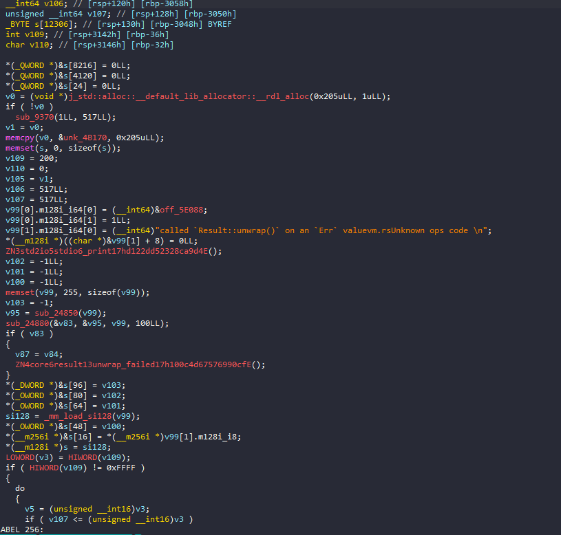

Và đây là mainloop cũng như switchcase xử lí chính trong chương trình.

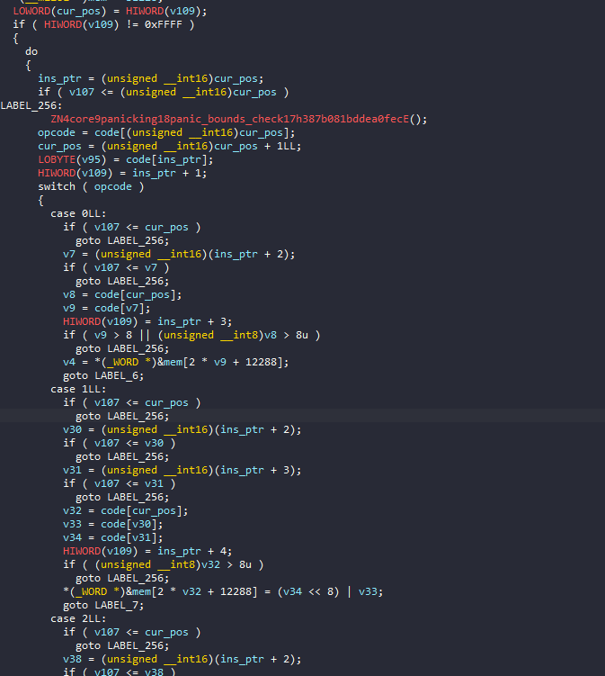

Đối với cá nhân mình thì rev VM vẫn quan trọng nhất là xác định được các yếu tố sau:Ba thứ này gần như là bộ khung của mọi VM: vùng nhớ nằm ở đâu, thanh ghi nằm ở đâu, và vòng lặp fetch-decode-execute đọc opcode kiểu gì. Xác định xong ba cái đó là viết disassembler được.

    - opcode
    - register
    - memory
    - instruction pointer
    - stack

Đầu tiên, ta có 1 buffer cơ bản, tạm gọi là `mem`, sau khi rev sơ mình biết được là các thanh ghi nằm ở vị trí `&mem + 0x3000`, có tổng cộng 9 register, size là 16 bit.

Stack nằm ở `&mem + 0x1000` và phần đầu của `mem` sẽ chứa input của chúng ta.

Mỗi opcode đều lấy 1 byte đầu của instruction, instruction length không cố định, có thể là 2, 3 hoặc 4 byte.

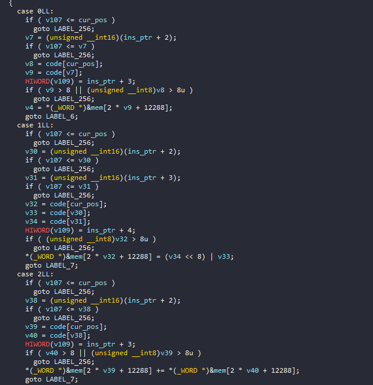

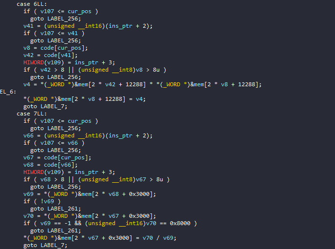

Ta thấy rằng các instruction đầu thường là các operator cơ bản như mov, add, sub, and, or, not, xor,... 

Tiếp theo là các instruction khó hơn là cmp hoặc jmp, jne, jg...

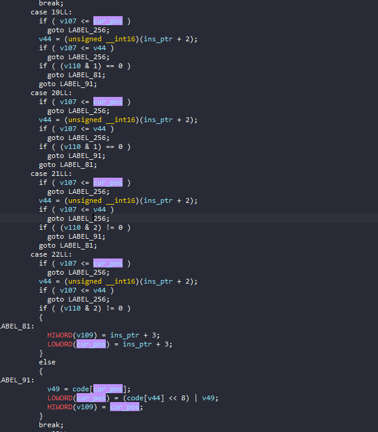

Và trong vm lần này có cả `call` và `ret`Có `call` và `ret` nghĩa là VM này có khái niệm hàm và địa chỉ trả về nằm trên stack. Nhờ vậy disassembler có thể tách code thành từng hàm riêng thay vì một khối liền. lý do mình thấy vì ngoài lệnh `push`, `pop` tương tác với stack ra nó còn push `return address` lên stack và ngược lại.

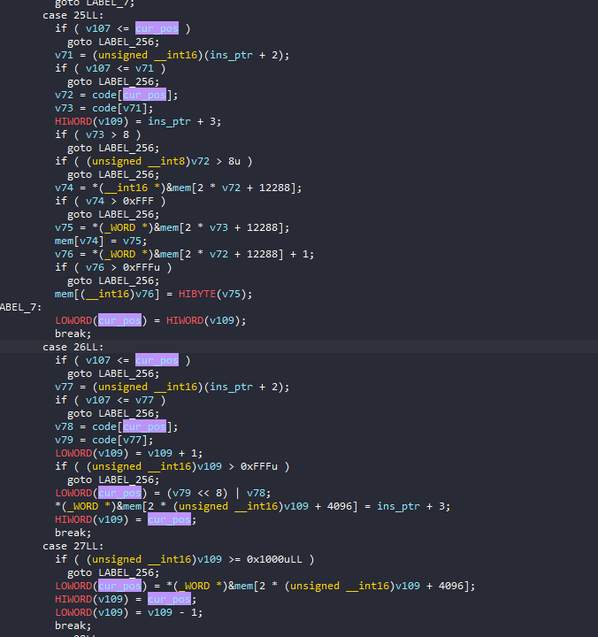

### Writing disassembler

Do đó từ các dữ kiện này mình có thể dễ dàng viết ra một disassembler cơ bản.

```python
code = b'\x01\x00\x01\x00\x01\x01p\x00\x01\x02\x02\x00\x19\x01\x00\x02\x01\x02\x19\x01\x00\x02\x01\x02\x01\x00\x02\x00\x19\x01\x00\x02\x01\x02\x19\x01\x00\x01\x00\xff\xff\x02\x01\x02\x19\x01\x00\x02\x01\x02\x19\x01\x00\x01\x00\xfe\xff\x02\x01\x02\x19\x01\x00\x02\x01\x02\x19\x01\x00\x01\x00\x02\x00\x01\x01\x80\x00\x19\x01\x00\x01\x00\xfe\xff\x02\x01\x02\x19\x01\x00\x01\x00\x01\x00\x02\x01\x02\x19\x01\x00\x01\x00\xff\xff\x02\x01\x02\x19\x01\x00\x01\x00\x02\x00\x02\x01\x02\x19\x01\x00\x01\x00\xfe\xff\x02\x01\x02\x19\x01\x00\x01\x00\x01\x00\x02\x01\x02\x19\x01\x00\x01\x00\xff\xff\x02\x01\x02\x19\x01\x00\x01\x07\x02\x00\x01\x08\x06\x00\x1ah\x01\x01\x03\x00\x00\x01\x01\x00\x00\x02\x01\x03\x04\x01\x01\x00\x02\x01\x01\x04\x04\x00\x0e\x02\x04\x01\x04\x0f\x00\x0b\x01\x04\x1a\xf1\x00\x01\x04\x00\x00\x11\x00\x04\x13\xed\x00\x00\x07\x01\x00\x08\x02\x1a\x8c\x01\x01\x04\x01\x00\x11\x00\x04\x13\xed\x00\x1ah\x01\x01\x01\x01\x00\x02\x03\x01\x12\xa5\x00\x1a\xac\x01\x17\x0f\x03\x0f\x04\x0f\x05\x0f\x06\x01\x03\x07\x00\x01\x04\xff\xff\x11\x01\x04\x16T\x01\x11\x01\x03\x15T\x01\x11\x02\x04\x16T\x01\x11\x02\x03\x15T\x01\x01\x04\x00\x00\x01\x03p\x00\x02\x03\x04\x05\x03\x03\x02\x03\x07\x11\x03\x01\x14C\x01\x01\x03\x80\x00\x02\x03\x04\x05\x03\x03\x02\x03\x08\x11\x03\x02\x13[\x01\x01\x03\x02\x00\x02\x04\x03\x01\x03\x0e\x00\x11\x04\x03\x16\x1d\x01\x01\x00\x00\x00\x12_\x01\x01\x00\x01\x00\x10\x06\x10\x05\x10\x04\x10\x03\x1b\x0f\x01\x0f\x02\x0f\x03\x01\x01\xa0\x00\x02\x01\x08\x04\x03\x01\x01\x02\x01\x00\r\x02\x07\x0c\x03\x02\x18\x01\x03\x10\x03\x10\x02\x10\x01\x1b\x0f\x01\x0f\x02\x01\x01\xa0\x00\x02\x01\x08\x04\x01\x01\x0e\x01\x07\x01\x02\x01\x00\x0b\x01\x02\x00\x00\x01\x10\x02\x10\x01\x1b\x0f\x01\x0f\x02\x0f\x03\x0f\x04\x01\x00\x00\x00\x01\x01\xa0\x00\x01\x02\xa8\x00\x01\x03\x01\x00\x04\x04\x01\x02\x00\x04\x02\x01\x03\x11\x01\x02\x14\xc4\x01\x01\x01\xf8\x07\x00\x02\x00\x01\x00\x00\x00\x11\x01\x02\x14\xfc\x01\x01\x01\x07\x00\x11\x07\x01\x14\xfc\x01\x01\x01\x02\x00\x11\x08\x01\x14\xfc\x01\x01\x00\x01\x00\x10\x04\x10\x03\x10\x02\x10\x01\x1b'

ip = 0
while ip < len(code):
    opcode = code[ip]
    ins = f'L_{hex(ip)}:   {opcode}'.ljust(20,' ')
    match opcode:
        case 0:
            v1 = code[ip+1]
            v2 = code[ip+2]
            ins += f"mov reg{v1}, reg{v2}"
            ip += 3
        case 1:
            v1 = code[ip+1]
            v2 = code[ip+2]
            v3 = code[ip+3]
            ins += f"mov reg{v1}, {hex((v3<<8)|v2)}"
            ip += 4
        case 2:
            v1 = code[ip+1]
            v2 = code[ip+2]
            ins += f"add reg{v1}, reg{v2}"
            ip += 3
        case 3:
            v1 = code[ip+1]
            v2 = code[ip+2]
            ins += f"sub reg{v1}, reg{v2}"
            ip += 3
        case 4:
            v1 = code[ip+1]
            v2 = code[ip+2]
            ins += f"mov reg{v1}, BYTE mem[reg{v2}]"
            ip += 3
        case 5:
            v1 = code[ip+1]
            v2 = code[ip+2]
            ins += f"mov reg{v1}, WORD mem[reg{v2}]"
            ip += 3
        case 6:
            v1 = code[ip+1]
            v2 = code[ip+2]
            ins += f"mul reg{v1}, reg{v2}"
            ip += 3
        case 7:
            v1 = code[ip+1]
            v2 = code[ip+2]
            ins += f"div reg{v1}, reg{v2}"
            ip += 3
        case 8:
            v1 = code[ip+1]
            v2 = code[ip+2]
            ins += f"mod reg{v1}, reg{v2}"
            ip += 3
        case 9:
            v1 = code[ip+1]
            v2 = code[ip+2]
            ins += f"xor reg{v1}, reg{v2}"
            ip += 3
        case 10:
            v1 = code[ip+1]
            ins += f"not reg{v1}"
            ip += 2
        case 11:
            v1 = code[ip+1]
            v2 = code[ip+2]
            ins += f"and reg{v1}, reg{v2}"
            ip += 3
        case 12:
            v1 = code[ip+1]
            v2 = code[ip+2]
            ins += f"or reg{v1}, reg{v2}"
            ip += 3
        case 13:
            v1 = code[ip+1]
            v2 = code[ip+2]
            ins += f"shl reg{v1}, reg{v2}"
            ip += 3
        case 14:
            v1 = code[ip+1]
            v2 = code[ip+2]
            ins += f"shr reg{v1}, reg{v2}"
            ip += 3
        case 15:
            v1 = code[ip+1]
            ins += f"push reg{v1}"
            ip += 2
        case 16:
            v1 = code[ip+1]
            ins += f"pop reg{v1}"
            ip += 2
        case 17:
            v1 = code[ip+1]
            v2 = code[ip+2]
            ins += f"cmp reg{v1}, reg{v2}"
            ip += 3
        case 18:
            v1 = code[ip+1]
            v2 = code[ip+2]
            ins += f"jmp {hex(v1|(v2<<8))}"
            ip += 3
        case 19:
            v1 = code[ip+1]
            v2 = code[ip+2]
            ins += f"je {hex(v1|(v2<<8))}"
            ip += 3 
        case 20:
            v1 = code[ip+1]
            v2 = code[ip+2]
            ins += f"jne {hex(v1|(v2<<8))}"
            ip += 3 
        case 21:
            v1 = code[ip+1]
            v2 = code[ip+2]
            ins += f"jl {hex(v1|(v2<<8))}"
            ip += 3
        case 22:
            v1 = code[ip+1]
            v2 = code[ip+2]
            ins += f"jge {hex(v1|(v2<<8))}"
            ip += 3
        case 23:
            ins += f'final check ;(reg0==1)?(WIN:LOST)\n'
            ip+=1
        case 24:
            v1 = code[ip+1]
            v2 = code[ip+2]
            ins += f"mov BYTE [reg{v1}], reg{v2}"
            ip += 3
        case 25:
            v1 = code[ip+1]
            v2 = code[ip+2]
            ins += f"mov WORD [reg{v1}], reg{v2}"
            ip += 3
        case 26:
            v1 = code[ip+1]
            v2 = code[ip+2]
            ins += f"call {hex(v1|(v2<<8))}"
            ip += 3
        case 27:
            ins += f"ret\n"
            ip += 1
        case 28:
            ins = 'exit'
            ip+=1
        case _:
            print('Unknown opcode!')
            break
    print(ins)


```

Vì số lượng instruction cũng ít nên mình dùng switchcase cho nhanh, sau khi disassemble và chỉnh sửa 1 tí thì mình được đoạn code đẹp như sau:

```asm
L_0x0:   1          mov reg0, 0x1
L_0x4:   1          mov reg1, 0x70
L_0x8:   1          mov reg2, 0x2
L_0xc:   25         mov WORD [reg1], reg0
L_0xf:   2          add reg1, reg2
L_0x12:   25        mov WORD [reg1], reg0
L_0x15:   2         add reg1, reg2
L_0x18:   1         mov reg0, 0x2
L_0x1c:   25        mov WORD [reg1], reg0
L_0x1f:   2         add reg1, reg2
L_0x22:   25        mov WORD [reg1], reg0
L_0x25:   1         mov reg0, 0xffff
L_0x29:   2         add reg1, reg2
L_0x2c:   25        mov WORD [reg1], reg0
L_0x2f:   2         add reg1, reg2
L_0x32:   25        mov WORD [reg1], reg0
L_0x35:   1         mov reg0, 0xfffe
L_0x39:   2         add reg1, reg2
L_0x3c:   25        mov WORD [reg1], reg0
L_0x3f:   2         add reg1, reg2
L_0x42:   25        mov WORD [reg1], reg0
L_0x45:   1         mov reg0, 0x2
L_0x49:   1         mov reg1, 0x80
L_0x4d:   25        mov WORD [reg1], reg0
L_0x50:   1         mov reg0, 0xfffe
L_0x54:   2         add reg1, reg2
L_0x57:   25        mov WORD [reg1], reg0
L_0x5a:   1         mov reg0, 0x1
L_0x5e:   2         add reg1, reg2
L_0x61:   25        mov WORD [reg1], reg0
L_0x64:   1         mov reg0, 0xffff
L_0x68:   2         add reg1, reg2
L_0x6b:   25        mov WORD [reg1], reg0
L_0x6e:   1         mov reg0, 0x2
L_0x72:   2         add reg1, reg2
L_0x75:   25        mov WORD [reg1], reg0
L_0x78:   1         mov reg0, 0xfffe
L_0x7c:   2         add reg1, reg2
L_0x7f:   25        mov WORD [reg1], reg0
L_0x82:   1         mov reg0, 0x1
L_0x86:   2         add reg1, reg2
L_0x89:   25        mov WORD [reg1], reg0
L_0x8c:   1         mov reg0, 0xffff
L_0x90:   2         add reg1, reg2
L_0x93:   25        mov WORD [reg1], reg0
L_0x96:   1         mov reg7, 0x2
L_0x9a:   1         mov reg8, 0x6
L_0x9e:   26        call 0x168
L_0xa1:   1         mov reg3, 0x0
L_0xa5:   1         mov reg1, 0x0
L_0xa9:   2         add reg1, reg3
L_0xac:   4         mov reg1, BYTE mem[reg1]
L_0xaf:   0         mov reg2, reg1
L_0xb2:   1         mov reg4, 0x4
L_0xb6:   14        shr reg2, reg4
L_0xb9:   1         mov reg4, 0xf
L_0xbd:   11        and reg1, reg4
L_0xc0:   26        call 0xf1
L_0xc3:   1         mov reg4, 0x0
L_0xc7:   17        cmp reg0, reg4
L_0xca:   19        je 0xed
L_0xcd:   0         mov reg7, reg1
L_0xd0:   0         mov reg8, reg2
L_0xd3:   26        call 0x18c
L_0xd6:   1         mov reg4, 0x1
L_0xda:   17        cmp reg0, reg4
L_0xdd:   19        je 0xed
L_0xe0:   26        call 0x168
L_0xe3:   1         mov reg1, 0x1
L_0xe7:   2         add reg3, reg1
L_0xea:   18        jmp 0xa5
L_0xed:   26        call 0x1ac
L_0xf0:   23        final check ;(reg0==1)?(WIN:LOST)

L_0xf1:   15        push reg3
L_0xf3:   15        push reg4
L_0xf5:   15        push reg5
L_0xf7:   15        push reg6
L_0xf9:   1         mov reg3, 0x7
L_0xfd:   1         mov reg4, 0xffff
L_0x101:   17       cmp reg1, reg4
L_0x104:   22       jle 0x154
L_0x107:   17       cmp reg1, reg3
L_0x10a:   21       jg 0x154
L_0x10d:   17       cmp reg2, reg4
L_0x110:   22       jle 0x154
L_0x113:   17       cmp reg2, reg3
L_0x116:   21       jg 0x154
L_0x119:   1        mov reg4, 0x0
L_0x11d:   1        mov reg3, 0x70
L_0x121:   2        add reg3, reg4
L_0x124:   5        mov reg3, WORD mem[reg3]
L_0x127:   2        add reg3, reg7
L_0x12a:   17       cmp reg3, reg1
L_0x12d:   20       jne 0x143
L_0x130:   1        mov reg3, 0x80
L_0x134:   2        add reg3, reg4
L_0x137:   5        mov reg3, WORD mem[reg3]
L_0x13a:   2        add reg3, reg8
L_0x13d:   17       cmp reg3, reg2
L_0x140:   19       je 0x15b
L_0x143:   1        mov reg3, 0x2
L_0x147:   2        add reg4, reg3
L_0x14a:   1        mov reg3, 0xe
L_0x14e:   17       cmp reg4, reg3
L_0x151:   22       jle 0x11d
L_0x154:   1        mov reg0, 0x0
L_0x158:   18       jmp 0x15f
L_0x15b:   1        mov reg0, 0x1
L_0x15f:   16       pop reg6
L_0x161:   16       pop reg5
L_0x163:   16       pop reg4
L_0x165:   16       pop reg3
L_0x167:   27       ret

L_0x168:   15       push reg1
L_0x16a:   15       push reg2
L_0x16c:   15       push reg3
L_0x16e:   1        mov reg1, 0xa0
L_0x172:   2        add reg1, reg8
L_0x175:   4        mov reg3, BYTE mem[reg1]
L_0x178:   1        mov reg2, 0x1
L_0x17c:   13       shl reg2, reg7
L_0x17f:   12       or reg3, reg2
L_0x182:   24       mov BYTE [reg1], reg3
L_0x185:   16       pop reg3
L_0x187:   16       pop reg2
L_0x189:   16       pop reg1
L_0x18b:   27       ret

L_0x18c:   15       push reg1
L_0x18e:   15       push reg2
L_0x190:   1        mov reg1, 0xa0
L_0x194:   2        add reg1, reg8
L_0x197:   4        mov reg1, BYTE mem[reg1]
L_0x19a:   14       shr reg1, reg7
L_0x19d:   1        mov reg2, 0x1
L_0x1a1:   11       and reg1, reg2
L_0x1a4:   0        mov reg0, reg1
L_0x1a7:   16       pop reg2
L_0x1a9:   16       pop reg1
L_0x1ab:   27       ret

L_0x1ac:   15       push reg1
L_0x1ae:   15       push reg2
L_0x1b0:   15       push reg3
L_0x1b2:   15       push reg4
L_0x1b4:   1        mov reg0, 0x0
L_0x1b8:   1        mov reg1, 0xa0
L_0x1bc:   1        mov reg2, 0xa8
L_0x1c0:   1        mov reg3, 0x1
L_0x1c4:   4        mov reg4, BYTE mem[reg1]
L_0x1c7:   2        add reg0, reg4
L_0x1ca:   2        add reg1, reg3
L_0x1cd:   17       cmp reg1, reg2
L_0x1d0:   20       jne 0x1c4
L_0x1d3:   1        mov reg1, 0x7f8
L_0x1d7:   0        mov reg2, reg0
L_0x1da:   1        mov reg0, 0x0
L_0x1de:   17       cmp reg1, reg2
L_0x1e1:   20       jne 0x1fc
L_0x1e4:   1        mov reg1, 0x7
L_0x1e8:   17       cmp reg7, reg1
L_0x1eb:   20       jne 0x1fc
L_0x1ee:   1        mov reg1, 0x2
L_0x1f2:   17       cmp reg8, reg1
L_0x1f5:   20       jne 0x1fc
L_0x1f8:   1        mov reg0, 0x1
L_0x1fc:   16       pop reg4
L_0x1fe:   16       pop reg3
L_0x200:   16       pop reg2
L_0x202:   16       pop reg1
L_0x204:   27       ret
```
### Analyzing
Ta có thể thấy ngay chương trình có 1 hàm main và 4 hàm khác, tiến hành phân tích từng cái một:

```asm
L_0x168:   15       push reg1
L_0x16a:   15       push reg2
L_0x16c:   15       push reg3
L_0x16e:   1        mov reg1, 0xa0
L_0x172:   2        add reg1, reg8
L_0x175:   4        mov reg3, BYTE input[reg1]
L_0x178:   1        mov reg2, 0x1
L_0x17c:   13       shl reg2, reg7
L_0x17f:   12       or reg3, reg2
L_0x182:   24       mov BYTE [reg1], reg3
L_0x185:   16       pop reg3
L_0x187:   16       pop reg2
L_0x189:   16       pop reg1
L_0x18b:   27       ret
```
Xuất phát từ hàm 0x168 trước vì nó ngắn, hàm này đang cố enable 1 bit từ index cho sẵn:

```python
def func_0x168(reg7,reg8):
    reg3 = mem[0xa0 + reg8]
    reg3 = reg3|(1<<reg7)
    mem[0xa0 + reg8] = reg3
```

Tương tự với hàm 0x18c, hàm này ngược lại với hàm trên, nó lấy 1 bit từ index cho sẵn:

```asm
L_0x18c:   15       push reg1
L_0x18e:   15       push reg2
L_0x190:   1        mov reg1, 0xa0
L_0x194:   2        add reg1, reg8
L_0x197:   4        mov reg1, BYTE mem[reg1]
L_0x19a:   14       shr reg1, reg7
L_0x19d:   1        mov reg2, 0x1
L_0x1a1:   11       and reg1, reg2
L_0x1a4:   0        mov reg0, reg1
L_0x1a7:   16       pop reg2
L_0x1a9:   16       pop reg1
L_0x1ab:   27       ret
```

```python
def func_0x18c(reg7,reg8):
    reg1 = mem[0xa0 + reg8]
    return (reg1>>reg7)&1
```

Hàm ở L_0x1ac là hàm cuối cùng được gọi trong main, nó tính tổng 0xa8 các phần tử liên tiếp tại `&mem + 0xa0`, và check xem `reg7==7 && reg8==2`.

```asm
L_0x1ac:   15       push reg1
L_0x1ae:   15       push reg2
L_0x1b0:   15       push reg3
L_0x1b2:   15       push reg4
L_0x1b4:   1        mov reg0, 0x0
L_0x1b8:   1        mov reg1, 0xa0
L_0x1bc:   1        mov reg2, 0xa8
L_0x1c0:   1        mov reg3, 0x1
L_0x1c4:   4        mov reg4, BYTE mem[reg1]
L_0x1c7:   2        add reg0, reg4
L_0x1ca:   2        add reg1, reg3
L_0x1cd:   17       cmp reg1, reg2
L_0x1d0:   20       jne 0x1c4
L_0x1d3:   1        mov reg1, 0x7f8
L_0x1d7:   0        mov reg2, reg0
L_0x1da:   1        mov reg0, 0x0
L_0x1de:   17       cmp reg1, reg2
L_0x1e1:   20       jne 0x1fc
L_0x1e4:   1        mov reg1, 0x7
L_0x1e8:   17       cmp reg7, reg1
L_0x1eb:   20       jne 0x1fc
L_0x1ee:   1        mov reg1, 0x2
L_0x1f2:   17       cmp reg8, reg1
L_0x1f5:   20       jne 0x1fc
L_0x1f8:   1        mov reg0, 0x1
L_0x1fc:   16       pop reg4
L_0x1fe:   16       pop reg3
L_0x200:   16       pop reg2
L_0x202:   16       pop reg1
L_0x204:   27       ret
```

```python
def func_0x1ac(reg7,reg8):
    i = 0
    s = 0
    while i < 0xa8:
        reg4 = mem[0xa0 + i]
        s += reg4
        i+=1
    if s==0x7f8 and reg7==7 and reg8==2:
        return 1
    return 0
```
Đối với hàm tại 0xf1 thì nó nhận 2 tham số vào reg1 và reg2, sau đó thực hiện các thao tác để check 2 tham số này:

```asm
L_0xf1:   15        push reg3
L_0xf3:   15        push reg4
L_0xf5:   15        push reg5
L_0xf7:   15        push reg6
L_0xf9:   1         mov reg3, 0x7
L_0xfd:   1         mov reg4, 0xffff
L_0x101:   17       cmp reg1, reg4
L_0x104:   22       jge 0x154
L_0x107:   17       cmp reg1, reg3
L_0x10a:   21       jl 0x154
L_0x10d:   17       cmp reg2, reg4
L_0x110:   22       jge 0x154
L_0x113:   17       cmp reg2, reg3
L_0x116:   21       jl 0x154
L_0x119:   1        mov reg4, 0x0
L_0x11d:   1        mov reg3, 0x70
L_0x121:   2        add reg3, reg4
L_0x124:   5        mov reg3, WORD mem[reg3]
L_0x127:   2        add reg3, reg7
L_0x12a:   17       cmp reg3, reg1
L_0x12d:   20       jne 0x143
L_0x130:   1        mov reg3, 0x80
L_0x134:   2        add reg3, reg4
L_0x137:   5        mov reg3, WORD mem[reg3]
L_0x13a:   2        add reg3, reg8
L_0x13d:   17       cmp reg3, reg2
L_0x140:   19       je 0x15b
L_0x143:   1        mov reg3, 0x2
L_0x147:   2        add reg4, reg3
L_0x14a:   1        mov reg3, 0xe
L_0x14e:   17       cmp reg4, reg3
L_0x151:   22       jge 0x11d
L_0x154:   1        mov reg0, 0x0
L_0x158:   18       jmp 0x15f
L_0x15b:   1        mov reg0, 0x1
L_0x15f:   16       pop reg6
L_0x161:   16       pop reg5
L_0x163:   16       pop reg4
L_0x165:   16       pop reg3
L_0x167:   27       ret
```

```python
def func_0xf1(reg1,reg2,reg7,reg8):
    if reg1<= -1 or reg1 > 7 or reg2 <= -1 or reg2 > 7:
        return 0
    i = 0
    while i < 0xe:
        reg3 = mem[0x70 + i]
        reg3 += reg7
        if reg3==reg1:
            reg3 = mem[0x80 + i]
            reg3 += reg8
            if reg3==reg2:
                return 1
        i+=2
    return 0
```

Cuối cùng là hàm main:
```asm
L_0x0:   1          mov reg0, 0x1
L_0x4:   1          mov reg1, 0x70
L_0x8:   1          mov reg2, 0x2
L_0xc:   25         mov WORD [reg1], reg0
L_0xf:   2          add reg1, reg2
L_0x12:   25        mov WORD [reg1], reg0
...
L_0x96:   1         mov reg7, 0x2
L_0x9a:   1         mov reg8, 0x6
L_0x9e:   26        call 0x168
L_0xa1:   1         mov reg3, 0x0
L_0xa5:   1         mov reg1, 0x0
L_0xa9:   2         add reg1, reg3
L_0xac:   4         mov reg1, BYTE mem[reg1]
L_0xaf:   0         mov reg2, reg1
L_0xb2:   1         mov reg4, 0x4
L_0xb6:   14        shr reg2, reg4
L_0xb9:   1         mov reg4, 0xf
L_0xbd:   11        and reg1, reg4
L_0xc0:   26        call 0xf1
L_0xc3:   1         mov reg4, 0x0
L_0xc7:   17        cmp reg0, reg4
L_0xca:   19        je 0xed
L_0xcd:   0         mov reg7, reg1
L_0xd0:   0         mov reg8, reg2
L_0xd3:   26        call 0x18c
L_0xd6:   1         mov reg4, 0x1
L_0xda:   17        cmp reg0, reg4
L_0xdd:   19        je 0xed
L_0xe0:   26        call 0x168
L_0xe3:   1         mov reg1, 0x1
L_0xe7:   2         add reg3, reg1
L_0xea:   18        jmp 0xa5
L_0xed:   26        call 0x1ac
L_0xf0:   23        final check ;(reg0==1)?(WIN:LOST)
```
Sau khi gom tất cả lại, ta có code chương trình như sau:


```python
mem = []
def func_0x168(reg7,reg8):
    reg3 = mem[0xa0 + reg8]
    reg3 = reg3|(1<<reg7)
    mem[0xa0 + reg8] = reg3

def func_0x18c(reg7,reg8):
    reg1 = mem[0xa0 + reg8]
    return (reg1>>reg7)&1

def func_0x1ac(reg7,reg8):
    i = 0
    s = 0
    while i < 0xa8:
        reg4 = mem[0xa0 + i]
        s += reg4
        i+=1
    if s==0x7f8 and reg7==7 and reg8==2:
        return 1
    return 0

def func_0xf1(reg1,reg2,reg7,reg8):
    if reg1<= -1 or reg1 > 7 or reg2 <= -1 or reg2 > 7:
        return 0
    i = 0
    while i < 0xe:
        reg3 = mem[0x70 + i]
        reg3 += reg7
        if reg3==reg1:
            reg3 = mem[0x80 + i]
            reg3 += reg8
            if reg3==reg2:
                return 1
        i+=2
    return 0


def main(input):
    mem[0x70:0x7e] = [1,1,2,2,-1,-1,-2,-2,...] 
    mem[0x80:0x8e] = [2,-2,1,-1,2,-2,1,-1,...] 
    reg7 = 2
    reg8 = 6
    func_0x168(reg7,reg8)
    i = 0
    while True:
        b = input[i]
        reg2 = b>>4
        reg1 = b&0xf
        if func_0xf1(reg1,reg2,reg7,reg8) == 0:
            break
        reg7,reg8 = reg1,reg2
        if func_0x18c(reg7,reg8)==1:
            break
        func_0x168(reg7,reg8)
        i+=1
    func_0x1ac()
    exit()
```

### Solving

Tới đây việc cần làm là suy nghĩ xem liệu đây chính xác là gì?

Sau quá trình nghiên cứu thì chính xác là ta có 1 ma trận 8x8 nhưng ở dưới dạng bit, nghĩa là 64 bit.Một bàn cờ 8x8 vừa đúng 64 bit, nên nhét gọn vào một số nguyên 64 bit. Cách biểu diễn này gọi là bitboard, các engine cờ vua dùng rất nhiều vì kiểm tra ô đã đi qua chỉ là một phép AND. 

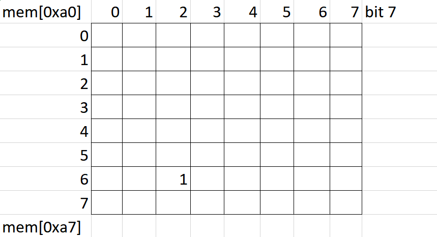

Việc tiếp theo là input của mình sẽ làm thay đổi các bit trong ma trận này, không được step trên những bit đã bật rồi.

Khi mà ta bật được tất cả các bit trong ma trận (sum = 0x7f8 = 2040) thì sẽ chiến thắng và có flag.

Tất cả điều này làm mình liên tưởng đến 1 trò thú vị trong cờ vua, đó chính là mã đi tuần.Tham khảo: [bài toán mã đi tuần](https://vi.wikipedia.org/wiki/B%C3%A0i_to%C3%A1n_m%C3%A3_%C4%91i_tu%E1%BA%A7n) và [Knight's tour](https://en.wikipedia.org/wiki/Knight%27s_tour).

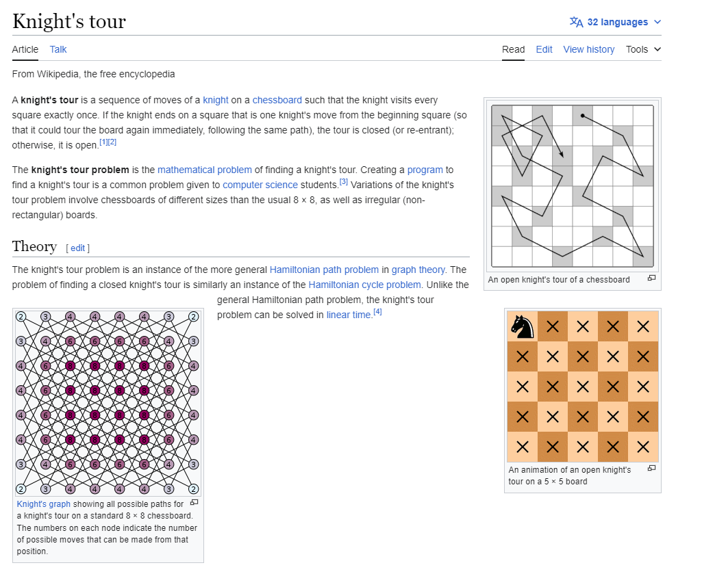

Tóm lại là trong bàn cờ thì quân mã có nước đi rất thú vị và nó có thể đi hết bàn cờ mà không đi đè lên nước cũ. Ta có thể chọn 2 điểm bắt đầu và kết thúc cho quân mã và tìm ra được đường đi hợp lệ.

Chính xác thì các giá trị được lưu dưới đây là các nước đi hợp lệ của quân mã: 

```
mem[0x70:0x7e] = [1,1,2,2,-1,-1,-2,-2,...] 
mem[0x80:0x8e] = [2,-2,1,-1,2,-2,1,-1,...] 
```

Ta có hàm `func_0x168` là hàm đánh dấu nước đi, `func_0xf1` là kiểm tra nước đi có hợp lệ, `func_0x1ac` sẽ kiểm tra bàn cờ và đưa ra flag cuối cùng.
Với input ta có thì 4 bit đầu và 4 bit cuối là toạ độ của nước đi tiếp theo.

Tới đây, ta chỉ cần giải quyết bài toán mã đi tuần nữa là tìm được flag, có 2 hướng giải:

- Làm tay, vì nó có thủ thuật nên tìm ra đường đi cũng nhanh
- Code dùng thuật toán, mình đã thử dùng bfs/dfs để tìm đường đi, tuy nhiên nó chỉ áp dụng được với điểm kết thúc bất kì, không được chọn trước điểm kết thúc như trong chương trình (7,2).Luật Warnsdorff luôn ưu tiên ô có ít nước đi kế tiếp nhất nên tìm ra đường rất nhanh, nhưng không cho chọn trước điểm kết thúc. Muốn cố định cả hai đầu thì phải quay lui hoặc ràng buộc bằng solver.

Trong trường hợp cấp bách mình đã làm tay theo như [video này](https://youtu.be/3Xoes1PFTZU) đã hướng dẫn, ta có điểm bắt đầu và kết thúc như bên dưới:

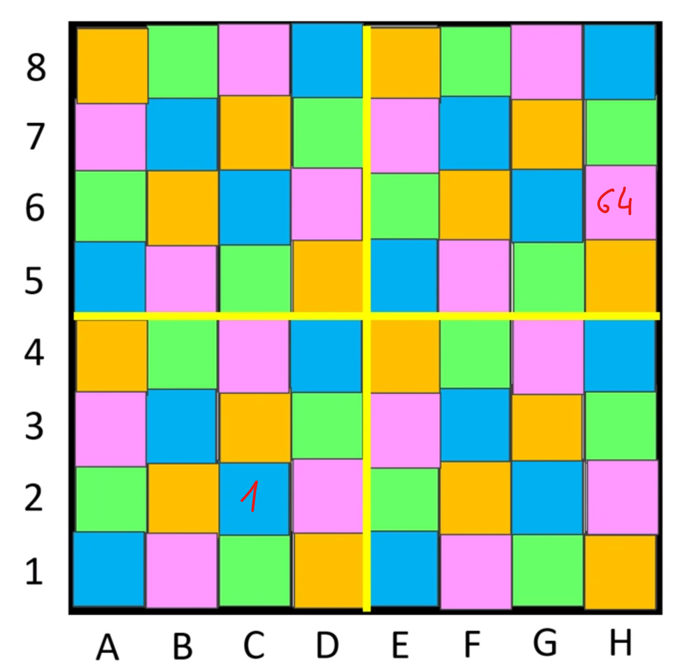

Việc của mình chỉ là cho quân mã đi hết lần lượt từng chuỗi màu tương ứng với điểm bắt đầu và cho đi vào chuỗi màu có chứa điểm kết thúc sau cùng.

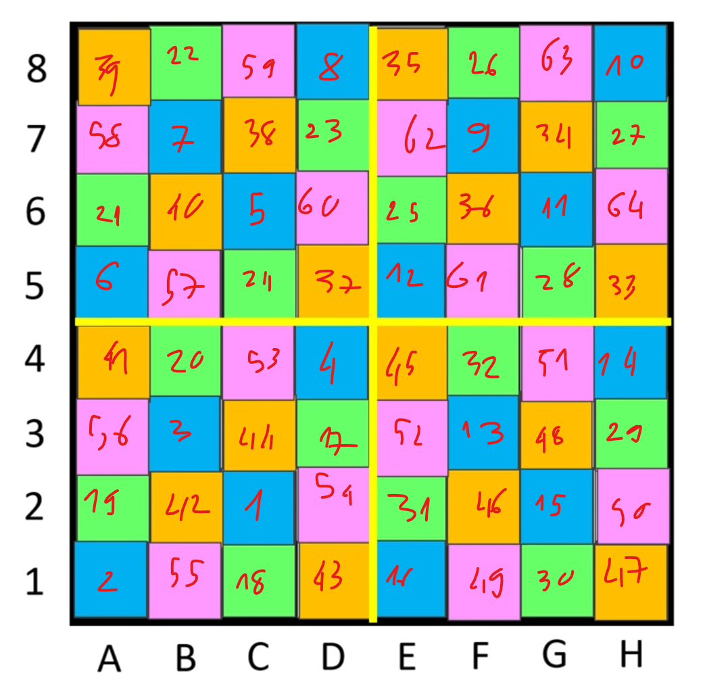
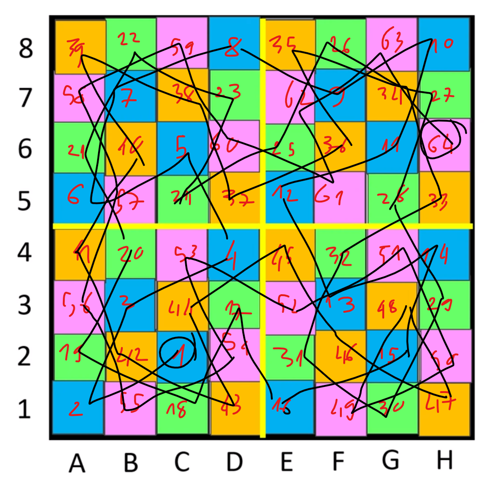

Việc này không tốn thời gian, quá nhiều. Từ đây ta chỉ cần convert thành các nước đi hợp lệ rồi gửi cho chương trình thôi.

```python
from pwn import *
chess = [
    [39,22,59,8,35,26,63,10],
    [58,7,38,23,62,9,34,27],
    [21,40,5,60,25,36,11,64],
    [6,57,24,37,12,61,28,33],
    [41,20,53,4,45,32,51,14],
    [56,3,44,17,52,13,48,29],
    [19,42,1,54,31,46,15,50],
    [2,55,18,43,16,49,30,47]
]
flat = []
for l in chess:
    flat.extend(l)
to_send = []
for i in range(2,65):
    if i not in flat:
        print('sus',i)
    pos = flat.index(i)
    x,y = (pos%8,pos//8)
    to_send.append((y<<4)|x)
to_send = bytes(to_send)
print(to_send)
# io = process('./rust_vm')
io = remote('139.162.1.95',31337)
io.recv()
io.sendline(to_send)
io.interactive()
```

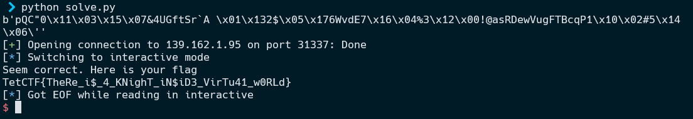

Flag: `TetCTF{TheRe_i$_4_KNighT_iN$iD3_VirTu41_w0RLd}`

### Bonus

Ngoài cách giải tay thì các bạn có thể dùng z3 để tìm, cách này được cung cấp bởi `@d4rkn19ht`, một coder chân chính.

```python
from z3 import *
from random import randint 

WARNING = '\033[93m'
OKGREEN = '\033[92m'
ENDC = '\033[0m'
#WARNING: This script works but it take hours to just find the path, so dont use this. 

dx = [-2, -1, 1, 2, -2, -1, 1, 2]
dy = [-1, -2, 2, 1, 1, 2, -2, -1]

def print_board(boardsize, trc):
    for i in range(boardsize):
        print("|".join(f"{trc.index((i, j)):>2}" for j in range(boardsize)))

# implementation for 8x8 chessboard
def solving(boardsize, start, end):
    global dx, dy
    # IDEA: 
    # Create an arr[], arr[i], with i - position on chess board (but in 1 dimension)
    # arr[i] : the order when knight move to position i
    # adding constrain to each cell arr[i] (arr[j] = arr[i] + 1, with j to i by moving knight)
    in_board = lambda x, y: (x >=0 and x<boardsize) and (y >=0 and y<boardsize)
    solver = Solver()
    arr = [Int(f"x{i}") for i in range(boardsize ** 2)]
    solver.add(Distinct(arr))
    for i in range(boardsize ** 2):
        solver.add(0<=arr[i])
        solver.add(arr[i] < boardsize ** 2)
    
    
    


    def in_one_of(x, ls):
        cond = BoolVal(False)
        for i in ls:
            cond = Or(cond, i == x)
        return cond 
    
    #define random startpoint, as arr[startpoint] = 0
    # startx = randint(0, 7)
    # starty = randint(0, 7)
    # solver.add(arr[startx * 8 + starty] == 0)
    solver.add(arr[start] == 0)
    solver.add(arr[end] == boardsize ** 2 - 1)
    for idx in range(0, boardsize ** 2):
        if idx == start:
            continue

        x = idx // boardsize
        y = idx % boardsize
        tmp = []
        for i in range(8):
            nx = x + dx[i]
            ny = y + dy[i]
            if in_board(nx, ny):
                tmp.append(arr[nx * boardsize + ny])
    
        solver.add(in_one_of(arr[idx] - 1, tmp))

    if solver.check() == sat:
        print(OKGREEN + "FOUND solution" + ENDC)
        # print(solver.model())
        tr = [None for i in range(boardsize * boardsize)]
        s = solver.model()
        for i in range(boardsize):
            for j in range(boardsize):
                tr[s[arr[i * boardsize + j]].as_long()] = (i, j)
        print_board(boardsize, tr)
    else:
        print(WARNING + "NO soulution found" + ENDC)
        # raise Exception()


solving(8, 2 * 8 + 6, 7 * 8 + 2)

```

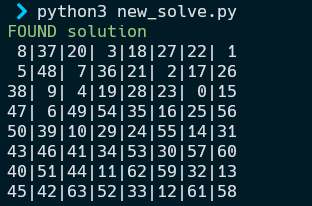

Quá Vjp.👍


### Conclusion

Đây là một bài khônng quá khó, hay nhiều technique nhưng vẫn rất hay, cảm ơn tác giả.