WM CTF 2022 mình note lại một bài: BabyDriver, 353 điểm. Đúng như cái tên, phần check flag không nằm trong file exe mà nằm trong một driver do chính file đó thả ra rồi cài vào máy. Đây cũng là bài driver đầu tiên mình làm, và để chạy được đề mình phải dựng hẳn một máy ảo Win7 64-bit.

## BabyDriver - 353pts

>Description: `<empty>`
>
>Attachment: [BabyDriver.zip](https://drive.google.com/file/d/1-Wxhs10ysmPMbkw9wcN66N_dAu3BXz78/view?usp=sharing)

Khi extract ra thì ta được 1 folder `__MACOSX` và 1 file `BabyDriver.exe`, tuy nhiên ở bài này chúng ta không cần quan tâm folder đó:


Khi chạy file thì mình nhận được cái này:

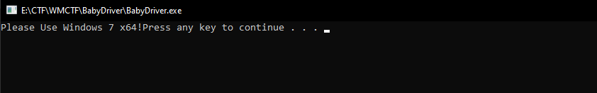


Check file với DiE:

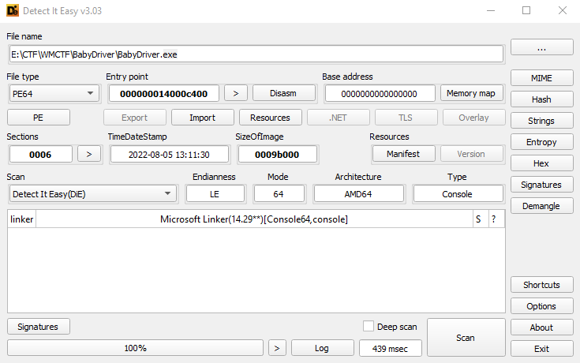

Là file PE64, tuy nhiên chưa thể chạy được, tạm thời cứ đưa vào IDA64 phân tích trước.

Khi mình load và trace tới hàm `sub_14000C190()` và có vẻ nó là hàm main (bởi vì hàm gọi nó chỉ có gọi 2 hàm: 1 hàm có biến `_security_cookie` hàm còn lại có thể sẽ là luồng thực thi chính)

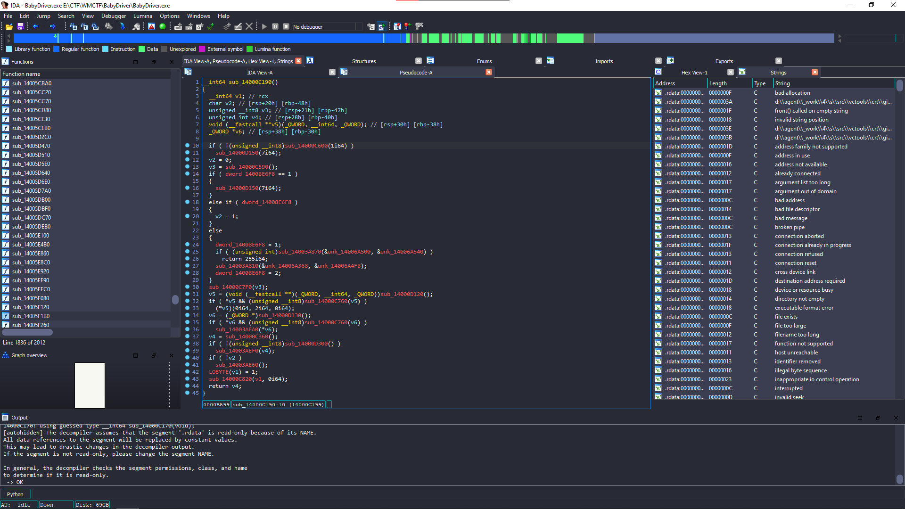

Tuy nhiên, xác định hàm main cũng không giúp ích gì nhiều, vì cơ bản đa số cá  hàm đều không được IDA rename lại. Thế nên ta phải đi từ strings lên, bấm `Shift + F12`:

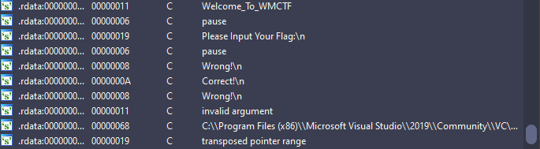

Sau khi tìm kiếm 1 lúc thì sẽ thấy một số chuỗi đúng như mong muốn, xref xem những hàm nào đã gọi nó:

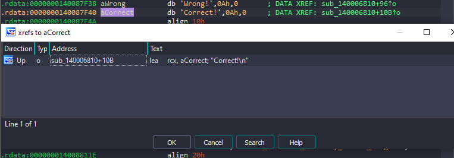

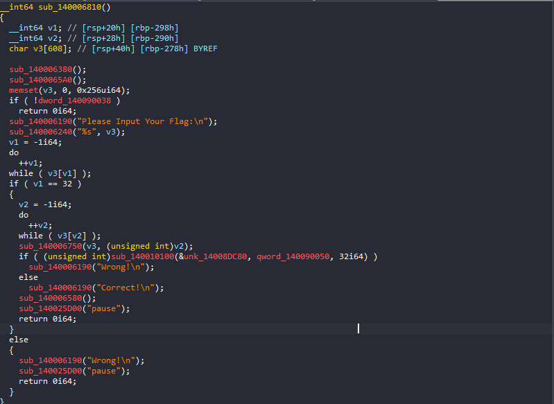

Hàm này có flow khá dễ hiểu, Đầu tiên nhập input của mình vào, sau đó kiểm tra length và đưa vào `sub_140006750()`. Không rõ là làm gì nhưng nó đứng trước hàm `sub_140010100()`, hàm này thì load 2 data có length là 32 lên, rất có thể chỉ là một hàm so sánh bình thường.

Còn về `sub_140006380()` thì mình thấy bên trong có đoạn như này:

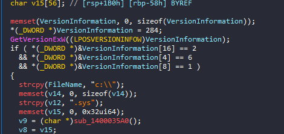

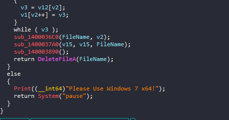

Hàm này check version của windows, Sau đó mình thử kiểm tra các hàm khác thì hàm này cơ bản là tạo 1 file `<abcdef..>.sys`(tên file ngẫu nhiên) trong ổ `C:`, và sau đó load resource có tên là "WMCTF" và ghi vào file:

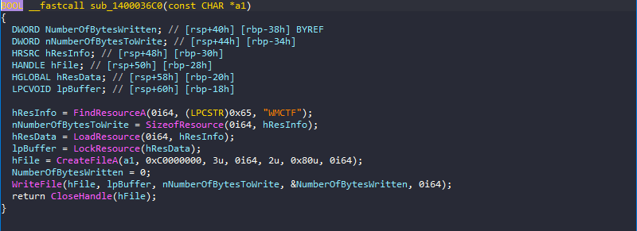

Tiếp theo nó cài đặt và khởi động file đó như một driver.

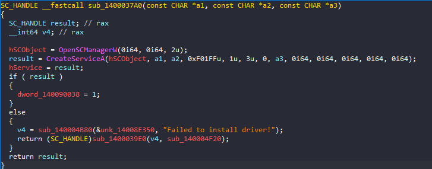

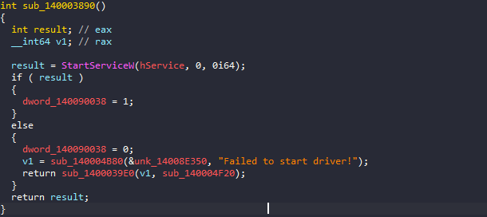

Còn về `sub_1400065A0()` ở ngay sau hàm CheckVersion(Đã được rename) thì ta chỉ cần quan tâm những dòng này:

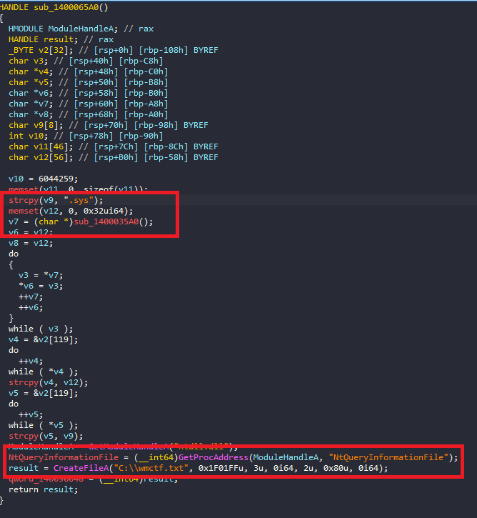

Nó sẽ load `NtQueryInformationFile`(đề cập ở đoạn sau), và tạo 1 file `wmctf.txt` giống như 1 file log.

Vậy là về cơ bản mình đã rename lại được đa số các hàm:

```c
__int64 CHECK_FLAG()
{
  __int64 len_inp; // [rsp+20h] [rbp-298h]
  __int64 len_input; // [rsp+28h] [rbp-290h]
  char input[608]; // [rsp+40h] [rbp-278h] BYREF

  CheckVersion_StartDriver();
  Load_NT_n_CreateFile();
  memset(input, 0, 0x256ui64);
  if ( !dword_140090038 )
    return 0i64;
  Print((__int64)"Please Input Your Flag:\n");
  Scanf("%s", input);
  len_inp = -1i64;
  do
    ++len_inp;
  while ( input[len_inp] );
  if ( len_inp == 32 )
  {
    len_input = -1i64;
    do
      ++len_input;
    while ( input[len_input] );
    Encrypt((__int64)input, len_input);
    if ( (unsigned int)Compare(BYTES, qword_140090050, 32ui64) )
      Print((__int64)"Wrong!\n");
    else
      Print((__int64)"Correct!\n");
    Stop_driver();                              // don't care
    System("pause");
    return 0i64;
  }
  else
  {
    Print((__int64)"Wrong!\n");
    System("pause");
    return 0i64;
  }
}
```

Trước khi làm ra bài này mình đã thử setup Win7 64bit để chạy thử và đây là kết quả:

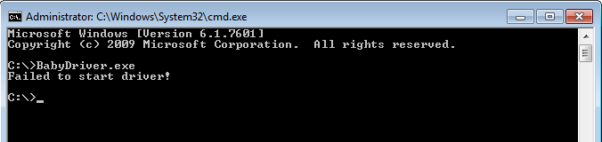

Có nghĩa là nó đã pass qua đoạn checkversion, cài đặt driver rồi nhưng không chạy driver được.

Quay về hàm `encrypt()` để kiểm tra:

```c
__int64 __fastcall encrypt(__int64 a1, unsigned int a2)
{
  unsigned __int64 i; // [rsp+28h] [rbp-20h]

  for ( i = 0i64; i < a2; ++i )
    *(_BYTE *)(i + a1) ^= i;
  qword_140090060 = (__int64)"Welcome_To_WMCTF";
  qword_140090050 = a1;
  qword_140090058 = a2;
  return (unsigned __int8)Cipher(1i64, &qword_140090050, 24i64);
}
```

Đầu tiên nó chạy vòng lặp và lấy `input[i]^i`, tiếp theo nó load 1 chuỗi 16bytes: "Welcome_To_WMCTF", và len để đi vào `Cipher()`:

```c
char __fastcall Cipher(__int64 a1, __int64 a2, __int64 a3)
{
  char v4[24]; // [rsp+38h] [rbp-110h] BYREF
  _QWORD v5[28]; // [rsp+50h] [rbp-F8h] BYREF

  memset(v5, 0, sizeof(v5));
  v5[0] = 0x123456111i64;
  v5[1] = a1;
  v5[2] = a2;
  v5[3] = a3;
  memset(v4, 0, 0x10ui64);
  NtQueryInformationFile(qword_140090048, v4, v5, 224i64, 52);
  return 0;
}
```

Tới đây mình kiểm tra thử `qword_140090048` thì thấ nó là kết quả của việc tạo file "wm.txt" lúc nãy:

```c
  result = CreateFileA("C:\\wmctf.txt", 0x1F01FFu, 3u, 0i64, 2u, 0x80u, 0i64);
  qword_140090048 = (__int64)result;
```

Trước tiên mình thử search google về [NtQueryInformationFile()](https://docs.microsoft.com/en-us/windows-hardware/drivers/ddi/ntifs/nf-ntifs-ntqueryinformationfile) thì được một số thông tin như này:

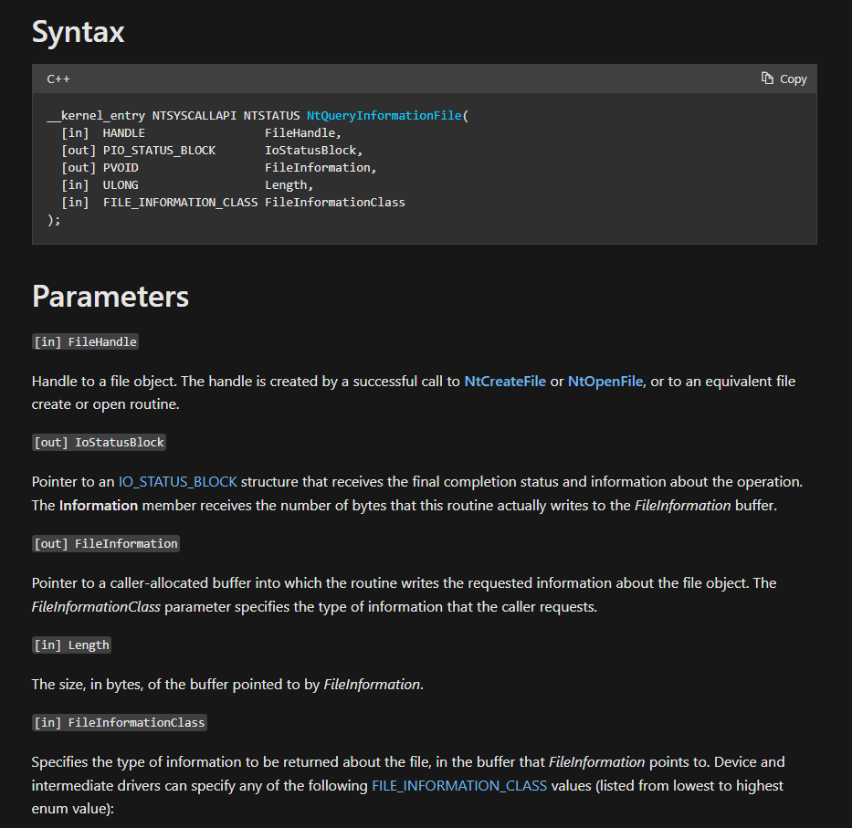

Cơ bản thì nó sẽ đưa cái input đã bị encrypt của mình lên nhờ 1 file xử lí.Ở đây `NtQueryInformationFile` không dùng để lấy thông tin file, mà bị lợi dụng làm đường truyền dữ liệu giữa user mode và driver. Cách giao tiếp thường gặp hơn là `DeviceIoControl`.
Và file đó chính là cái file .sys lúc nãy mình đã gặp. Giờ bắt buột phải biết xem file đó đã làm gì, có nhiều cách để lấy file.

Trong 1 lần mình debug trên win7 thì mình đã có được file trước khi nó install hoặc là cách dễ hơn các bạn dùng Resource Hacker để view resource WMCTF:

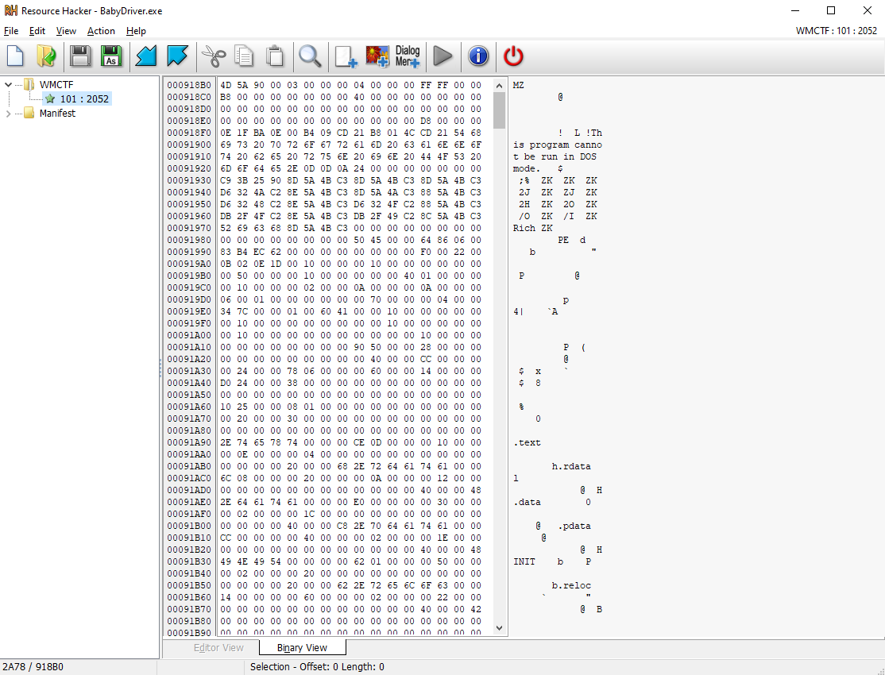

Lưu thành 1 file mới và mở trong IDA, thử check `DriverEntry()` và các hàm khác:

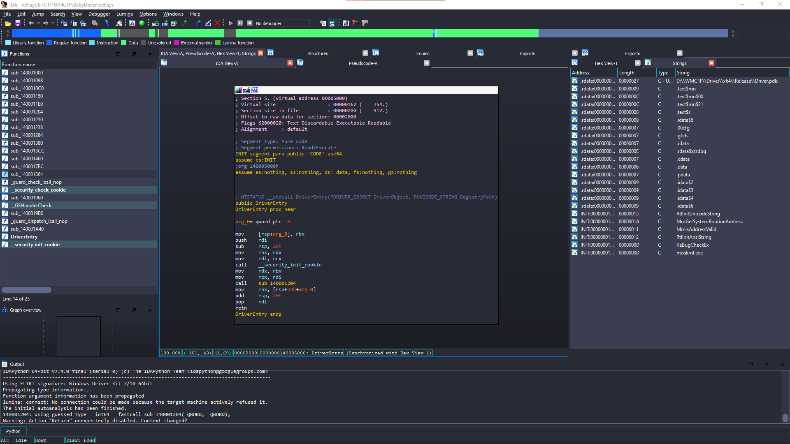

Dự đoán thì file này chỉ là 1 loạt encryption nào đó, tuy nhiên khi mình dùng `findcrypt-yara` thì không tìm được gì.

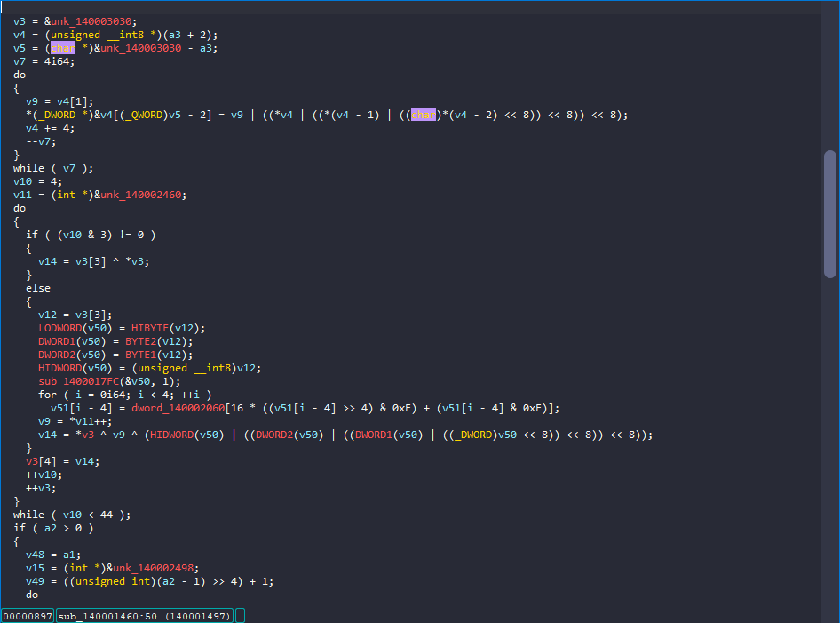

Còn về đoạn này thì mình đọc thấy lạ lạ, encryption khá là dài, mình thử đối chiếu nó với các encryption mình từng gặp thì mình lại loại trừ được kha khá,

Đầu tiên nó có thể có key, và key là `Welcome_To_WMCTF`(tìm được ở file BabyDriver.exe), nếu là RC4 thì code sẽ không dài như vậy, vậy nên mình đã thử với encryption phổ biến nhất đối với mình là AES mode CBC:Tham khảo: [các chế độ mã hoá khối](https://en.wikipedia.org/wiki/Block_cipher_mode_of_operation), trong đó có CBC.

Mình thử kiểm tra thì len(key) = 16 bytes và IV rất có thể là đoạn này:

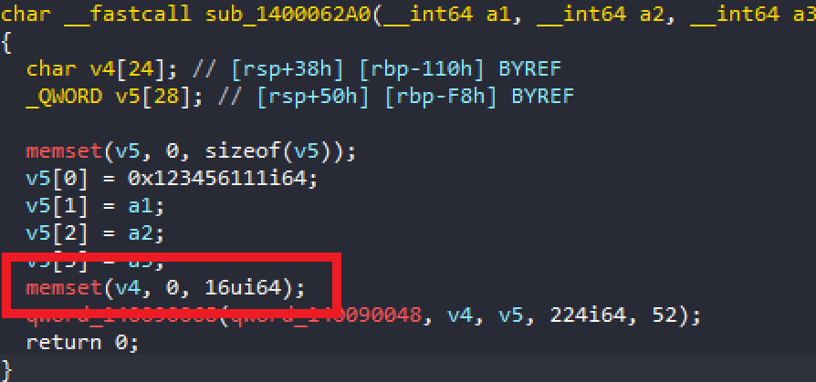

Còn về phần encrypted data thì có thể dễ dàng lấy được thông qua IDA:

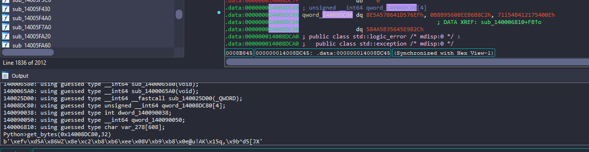

```python
get_bytes(0x14008DC80,32)
#b'\xefv\xd5A\x86WZ\x8e\xc2\xb8\xb6\xee\x08V\xb9\xb8\x0e@u!AK\x15q,\x9b^d5[JX'
```

Mình đã thử viết script decrypt:

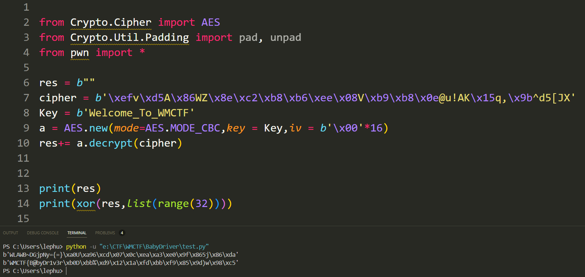

Tới đây mình đã thấy preflix flag thì chắc chắn là đúng rồi, nhưng có một vấn đề là 16 bytes cuối decrypt sai.Trong CBC mỗi block được XOR với block mã hoá trước đó. Nếu chương trình mã hoá theo từng đoạn riêng và đặt lại IV, giải mã một lượt sẽ sai đúng chỗ nối. Đó là lý do chia làm 2 đoạn thì ra đúng.

Mình đã thử chia làm 2 đoạn decrypt thì cuối cùng cũng có flag:

```python
from Crypto.Cipher import AES
from Crypto.Util.Padding import pad, unpad
from pwn import *

res = b""
cipher = b'\xefv\xd5A\x86WZ\x8e\xc2\xb8\xb6\xee\x08V\xb9\xb8\x0e@u!AK\x15q,\x9b^d5[JX'
Key = b'Welcome_To_WMCTF'
a = AES.new(mode=AES.MODE_CBC,key = Key,iv = b'\x00'*16)
res+= a.decrypt(cipher[:16])
a = AES.new(mode=AES.MODE_CBC,key = Key,iv = b'\x00'*16)
res+= a.decrypt(cipher[16:])

print(res)
print(xor(res,list(range(32)))) #WMCTF{B@byDr1v3r_2nd_E@syA3s!!!}
```

Flag: `WMCTF{B@byDr1v3r_2nd_E@syA3s!!!}`


